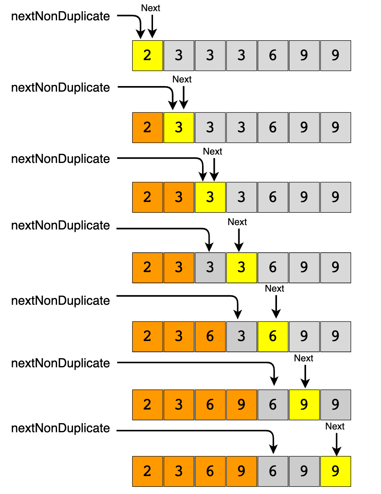

### Two Pointers

#### Pair with Target sum

Given an array of sorted numbers and a target sum, find a **pair in the array whose sum is equal to the given target**.

Write a function to return the indices of the two numbers (i.e. the pair) such that they add up to the given target.

```
Input: [1, 2, 3, 4, 6], target=6
Output: [1, 3]
Explanation: The numbers at index 1 and 3 add up to 6: 2+4=6
```


```c++
using namespace std;
#include <iostream>
#include <vector>

class PairWithTargetSum {
  public:
  static piar<int, int> search(const vector<int> &arr, int targetSum) {
    int left = 0;
    int right = arr.size() - 1;
    while (left < right) {
      int currentSum = arr[left] + arr[right];
      if (currentSum == targetSum) {
        return make_pair(left, right);
      }
      
      if (targetSum > currentSum) 
        left++;
      else 
        right--
    }
    return make_pair(-1, -1);
  }
};
```

#### Remove Duplicates (easy)

Given an array of <u>sorted numbers</u>, **remove all duplicates** from it. You should **not use any extra space**; after removing the duplicates in-place return the length of the subarray that has no duplicate in it.

```
Input: [2, 3, 3, 3, 6, 9, 9]
Output: 4
Explanation: The first four elements after removing the duplicates will be [2, 3, 6, 9].
```

##### 解法：

As the input array is sorted, therefore, one way to do this is to shift the elements left whenever we encounter duplicates. In other words, we will keep one pointer for iterating the array and one pointer for placing the next non-duplicate number. So our algorithm will be to iterate the array and whenever we see a non-duplicate number we move it next to the last non-duplicate number we’ve seen.



```c++
using namespace std;

#include <iostream>
#include <vector>

class RemoveDuplicates {
 public:
  static int remove(vector<int>& arr) {
    // TODO: Write your code here
    int nextNonDup = 1;
    for (int i = 1; i<arr.size(); i++) {
      if (arr[nextNonDup-1] != arr[i]) {
        arr[nextNonDup] = arr[i];
        nextNonDup++;
      }
    }
    return nextNonDup;
  }
};
```

##### Similar questions

Given an unsorted array of numbers and a target ‘key’, remove all instances of ‘key’ in-place and return the new length of the array.

```
Input: [3, 2, 3, 6, 3, 10, 9, 3], Key=3
Output: 4
Explanation: The first four elements after removing every 'Key' will be [2, 6, 10, 9].
```

```c++
using namespace std;

#include <iostream>
#include <vector>

class RemoveElement {
 public:
  static int remove(vector<int>& arr, int key) {
    int nextElement = 0;
    for (int i = 0; i < arr.size(); i++) {
      if (arr[i] != key) {
        arr[nextElement] = arr[i];
        nextElement++;
      }
    }
    return nextElement;
  }
};
```


#### Triplet Sum to Zero (medium)

Given an array of unsorted numbers, find all **unique triplets in it that add up to zero**.

```
Input: [-3, 0, 1, 2, -1, 1, -2]
Output: [-3, 1, 2], [-2, 0, 2], [-2, 1, 1], [-1, 0, 1]
Explanation: There are four unique triplets whose sum is equal to zero.
```

```
Input: [-5, 2, -1, -2, 3]
Output: [[-5, 2, 3], [-2, -1, 3]]
Explanation: There are two unique triplets whose sum is equal to zero.
```

X + Y + Z = 0

-X = Y + Z

就又成了 找两数和等于一个Target。 但要注意避免重复。

```c++
using namespace std;

#include <algorithm>
#include <iostream>
#include <vector>

class TripletSumToZero {
 public:
  static vector<vector<int>> searchTriplets(vector<int> &arr) {
    vector<vector<int>> triplets;
    // TODO: Write your code here
    sort(arr.begin(), arr.end());
    
    return triplets;
  }
};


int main(int argc, char *argv[]) {
  vector<int> vec = {-3, 0, 1, 2, -1, 1, -2};
  auto result = TripletSumToZero::searchTriplets(vec);
  for (auto vec : result) {
    cout << "[";
    for (auto num : vec) {
      cout << num << " ";
    }
    cout << "]";
  }
  cout << endl;

  vec = {-5, 2, -1, -2, 3};
  result = TripletSumToZero::searchTriplets(vec);
  for (auto vec : result) {
    cout << "[";
    for (auto num : vec) {
      cout << num << " ";
    }
    cout << "]";
  }
}
```


#### Triplet Sum Close to Target (medium)

Given an array of unsorted numbers and a target number, find a **triplet in the array whose sum is as close to the target number as possible**, return the sum of the triplet. If there are more than one such triplet, return the sum of the triplet with the smallest sum.


```
Input: [-2, 0, 1, 2], target=2
Output: 1
Explanation: The triplet [-2, 1, 2] has the closest sum to the target.
```

```
Input: [-3, -1, 1, 2], target=1
Output: 0
Explanation: The triplet [-3, 1, 2] has the closest sum to the target.
```

```
Input: [1, 0, 1, 1], target=100
Output: 3
Explanation: The triplet [1, 1, 1] has the closest sum to the target.
```

```c++
using namespace std;

#include <algorithm>
#include <iostream>
#include <limits>
#include <vector>

class TripletSumCloseToTarget {
 public:
  static int searchTriplet(vector<int>& arr, int targetSum) {
    // TODO: Write your code here
    return -1;
  }
};

```

