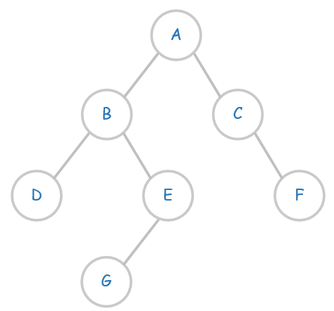
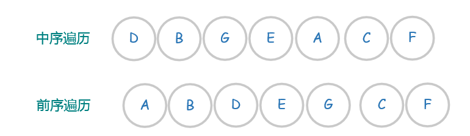

## 平衡二叉树

平衡二叉树是基于二分法的策略提高数据的查找速度的二叉树的数据结构；

平衡二叉树是采用二分法思维把数据按规则组装成一个树形结构的数据，用这个树形结构的数据减少无关数据的检索，大大的提升了数据检索的速度；平衡二叉树的数据结构组装过程有以下**规则**：

（1）非叶子节点只能允许最多两个子节点存在。

（2）每一个非叶子节点数据分布规则为左边的子节点小当前节点的值，右边的子节点大于当前节点的值(这里值是基于自己的算法规则而定的，比如hash值)；

平衡树的层级结构：因为平衡二叉树查询性能和树的层级（h高度）成反比，h值越小查询越快、为了保证树的结构左右两端数据大致平衡降低二叉树的查询难度一般会采用一种算法机制实现节点数据结构的平衡，实现了这种算法的有比如[Treap](https://link.zhihu.com/?target=http%3A//baike.baidu.com/item/Treap)、**红黑树，**使用平衡二叉树能保证数据的左右两边的节点层级相差不会大于1.，通过这样避免树形结构由于删除增加变成线性链表影响查询效率，保证数据平衡的情况下查找数据的速度近于二分法查找；

## B树

B树属于多叉树又名**平衡多路查找树**（查找路径不只两个），数据库索引技术里大量使用者B树和B+树的数据结构

InnoDB使用B+树

- **规则：**

（1）排序方式：所有节点关键字是按递增次序排列，并遵循左小右大原则；

（2）子节点数：非叶节点的子节点数>1，且<=M ，且M>=2，空树除外（注：M阶代表一个树节点最多有多少个查找路径，M=M路,当M=2则是2叉树,M=3则是3叉）；

（3）关键字数：枝节点的关键字数量大于等于ceil(m/2)-1个且小于等于M-1个（注：ceil()是个朝正无穷方向取整的函数 如ceil(1.1)结果为2);

（4）所有叶子节点均在同一层、叶子节点除了包含了关键字和关键字记录的指针外也有指向其子节点的指针只不过其指针地址都为null对应下图最后一层节点的空格子;

### 特点

B树相对于平衡二叉树的不同是，每个**节点**包含的**关键字**增多了，特别是在B树应用到数据库中的时候，数据库充分利用了磁盘块的原理（磁盘数据存储是采用块的形式存储的，每个块的大小为4K，每次IO进行数据读取时，同一个磁盘块的数据可以一次性读取出来）把节点大小限制和充分使用在磁盘快大小范围；把树的节点关键字增多后树的层级比原来的二叉树少了，**减少数据查找的次数和复杂度**;

## B+树

B+树是B树的一个升级版，相对于B树来说B+树更充分的利用了节点的空间，让查询速度更加稳定，其速度完全接近于二分法查找。为什么说B+树查找的效率要比B树更高、更稳定；我们先看看两者的区别

## 还原二叉树

### 从中序遍历和前序遍历还原二叉树

1. 首先由**前序遍历**的第一个节点确认其为根节点root；
2. 在**中序遍历**的结果中找到root，这时候可以知道在中序遍历结果中，A左边的节点DBGE为A的左子树的节点，A右边的节点CF为A右子树的节点。

