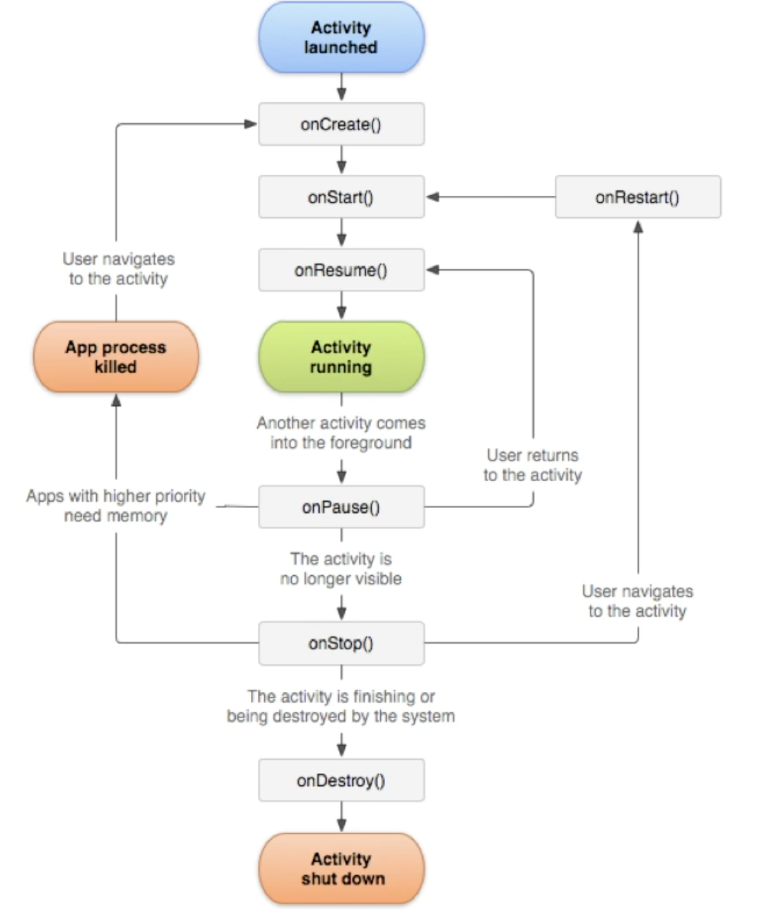

Split the problem into small problem

androidmanifest.xml

* Names the package manager
* Describes Activity Components
* Names the classes that implements components and publishers their capabilities
* Declares permissions
* Sets the minimum API
* LIsts libraries

