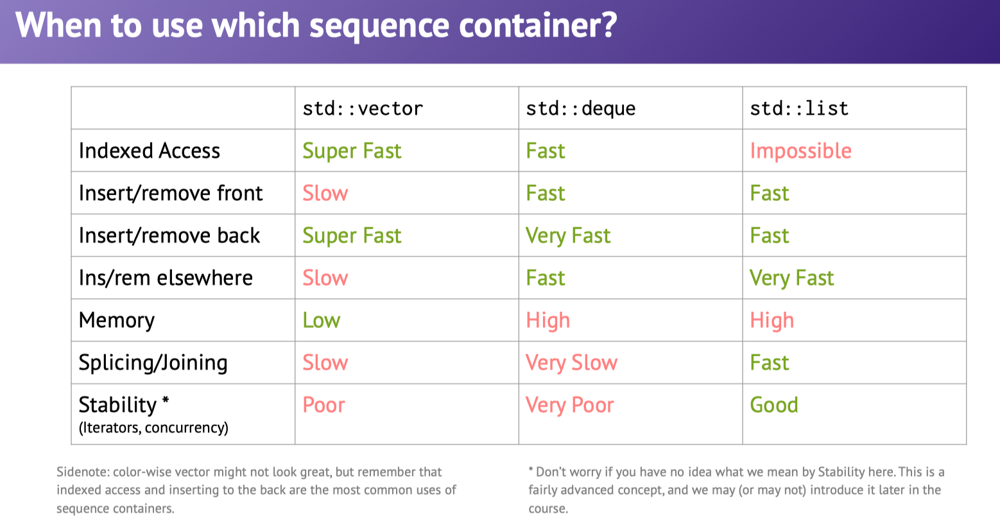

| what you want to do               | `std::vector<int>`                          |
| --------------------------------- | ------------------------------------------- |
| 创建空向量                        | `vector<int> v;`                            |
| 创建一个向量带有n个0              | `vector<int> v(n)`                          |
| 创建一个向量带有n个k              | `vector<int> v(n, k);`                      |
| add k to the end of the vector    | `v.push(k);`                                |
| Clear vector                      | `v.clear();`                                |
| Get the ele at index i            | `int k = v.at(i);`                          |
| replace the element at index i    | `v.at(i) = k;`                              |
| add j to the front of the vector  | `v.insert(v.begin(), k);`                   |
| Insert k at some index i          | `v.insert(v.begin()+i, k);`                 |
| Remove the element at index i     | `v.erase(v.begin()+i)`                      |
| Get the sublist in indices [i, j) | `vector<int> c (v.begin()+i, v.begin()+j);` |

std::vector does not have a push_front function

3 1 4 5

0 3 1 4 5

Slow

> Don't provide functions which might be mistaken to be efficient when it's not


真想要个很快的在头部插入该怎么办呢

`std::deque` has the exact same functions as `std::vector` but also has push_from and pop_front

```c++
std::deque<int> deq{5,6}; // {5, 6}
deq.push_front(3);				// {3, 5, 6}
deq.pop_back();						// {3, 5}
deq[-1] = -2;							// {3, -2}
```


size = number of elements in the vector

capacity = amount of space saved for the vector



不要觉得vector不好，因为indexed access 和向后插入是最常用的


:heavy_exclamation_mark: 

> vector is the type of sequence that should be used by ==default==...
>
> deque is the data structure of choice when most insertions and deletions take place at the ==beginning== or at the ==end== of sequence.


:facepunch:

if possible, reserve before insert

What's the best way to create a vector of the first 1000000 integers?

```c++
std::vector<int> vec;
vec.reserve(1000000);
for (size_t i = 0; i < 1000000; ++i) {
  vec.push_back(i);
}
```

* Consider using shrink_to_fit if you don't need the memory
* Call empty(), rather than check if size() == 0
* Don't use `vector<bool>`("noble failed experiment")

It's easy to write inefficient code.

Know about the common pitfalls - prevent as much resizing as much as possible.


##### What's a container adaptor?

Container adaptors provide a different interface for sequence containers. You can choose what the underlying container is


