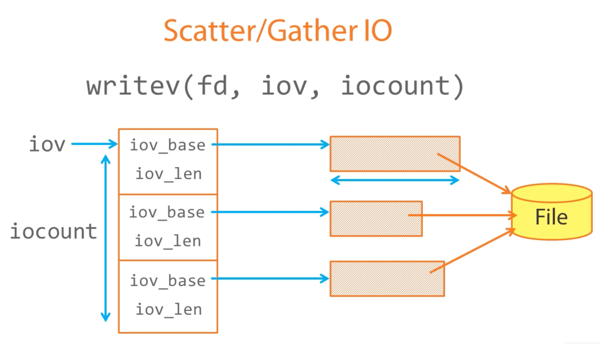

```bash
man chmod
```

Gets the user command


```bash
man 2 chmod
```

Gets the system call


| Section | Contents         |
| ------- | ---------------- |
| 1       | User commands    |
| 2       | System calls     |
| 3       | Library routines |
| 7       | Miscellaneous    |


### Data Types

| Typedef name | Actual Type   | Description                                           |
| ------------ | ------------- | ----------------------------------------------------- |
| `pid_t`      | int           | A process ID or process group ID                      |
| `gid_t`      | unsigned int  | A numeric group identifier                            |
| `uid_t`      | unsigned int  | A numeric user identifier                             |
| `time_t`     | long int      | Time (in seconds) since "the epoch"                   |
| `size_t`     | unsigned long | the size of an object in bytes                        |
| `ssize_t`    | long int      | The size of an object, or a negative error indication |
| `mode_t`     | unsigned int  | File Permissions                                      |
| `off_t`      | long int      | A file offset or size                                 |
| `socklen_t`  | unsigned int  | The size of a socket address structure                |


## Accessing Files

* Unbuffered I/O
* Sequential access
* Random access


* Using the standard library
* Buffered I/O
* Formatted I/O

* Advanced Techniques
* Scatter/gather I/O
* Mapping Files into Memory

The heart of matter

`open()` 

`read()`

`write()`

`close()`


### Low-Level IO

#### openning a file

```c++
fd = open(name, flags, mode);
```

* name: Pathname of the file to be opened
* flags: 
  * Must include one of: `O_RDONLY`, `O_WRONLY`, `O_RDWR`
  * May include one or more of: `O_APPEND`, `O_CREAT`, `O_TRUNC`
* mode: access mode of the file (only used if the file is being created)

#### Standard Streams


#### Unbuffered Output

```c
write(fd, buffer, count)
```


#### Unbuffered Input


```c
read(fd, buffer, count);
// Returns the number of bytes actually read (0 on end of file)
```

#### Closing a file

```c
close(fd)
```

* fd: an open file descriptor
* Closes the descriptor
* Makes it available for re-use
* Descriptors are implicitly closed when a process terminates
* There is a finite limit on how many descriptors a process can have open


```bash
dd if=/dev/urandom of=foo bs=1000 count=1000
./copy
cmp bar foo
```

#### Random Access


`read (fd, buffer, 1200);`


`read (fd, buffer, 600);`


The file position pointer may be explicitly repositioned:

`lseek(fd, offset, whence)`

* fd: File descriptor
* offset: Byte offset. +/-
* whence: 
  * Specifies where the offset is relative to
  * `SEEK_SET` Relative to start of file
  * `SEEK_CUR` Relative to current position
  * `SEEK_END` Relative to end of file


##### Examples

`lseek (fd, 100, SEEK_CUR);`


`lseek (fd, 100, SEEK_SET);`


`lseek (fd, -100, SEEK_END);`


#### Buffered and Formatted


##### opening a file

```c
fd = fopen(name, mode);
// "r": open text file for reading
// "w": trucate and open for writing
// "r+": open text file for update
// Append "b" to the mode for binary files
// Returns a descriptor of type FILE * 
// (Or NULL on error)
```

[详情见](/Users/xuzheng/Projects/notes/C/File IO.md)


#### Formatted IO


##### `printf()`

* Generates a formatted string and writes it to standard output
* returns the number of characters printed

| format codes | effects                                                      |
| ------------ | ------------------------------------------------------------ |
| `%d`         | decimal integer                                              |
| `%8d`        | ...right-justified in 8 character field                      |
| `%-8d`       | ... left justified                                           |
| `%s`         | string                                                       |
| `%12.3f`     | double, in 12 character field with 3 digits after the decimal point |

`man 3 printf` for details


##### `fprintf()`

```c
fd = fopen(...);
fprintf(fd, "hello"); // Use stderr to write an error message
```

##### `sprintf()`

formats a string into a memory

```c
char[100] buf;
sprintf(buf, "hello");
```


#### Demo: File Copy2

现在有两种方式读写文件，

一种是linux系统自带的low-level IO

另一个是C的标准库。

###### rawio.c

```c
#include <stdio.h>
#include <fcntl.h>
#include <stdlib.h>

int main(int argc, char *argv[])
{
    char *buffer;
    int  fd, size, count, i;

    if (argc != 3) {
	printf("usage: %s blocksize blockcount\n", argv[0]);
	exit(1);
    }

    fd = open("rawio.out", O_WRONLY | O_CREAT | O_TRUNC, 0600);

    size  = atoi(argv[1]);
    count = atoi(argv[2]);

    buffer = malloc(size);

    for (i=0; i<count; i++) {
	write(fd, buffer, size);
    }

    close(fd);
}

```

###### bufio.c

```c
#include <stdio.h>
#include <stdlib.h>

int main(int argc, char *argv[])
{
    char *buffer;
    int  size, count, i;
    FILE *fd;

    if (argc != 3) {
	printf("usage: %s blocksize blockcount\n", argv[0]);
	exit(1);
    }

    fd = fopen("bufio.out", "w");

    size  = atoi(argv[1]);
    count = atoi(argv[2]);

    buffer = malloc(size);

    for (i=0; i<count; i++) {
	fwrite(buffer, size, 1, fd);
    }

    close(fd);
}

```


```
$ time ./rawio 1 10000

real    0m0.357s
user    0m0.000s
sys     0m0.305s

$ time ./bufio 1 10000

real    0m0.004s
user    0m0.002s
sys     0m0.000s

$ time ./rawio 12 10000

real    0m0.340s
user    0m0.000s
sys     0m0.296s

$ time ./bufio 12 10000

real    0m0.005s
user    0m0.003s
sys     0m0.000s
```

don't do your IO in tiny little pieces


#### Scatter/Gather IO mmap

* Read or write multiple buffers of data in a single call
* Atomic
* `readv()` and `writev()`

##### `writev`



##### Mapping files into memory

* `mmap()` maps a file into memory and allows you to access it as if it were an **array**.

```c
mmap (addr, length, prot, flags, fd, offset)
```

* `addr`: where the mapping should be placed. Set this to `NULL` to allow the kernel to choose the address
* `length`: The length of the mapping. which piece of file you want to map
* `prot`: 
  * PROT_READ
  * PROT_WRITE
* `flags`:
  * MAP_SHARED
  * MAP_RPIVATE
* `fd`: File descriptor from `open()`
* `offset`: Offset within the file. Multiple of the page size. very often it's 0 and you mapping the entire file
* **returns** the address at which the file has been mapped


```c
#include <sys/mman.h>
#include <sys/stat.h>
#include <fcntl.h>
#include <stdlib.h>
#include <string.h>

int main()
{
    char *src, *dst;
    int fin, fout;
    size_t size;

    // open the input file
    fin = open("foo", O_RDONLY);
    if (fin < 0)
    {
        perror("foo");
        exit(1);
    }

    /* Get the size of the file. We use this to specify the size of the two mappings */

    size = lseek(fin, 0, SEEK_END);

    src = mmap(NULL, size, PROT_READ, MAP_PRIVATE, fin, 0);
    if (src == MAP_FAILED)
    {
        perror("mmap");
        exit(2);
    }

    // open the output file
    fout = open("bar", O_RDWR | O_CREAT | O_TRUNC, S_IRUSR | S_IWUSR);
    if (fout < 0)
    {
        perror("bar");
        exit(1);
    }

    if (ftruncate(fout, size) == -1)
    {
        perror("ftruncate");
        exit(3);
    }

    dst = mmap(NULL, size, PROT_READ | PROT_WRITE, MAP_SHARED, fout, 0);
    if (dst == MAP_FAILED)
    {
        perror("mmap");
        exit(4);
    }

    memcpy(dst, src, size); /* Copy bytes between mappings */
    if (msync(dst, size, MS_SYNC) == -1)
    {
        perror("msync");
        exit(5);
    }

    exit(0);
}
```


### 