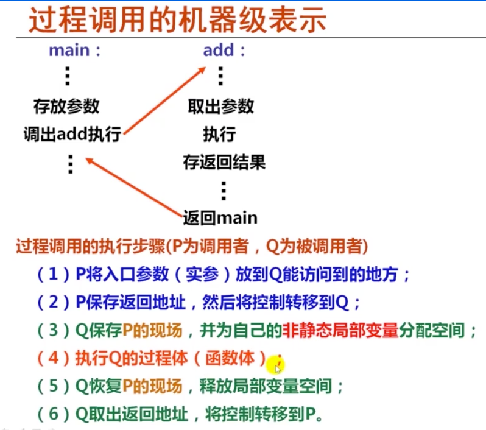

\# 3.7 过程

过程调用步骤(P为调用者, Q为被调用者)

1. P将入口参数(实参)放到Q能访问到的地方;

2. P保存返回地址, 然后将控制转移到Q

3. Q保存P的现场, 并为自己的非静态局部变量分配空间

4. 执行Q的过程体(函数体);

5. Q恢复P的现场, 释放局部变量空间

6. Q取出返回地址, 将控制转移到P

\- 准备阶段

​	- 形成帧底: push指令和mov指令

​	- 生成栈帧(如果如需要): sub指令 或 and指令

​	- 保存现场(如果有被调用者保存寄存器): mov指令

\- 过程(函数)体

​	- 分配局部变量空间, 并赋值

​	- 具体逻辑处理, 如果遇到函数调用时

​		- 准备参数: 将实参送到栈帧入口

​		- CALL指令: 保存返回地址并转到被调用函数

​	- 在EAX中准备返回参数

\- 结束阶段

​	- 退栈: leave指令 或 pop指令

​	- 取返回地址返回

