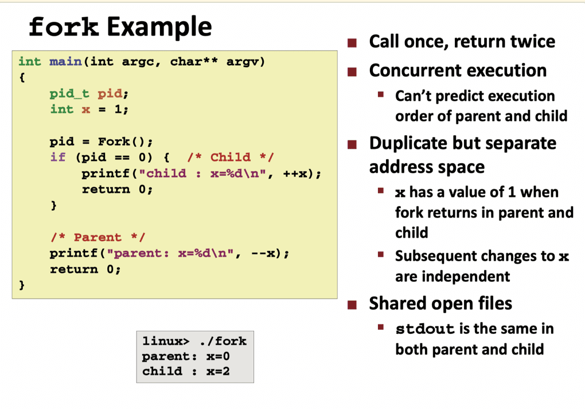

## 获得进程IDs

```c

#include <sys/types.h>
#include <unistd.h>
// pid_t在types.h中被定义为int

pid_t getpid(void); // 返回调用进程的PID
pid_t getppid(void); // 返回它的父进程的PID

pid_t fork(void); // 子进程返回0, 父进程返回子进程的PID, 如果出错,则为-1
pid_t wait(int *statusp);
// 返回:如果成功,则为子进程的PID, 如果出错, 则为-1

```





## 回收子进程 Reaping Child Processes
- Idea
	- 当进程终止, 它仍然会消耗系统资源
		- examples: Exit status, various OS table
	- called a “zombie”
		- Living corpse, half alive and half dead
- Reaping 回收
	- 由父程序对被终止的子程序执行 (using `wait` or `waitpid`)
	- 内核将子进程的退出状态传递给父进程, 
	- 然后抛弃(delete)已终止的进程.
- 那如果回收父进程呢?
	- 如果一个父进程在回收它的子进程之前被终止了, 内核会安排init进程对这些孤儿进程进行回收.
		- 除非 ppid==1. Then need to reboot
	- 长时间运行的程序, 比如shell或者服务器, 总是应该回收它们的僵尸子进程.
		- 即使僵尸子进程没有运行, 它们仍然消耗系统的内存资源

### wait synchronizing with children
- wait 函数是waitpid函数的简单版本

- pid_t wait(int *child_status);
	// 返回:如果成功,则为子进程的PID, 如果出错, 则为-1
	- 挂起当前进程, 直到他的子进程终止
	- 返回值是被终止的子进程的pid
	
- ```c
	#include <sys/types.h>
	#include <sys/wait.h>
	
	pid_t waitpid(pid_t pid, int *statusp, int options);
	```
	
	- 默认情况下(当options=0), waitpid挂起调用进程的执行, 直到它的等待集合(wait set)中的一个子进程终止. 如果等待集合中的一个进程在港调用的时刻就已经终止了,那么waitpid就立即返回. PID
	1. 判定集合成员
		- pid>0: 等待集合就是一个单独的子进程, 他的进程ID等于pid
		- pid=-1. 等待集合就是父进程所有的子进程组成的
	2. 修改默认行为options