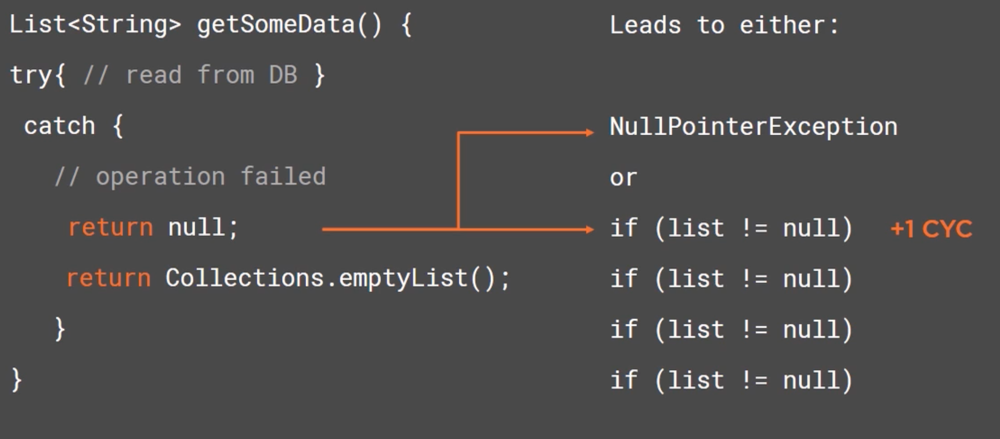
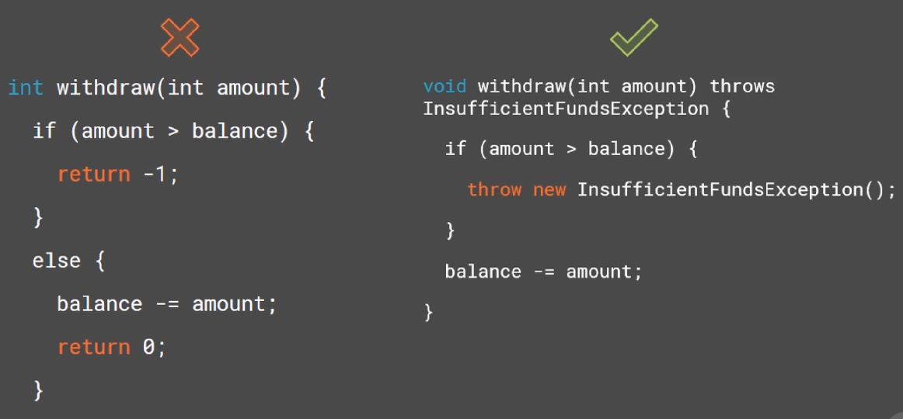

## Implementing Mehods

what methods should return 
Parameters
Fail fast & return early
Avoid duplication
Conditionals

### Clean Code Concepts

DRY: Don't repeat yourself

WET: Write everything twice

#### Cyclomatic Complexity (CYC)

A software metric used to simply indicate the complexity of a program.

循环复杂度（Cyclomatic complexity）也称为条件复杂度或圈复杂度，是一种软件度量，是由老托马斯·J·麦凯布在1976年提出，用来表示程序的复杂度，其符号为VG或是M。循环复杂度由程序的源代码中量测线性独立路径的个数。此概念有些类似的量测文本复杂度的Flesch-Kincaid可读性测试 ，不过方法不完全相同。

Signal: Clean Useful Code

Noise: Poor Names, high CYC, duplication, bad comments...

### What (not) to return 

### Do not return 

* Null

* Special codes (-1, 0, 1, and other)

  

  

### Method Parameter

:warning: Generally, fewer better

OK: 0-2

Avoid: 3

Refactor!: 4+

#### Methods with 3+ arguments might:

* Do too many things (split it)
* Take too many primitive types (pass a single object)
* Takes a boolean (flag) argument (remove it)

> Flag arguments are ugly. It immediately complicates the signature of the method, loudly proclaiming that this function does more than one thing.

https://martinfowler.com/bliki/FlagArgument.html

#### Magic Number

Avoid magic number. Put them into vairables with names.

#### Fail Fast

| Fail Fast                                               | Fail Safe                       |
| ------------------------------------------------------- | ------------------------------- |
| Immediately report any failure and let the program fail | Try to keep the program running |
|                                                         |                                 |

Failing fast frequently means easier troubleshooting.

### Return early

### Refactor Duplication

#### Conditionals

