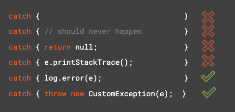

* Error

  * out of memory error
  * internal error

  you won't try to recover from these error.

不捕捉Nullpointer Exception

Don't handle NPEs
Prevent them!

#### Catch Block Anti-patterns

Catch block shouldn't

- Be empty
- Have only comments
- Contain unhelpful code

Avoid throwing exception in finally block

