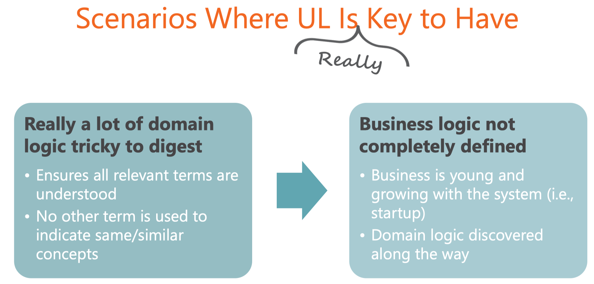

# Modern Software Architecture: Domain Models, CQRS, and Event Sourcing

Big Ball of Mud (BBM)

A system that's largely unstructured, padded with **hidden dependencies** between parts, with a lot of data and code duplication and an unclear identification of layers and concerns - a spaghetti code jungle.

Yummy

### Why DDD so intriguing

* Captured known elements of desgin process
* Organized them into a set of principles
* Made **domain modeling** the focus of development
* **Different** approach to building business logic

### DDD is Still about business Logic

1. Crunch knowledge about the domain
2. Recognize subdomains
3. Design a Rich domain model
4. Code by telling objects in the domain model what to do

### Supreme Goal

Tackling Complexity in the Heart of Software

* Wonderful idea
* Not a mere promise
* Not really hard to do right
* But just easier to do wrong

Domain Model remains a valid pattern to organize the business logic but other patterns can be used as well:	

* Object-oriented models
* Functional models
* CQRS
* Classic 3-tier
* 2-tier

## Ubiquitous language

“Use the model as the backbone of a language"

Eric Evans

* Discovering the ubiquitous language
* leads you to understand the business domain
* in order to design a model

PS: Any model that works, not necessarily oo model

Words and verbs that truly reflect the semantics of the business domain

:exclamation:**Different** concepts named differently.

:exclamation:**Matching** concepts named equally.

Missing a point is creating a bug.

## Bounded Context

Not duplication, it's clarification.

Forcing abstraction, thus having different functionalities full under the umbrella of the same class, that would likely be a violation of the **==single resoponsibility principle==**.

Context map is the diagram that provides a comprehensive view of the system being designed.

## Context map

**Upstream** context influences **Downstream** context.

U influnces D, but vice versa is not true.

Influences may take various forms. For sure it means the code in the upstream context is available as a reference to the downstream.

It also means the schedule of work in Upstream context cannot be changed and won't be changed from within the downstream. context.

但同时Upstream context背后的团队对变更请求的响应速度也可能不尽如人意。

### Relationships

* Conformist(墨守成规的人;循规蹈矩的人):
  * Downstream Context depends on upstream context.
  * No negotiation possible
* Customer/Supplier:
  * Customer context depends on supplier context
  * Chance to raise concerns and have them addressed in some ways.
* Partner:
  * Mutual dependency between the two contexts
* Shared Kernel
  * Shared Model that can't be changed without consulting teams in charge of contexts that depend on it.
* Anti-corruption layer
  * Additional layer giving the downstream context a fixed interface no matter what happens in the upstream context.

首先，它代表了一种快速获得业务领域全面视野的方法。

事件风暴的一个有价值的输出是在每个上下文中发现的有界上下文和聚合体的列表。

这里的聚合体本质上是处理命令和事件并控制持久性的软件组件。

事件风暴还有助于形成关于系统中用户类型的想法，以及哪里是用户体验特别重要的地方，甚至比实际执行的任务更重要。

在这种情况下，从用户体验角度出发的关键屏幕的草图可以添加到事件风暴的输出中。

事件暴击是一种令人惊喜的体验，有时甚至是一种震撼人心的体验，但它是一个新事物，所以你可能无法在外面找到详细的说明，至少没有你所期望的数量。

## Module 3 The DDD Layered Architecture

**Layer**

the term layer should be used to identify a logical container for a portion of code

**Tier**

The term tier indicate some physical containers for code. 

经典三层

物理上往往两层。

Domain-driven design brought to a slight variation of the classic 3-tier model. 

### Presentation Layer

Responsible for providing the **user interface** to accomplish any required tasks.

Responsible for providing an effective, smooth, and even pleasant **user experience**.

User experience is then defined as the experience the user goes through when she interacts with the application screens.

* Task-based nature
* Device-friendly
* User-friendly
* Faithful to real-world process

### Application Layer

### Business Logic

#### Business Rule

Statements that detail the implementation of a buisness process or describe a business policy to be taken into account.

#### Domain Model

领域模型模式的要点是 hitting an object-oriented model, 打击面向对象模型，其完全代表业务领域的行为和流程。在实现这个模式时，你有代表领域中entities的的类。

这些累暴露了属性和方法，而方法指的是entity(实体)的实际行为和业务规则。

聚合模型是领域驱动设计中的一个术语，指的是领域模型的核心对象。

领域模型中的类对持久化来讲应该是不可知的，并且与服务类配对。这些服务类只包含将类的实例物化到持久化层和从持久化层出来的逻辑。

领域模型的图形模式有两个元素，一个是聚合对象的模型，另一个是服务，用来执行跨越多个聚合对象或直接处理持久化的具体工作流。

### The Domain Layer

架构师将所有对用例不变的逻辑放置在领域层。

这意味着一个业务领域的软件模型，只是领域模型，以及相关的、互补的一套领域专用服务。

#### Models for the business domain

1. Object-oriented entity model
2. Functional model

#### Guidelines for classes in an entity model

An entity model has two main characteristics. 

Classes in first place follow strict **DDD conventions**, which means that for the most part these classes are expected not to have constructors, but factories, use value types over primitive types, and avoid private setters on properties. 

遵循DDD惯例，在大多数情况下，这些类预计不会有构造函数，而是有工厂。使用值类型（value type）而不是基本类型（primitive type）

> A value type is *usually* whatever type reside on the Stack. A primitive type is a type defined at the programming language level, often it is even a value type, directly supported by the compiler of the language. However this is a summary general answer because each programming language have different set of differences between the two types ...

In addition, these classes are expected to expose both **data and behavior**. 

#### Anaemic Model 贫血型模型

A anemic class just contains data 

the implementation of workflows and business rules is moved to external components, such as domain services.

* Plain **data containers**
* Behavior and rules **moved** to domain services

#### Domain Services

领域服务（Domain Services）是对领域模型的补充，包含那些不适合其他实体的领域逻辑。

这基本上涵盖了两种情况

## Module 4 The Domain Model Supporting Architecture

### Holistic Model for the Bussiness model

在领域驱动设计中，identification and mapping of bounded context 是最重要的。

最后，领域层是业务领域的API，你应该确保不可能对API进行错误的调用，从而破坏领域的完整性。

应该清楚的是，为了与业务保持持续一致，你应该将设计的重点放在行为上，而不是数据上。

要想让领域驱动的设计成功，你必须理解业务领域的工作原理，并用软件来渲染它。

这就是为什么要关注行为的原因。

### Aspects of a domain model

* Domain Model:
  * Modules
    * Entities
    * Values
* Domain Services:
  * Repositories:
    * Provide access to storage
  * Proxies:
    * Towards external web services

#### DDD value types

* Coolection of individual values
* Fully defined by its collection of attributes
* Immutable
* More precise and accurate than primitive types.

Domain logic goes in the domain layer, model or services.

Persistence goes in the infrastructure layer managed by domain services.

#### DDD Entities

* Need an identity
* Uniqueness is important to the specific object
* Typically made of data and behavior
* Contain domain logic, but not persistence logic

#### DDD Aggregates

* A few individual entities constantly used and referenced together
  * 一个Aggreagte是一个逻辑上相关的实体和值类型的集合。
* Cluster of associated objects treated as one for data changes.
  * 相关对象的集群，有数据变化时，将他们视为一个单一的实体
* Aggregate roots
  * 在集群中，有一个根对象（root object）是外界用来查询或命令的公共端点。对聚合体其他成员的访问。总是由聚合体的根来作中介。
* Preserve transactional integrity
  * 两个聚合体之间由某种一致性边界隔开，该边界提示如何将实体分组。
  * 聚合体的设计受到系统所需的业务交易的启发。
  * 这里的一致性指事务上的一致性。
  * 集合中的对象暴露了一个与业务流程完全一致的整体行为

Persistence vs. Domain Model

// TODO

### That Crazy Little thing Called Behavior

## CQRS

## Event Sourcing (事件溯源)

