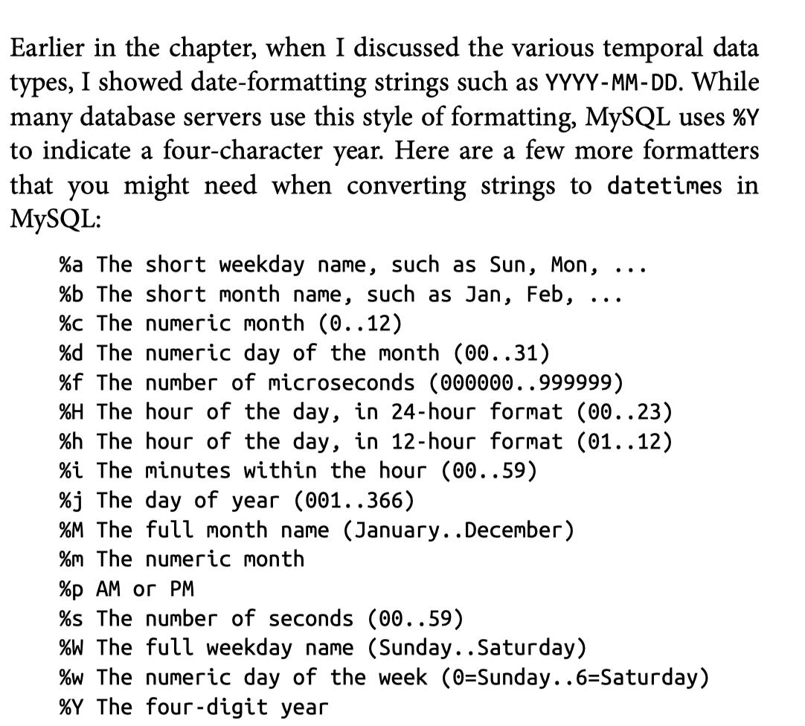

# Chapter 2 Creating and Populating a database


```sql
show databases;
use sakila;
```

## MySQL data types

### Character Data


如果你想存储最大长度为20个字符的字符串，你可以使用以下任一定义。

```sql
char(20) /*. fixed-length */
varchar(20) /* variable-length */
```

最大长度：

char 255 bytes

varchar 65535 bytes

text types(mediumtext and longtext): for emails, XML documents.

一般来说，当所有要存储在列中的字符串长度相同时，应该使用char类型。如 缩写

用varchar类型，当字符串长度改变时。

设定默认字符集

```sql
create database european_sales character set latin1;
```

| text type  | Maximum number of bytes |
| ---------- | ----------------------- |
| tinytext   | 255                     |
| text       | 65535                   |
| mediumtext | 16777215                |
| longtext   | 4,294,967,295           |
|            |                         |

使用text type时，注意以下几点：

* 如果加载到文本列中的数据超过了该类型的最大尺寸，数据将被截断。

- 当数据被加载到列中时，尾部的空格将不会被删除。

- 当使用文本列进行排序或分组时，只使用前1,024个字节，尽管必要时可增加这一限制。

- 不同的文本类型是MySQL独有的。SQL Server有一个用于大字符数据的单一文本类型，而DB2和Oracle则使用一种称为clob的数据类型，即Character Large Object (字符大对象)。

- 现在MySQL允许`varchar`列最多允许65,535个字节（在第4版中限制为255个字节），所以并没有特别需要使用tinytext或文本类型。

如果您是为自由形式的数据输入创建一列，例如笔记列来保存有关客户与公司客户服务部门互动的数据，那么varchar可能就足够了。但是，如果你要存储文档，你应该选择中文本或长文本类型。

```sql

```

### Numeric Data

| Type      | Signed range                    | Unsigned range     |
| --------- | ------------------------------- | ------------------ |
| tinyint   | −128 to 127                     | 0 to 255           |
| smallint  | −32,768 to 32,767               | 0 to 65,535        |
| mediumint | −8,388,608 to 8,388,607         | 0 to 16,777,215    |
| int       | −2,147,483,648 to 2,147,483,647 | 0 to 4,294,967,295 |
| bigint    | −2^63 to 2^63 - 1               | 0 to 2^64 - 1      |


floating-point types

| Type         | Numeric range                                                |
| ------------ | ------------------------------------------------------------ |
| float(p,s)   | −3.402823466E+38 to −1.175494351E-38 <br />and 1.175494351E-38 to 3.402823466E+38 |
| double(p, s) | −1.7976931348623157E+308 to −2.2250738585072014E-308 <br />and 2.2250738585072014E-308 to 1.7976931348623157E+308 |

precision

scale

For example, a column defined as `float(4,2)`

 will store a total of four digits, two to the left of the decimal and two to the right of the decimal.

```sql

```

### Temporal Data 

| Type      | Default format      | Allowable values                                             |
| --------- | ------------------- | ------------------------------------------------------------ |
| date      | YYYY-MM-DD          | 1000-01-01 to 9999-12-31                                     |
| datetime  | YYYY-MM-DD HH:MI:SS | 1000-01-01 00:00:00.000000<br />to 9999-12-31 23:59:59.999999 |
| timestamp | YYYY-MM-DD HH:MI:SS | 1970-01-01 00:00:00.000000<br />to 2038-01-18 22:14:07.999999 |
| year      | YYYY                | 1901 to 2155                                                 |
| time      | HHH:MI:SS           | −838:59:59.000000<br />to 838:59:59.000000                   |
|           |                     |                                                              |


* Columns to hold the expected future shipping date of a customer order and an employee’s birth date would use the **==date==** type, since it is unrealistic to schedule a future shipment down to the second and unnecessary to know at what time a person was born.
* 用来保存客户订单的预期未来发货日期和员工的出生日期的列将使用日期类型，因为将未来的发货安排到秒是不现实的，也没有必要知道一个人在什么时间出生。
* A column to hold information about when a customer order was actually shipped would use the **datetime** type, since it is important to track not only the date that the shipment occurred but the time as well.
* 一列用来保存客户订单实际发货时间的信息，将使用日期时间类型，因为不仅要跟踪发货发生的日期，还要跟踪时间，这一点很重要。
* A column that tracks when a user last modified a particular row in a table would use the **==timestamp==** type. The timestamp type holds the same information as the datetime type (year, month, day, hour, minute, second), but a timestamp column will automatically be populated with the current date/time by the MySQL server when a row is added to a table or when a row is later modified.
* A column holding just year data would use the **==year==** type.
* Columns that hold data regarding the length of time needed to complete a task would use the **==time==** type. For this type of data, it would be unnecessary and confusing to store a date component, since you are interested only in the number of hours/minutes/seconds needed to complete the task. This information could be derived using two datetime columns (one for the task start date/time and the other for the task completion date/time) and subtracting one from the other, but it is simpler to use a single time column.


## Table Creation

Normalization:

the process of ensuring that there are no duplicate (other than foreign keys) or compound columns in your database design.


```sql
CREATE TABLE person
	(person_id SMALLINT UNSIGNED,
   fname VARCHAR(20),
   lname VARCHAR(20),
   eye_color ENUM('BR', 'BL', 'GR'),
   birth_date DATE,
   street VARCHAR(30),
   city VARCHAR(20),
   state VARCHAR(20),
   country VARCHAR(20),
   postal_code VARCHAR(20),
   CONSTRAINT pk_person PRIMARY KEY (person_id)
	);
```


```bash
mysql> desc person;
```

Null is used for various cases where a value cannot be supplied, such as:

* Not applicable
* Unknown
* Empty set

create the favorite_food table:

```sql
CREATE TABLE favorite_food
	(person_id SMALLINT UNSIGNED,
   food VARCHAR(20),
   CONSTRAINT pk_favorite_food PRIMARY KEY (person_id, food),
   CONSTRAINT fk_fav_food_person_id FOREIGN KEY (person_id)
   REFERENCES person (person_id)
  );
```


你不需要为表中的每一列提供数据（除非表中的所有列都被定义为非空）。在某些情况下，那些没有包含在初始插入语句中的列将在以后通过更新语句获得一个值。在其他情况下，某列可能永远不会收到某行数据的值（例如客户订单在发货前被取消，从而使shipping_date列不适用）。


#### Generating numeric key data

two options:

1. Look at the largest value currently in the table and add one.
2. Let the database server provide the value for you.

第一种不好。

用第二种，添加AUTO_INCREMENT

```sql
set foreign_key_checks=0;
ALTER TABLE person
	MODIFY person_id SMALLINT UNSIGNED AUTO_INCREMENT;
set foreign_key_checks=1;
```


#### insert statement

```sql
INSERT INTO person
	(fname, lname, eye_color, birth_date)
	VALUES ('William', 'Turner', 'BR', '1972-05-27');
```

查看

```sql
SELECT person_id, fname, lname, birth_date FROM person;
```

* 没有为任何地址栏提供数值。这没有问题，因为这些栏目允许有空值。

* birth_date列提供的值是一个字符串。只要符合表2-4所示的所需格式，MySQL就会为你把字符串转换为日期。
* 列名和提供的值在数量和类型上必须一致。如果您命名了7个列，但只提供了6个值，或者您提供的值不能转换为相应列的适当数据类型，您将收到一个错误。

**往favorite_food表中插入数据**

```sql
INSERT INTO favorite_food (person_id, food) VALUES (1, 'pizza');
INSERT INTO favorite_food (person_id, food) VALUES (1, 'cookies');
INSERT INTO favorite_food (person_id, food) VALUES (1, 'nachos');
```


```sql
SELECT food FROM favorite_food WHERE person_id = 1 ORDER BY food;
```


```sql
INSERT INTO person 
	(person_id, fname, lname, eye_color, birth_date, street, city, state, country, postal_code)
	VALUES (null, 'Susan', 'Smith', 'BL', 'DEC-22-1984', '23 Maple St.', 'Arlington', 'VA', 'USA', '20220');
```


```sql
SELECT person_id, fname, lname, birth_date FROM person;
```


#### Updating Data

```sql
UPDATE person SET street = '1225 Tremont St',
									city = 'Boston',
									state = 'MA',
									country = 'USA',
									postal_code = '02138'
							WHERE person_id = 1;
```


**uses the `str_to_date` function to specify which format string to use**

```sql
UPDATE person
SET birth_date = str_to_date('DEC-21-1980', '%b-%d-%Y')
WHERE person_id = 1;

```

#### date format



