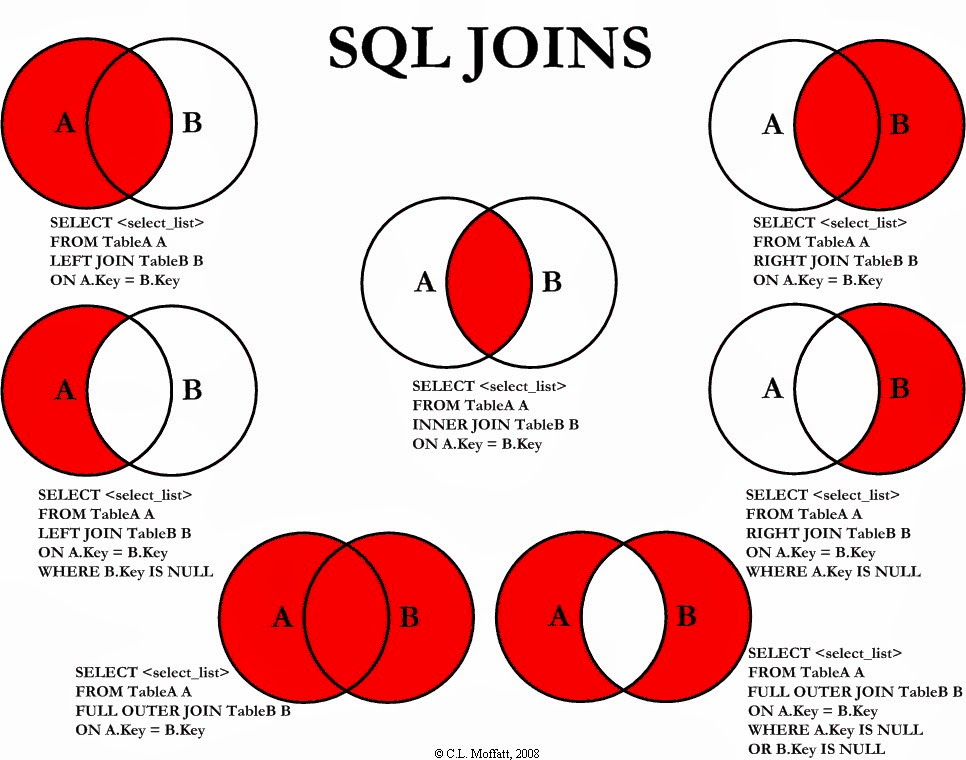

## What is join?


A foreign key constraint can optionally be created to verify that the values in one table exist in another table.

```sql
SELECT c.first_name, c.last_name, a.address
FROM customer c JOIN address a;
```



### Inner Joins


```sql
SELECT c.first_name, c.last_name, a.address
FROM customer c INNER JOIN address a
ON c.address_id = a.address_id;
```

* If you do not specify the type of join, then the server will do an **inner join** by default.


If the names of the columns used to join the two tables are identical, which is true in the previous query, you can use the `using` subclause instead of the `on` subclause

```sql
SELECT c.first_name, c.last_name, a.address
FROM customer c INNER JOIN address a
USING (address_id);
```

:warning: ​Prefer to use the `on` subclause to avoid confusion.

:warning: Use SQL92 syntax

clear and portable

```sql
SELECT c.first_name, c.last_name, a.address
FROM customer c INNER JOIN address a
ON c.address_id = a.address_id
WHERE a.postal_code = 52137;
```

## Join Three or More Tables


```sql
SELECT c.first_name, c.last_name, a.address, ct.city
FROM customer c
	INNER JOIN address a
	ON c.address_id = a.address_id
	INNER JOIN city ct
	ON a.city_id = ct.city_id;
```


```sql

```


```sql

```


```sql

```


```sql

```


```sql

```


```sql

```


```sql

```


```sql

```


```sql

```


```sql

```


```sql

```


```sql

```


```sql

```


```sql

```


```sql

```


```sql

```

