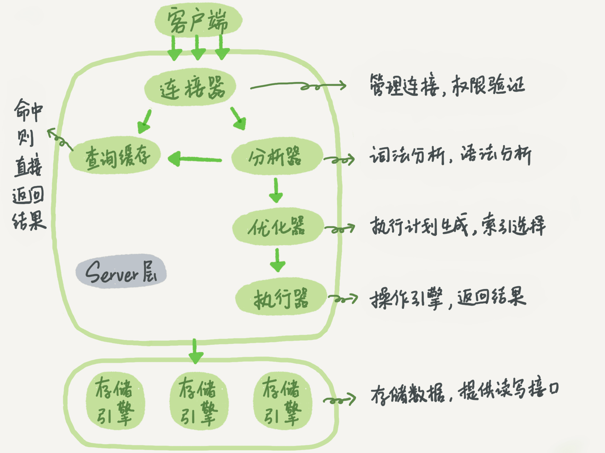
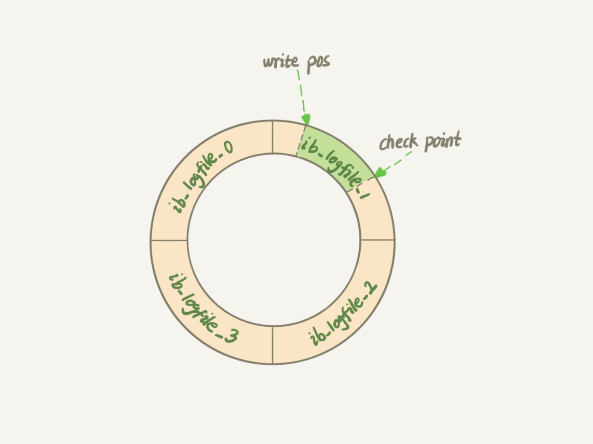

`mysql -S /tmp/mysql_3305.sock -uroot -p`


```sql
mysql> create table T(ID int primary key, c int);
```

如果要将 ID=2 这一行的值加 1，SQL 语句就会这么写：

```sql
mysql> update T set c=c+1 where ID=2;
```


分析器： 分析做什么

优化器：怎么做

执行器：做



在一个表上有**更新**的时候，跟这个表有关的**查询缓存**会失效，所以这条语句就会把表 T 上所有缓存结果都**清空**。这也就是我们一般**不建议**使用查询缓存的原因。

在MySQL 8.0中查询缓存被删除。


两个重要的日志模块：

1. redo log （重做日志）
2. binlog（归档日志）


## 日志模块redo log


### WAL Write-Ahead Logging


先写日志，再写磁盘


当有一条记录需要**更新**的时候，InnoDB 引擎就会先把记录写到 `redo log`里面，并更新内存，这个时候更新就算完成了。同时，InnoDB 引擎会在适当的时候，将这个操作记录更新到磁盘里面，而这个更新往往是在系统比较空闲的时候做


redo log 是固定大小的。




`write_pos` 当前记录的位置，

`checkpoint`是当前要擦除的位置


`write pos` 和 `checkpoint` 之间的是“粉板”上还空着的部分，可以用来记录新的操作。如果 `write pos` 追上 `checkpoint`，表示“粉板”满了，这时候不能再执行新的更新，得停下来先擦掉一些记录，把 `checkpoint` 推进一下。


有了redo log，InnoDB就可以保证即使数据库发生异常重启，之前提交的记录都不会丢失，这个能力成为**crash-safe**


## binlog

redo log是InnoDB特有的日志

Server层也有自己的日志，称为binlog（归档日志）


### 两种日志的不同：


1. redo log 是 InnoDB 引擎特有的；binlog 是 MySQL 的 Server 层实现的，所有引擎都可以使用。
2. redo log是`物理日志`，记录的是在某个**数据页**上做了什么修改，binlog是`逻辑日志`，记录的是这个语句的`原始逻辑`。比如“给 ID=2 这一行的 c 字段加 1 ”。
3. redo log 是**循环**写的，空间固定会用完；binlog 是可以追加写入的。“追加写”是指 binlog 文件写到一定大小后会切换到下一个，**并不会覆盖以前的日志**。


```sql
mysql> update T set c=c+1 where ID=2;
```

执行器和InnoDB引擎在执行这个简单的**update**语句是的内部流程。

1. **执行器**先找引擎取 ID=2 这一行。ID 是主键，引擎直接用**树搜索**（？）找到这一行。如果 ID=2 这一行所在的数据页本来就在内存中，就直接返回给执行器；否则，需要先从磁盘读入内存，然后再返回。
2. 执行器拿到引擎给的行数据，把这个值加上 1，比如原来是 N，现在就是 N+1，得到新的一行数据，再调用引擎接口写入这行新数据。
3. 引擎将这行新数据更新到内存中，同时将这个更新操作记录到 redo log 里面，此时 redo log 处于 prepare 状态。然后告知执行器执行完成了，随时可以提交事务。
   1. 这里更新到内存中是指更新内存中这条数据所在的数据页中的数据
4. **执行器**生成这个操作的 binlog，并把 binlog 写入磁盘。
5. **执行器**调用引擎的**提交事务**接口，引擎把刚刚写入的 redo log 改成**提交**（commit）状态，更新完成。


数据恢复：


binlog（归档日志） --> 恢复数据： 从最近一次全量备份的时间点开始；到删库跑路的时间点结束


> 1.首先找个临时库,完全空的 
>
> 2.找最近的一份全量备份,全量备份的时间点比如为2020-07-03 00:00:00 
>
> 3.从2020-07-03 00:00:00开始找出到误删前的增量binlog日志,并执行到临时库 这样就保证了临时库和误删前的库一致了


**如果不使用“两阶段提交”**，那么数据库的状态就有可能和他的日志恢复出来的库的状态**不一致**


> 1. Prepare阶段 2. 写binlog 3. 提交事务 commit
>
> 当在2之前崩溃时：
>
> 重启恢复：后发现没有commit，回滚。备份恢复：没有binlog
>
> 当在3之前崩溃：
>
> 重启恢复：虽没有commit，但满足prepare和binlog完整，所以重启后会自动commit。备份有binlog，一致

binlog只记录逻辑操作，并无操作状态，即无法确定该操作是否完成。

**逻辑操作**指“做了什么事儿，并无记录有没有做成功”

**物理操作**指“在哪做了这些事，有没有成功”

