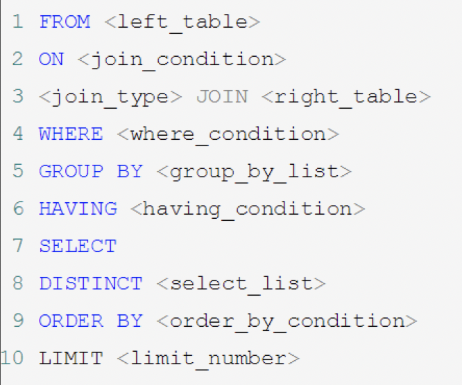

```
mysql -S /tmp/mysql_3305.sock -uroot -p
```


# 初始设置


mysql架构介绍

索引优化分析

查询截取分析

#### 检查当前系统是否安装过mysql

```bash
grep mysql
grep mariadb
```

如果有

```bash
rpm -e --nodeps mariadb-libs
```


#### 检查版本

```bash
mysqladmin --version
```


#### mysql服务初始化

```bash
mysqld --initialize --user=mysql
```

查看密码

cat /var/log/mysqld.log

启动: systemctl start mysqld.service

关闭: systemctl stop mysqld.service


#### 中文乱码问题

第一步, 修改配置文件

vi m /etc/my.cnf

第二步, 重新启动mysql

第三步, 如果已经生成库表, 

修改数据库的字符集, `alter database mydb character set 'utf8'`

修改数据表的字符集. `alter table mytbl convert to character set 'utf8'`


#### 看用户表

select host, user,authentication_string, Select_priv from user;

授权限

grant all privileges on *.* to xuzheng@localhost


#### 注意: Group by使用原则

`show variables like 'sql_mode';  `


:heavy_exclamation_mark:  group by使用原则：select 后面只能放 函数 和group by后的字段 

下面这种是错的.

```mysql
SELECT NAME, dept, MAX(age) FROM mytbl2 GROUP BY dept;
```

5.5 校验不严格. NAME匹配分组里的第一个

正确的:

```mysql
SELECT m.NAME, m.age, m.dept FROM mytbl2 m INNER JOIN (
	SELECT dept, MAX(age) maxage FROM mytbl2 GROUP BY dept
) ab ON ab.dept=m.dept and m.age=ab.maxage
```


# MySQL逻辑架构

## 总体概览

Cache 读信息用的

Buffers 写信息用的.


### 利用show profile查看sql的执行周期

1. 修改配置文件 /etc/my.cnf 新增一行`query_cache_type=1`
2. show variables like '%profileing%';
3. set profiling = 1;

### SQL 执行顺序

手写:

```sql
SELECT DISTINCT
	<select_list>
FROM
	<left_table> <join_type>
JOIN <right_table> ON <join_condition>
WHERE
	<where_condition>
GROUP BY
	<group_by_list>
HAVING
	<having_condition>
ORDER BY
	<order_by_condition>
LIMIT < limit_number >
```

机读:




1、FROM子句组装数据
2、WHERE子句进行条件筛选
3、GROUP BY分组
4、使用聚集函数进行计算；
5、HAVING筛选分组；
6、计算所有的表达式；
7、SELECT 的字段；
8、ORDER BY排序
9、LIMIT筛选
所以中间有两个过程是需要计算的：聚集函数 和 表达式。

## MySQL的查询流程

首先，mysql的查询流程大致是： 

- mysql客户端通过协议与mysql服务器建连接，发送查询语句，先检查查询缓存，如果命中，直接返回结果，否则进行语句解析,也就是说，在解析查询之前，服务器会先访问查询缓存(query cache)——它存储SELECT语句以及相应的查询结果集。如果某个查询结果已经位于缓存中，服务器就不会再对查询进行解析、优化、以及执行。它仅仅将缓存中的结果返回给用户即可，这将大大提高系统的性能。 

 

- 语法解析器和预处理：首先mysql通过关键字将SQL语句进行解析，并生成一颗对应的“解析树”。mysql解析器将使用mysql语法规则验证和解析查询；预处理器则根据一些mysql规则进一步检查解析数是否合法。 

 

- 查询优化器当解析树被认为是合法的了，并且由优化器将其转化成执行计划。一条查询可以有很多种执行方式，最后都返回相同的结果。优化器的作用就是找到这其中最好的执行计划。。 

 

- 然后，mysql默认使用的BTREE索引，并且一个大致方向是:无论怎么折腾sql，至少在目前来说，mysql最多只用到表中的一个索引。 


## 存储引擎

查看mysql提供什么存储引擎: **show engines;**

查看当前存储引擎: **show variables like '%storage_engine%';**

// anki todo

MyISAM 和 InnoDB

表里一般不设外键. 表之间关系用程序逻辑去判断.

| 对比   | MyISAM                                                       | InnoDB                                                       |
| ------ | ------------------------------------------------------------ | ------------------------------------------------------------ |
| 外键   | 不支持                                                       | 支持                                                         |
| 事务   | 不支持                                                       | 支持                                                         |
| 行表锁 | 表锁, 即使操作一条记录也会锁住整个表, <br />不适合高并发操作 | 行锁, 操作时只锁某一行, 不对其它行有影响, <br />适合高并发的操作. |
| 缓存   | 只缓存索引, 不缓存真实的数据                                 | 不仅缓存索引还要缓存真实数据, 对内存要求较高.<br />而且内存大小对性能有决定性作用 |
|        |                                                              |                                                              |


