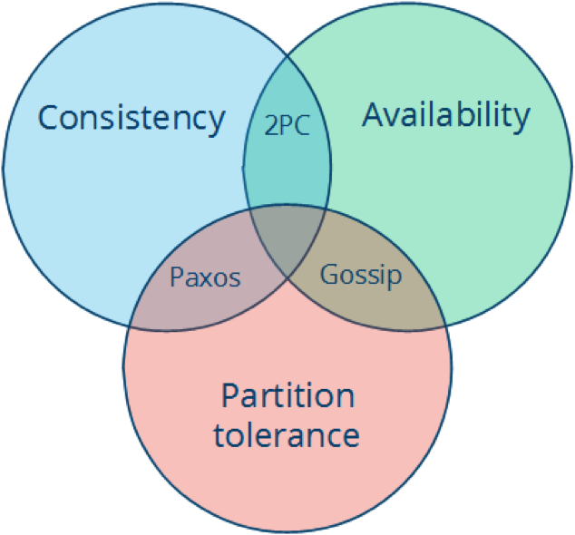

CAP 定理 [wiki](https://en.wikipedia.org/wiki/CAP_theorem)

一致性（Consistency）：每次读取要么获得最近写入的数据，要么获得一个错误。

可用性（Availability）：每次请求都能获得一个（非错误）响应，但不保证返回的是最新写入的数据。

分区容忍（Partition tolerance）：尽管任意数量的消息被节点间的网络丢失（或延迟），系统仍继续运行。

门户网站，因为机器数量庞大，部署节点分散，网络故障时常态，可用性是必须保证的，所以只有舍弃一致性来保证 AP， 可用性和分区容忍。

对于银行等，需要确保一致性的场景，通常会权衡CA和CP模型。

CA模型网络故障时完全不可用

CP模型具备部分可用性。

* CA(consistency + availability), 这样的系统**关注一致性**和**可用性**。它需要非常严格的全体一致性的协议，比如两阶段提交（2PC）。CA系统不能容忍网络错误或节点错误，一旦出现这样的问题，整个系统就会拒绝写请求，因为它并不知道对面的那个节点是挂掉了，还是只是网络问题。唯一安全的做法就是把自己变成只读的。
* CP (consistency + partition tolerance)，这样的系统关注**一致性**和**分区容忍性**。它关注的是系统里大多数人的一致性协议，比如：Paxos 算法（Quorum 类的算法）。这样的系统只需要保证大多数结点数据一致，而少数的结点会在没有同步到最新版本的数据时变成不可用的状态。这样能够提供一部分的可用性。
* AP (availability + partition tolerance)，这样的系统关心**可用性**和**分区容忍性**。因此，这样的系统不能达成一致性，需要给出数据冲突，给出数据冲突就需要维护数据版本。Dynamo 就是这样的系统。

Fallacies of distributed computing

1. The [network](https://en.wikipedia.org/wiki/Computer_network) is reliable;
2. [Latency](https://en.wikipedia.org/wiki/Latency_(engineering)) is zero;
3. [Bandwidth](https://en.wikipedia.org/wiki/Throughput) is infinite;
4. The network is [secure](https://en.wikipedia.org/wiki/Computer_security);
5. [Topology](https://en.wikipedia.org/wiki/Network_topology) doesn't change;
6. There is one [administrator](https://en.wikipedia.org/wiki/Network_administrator);
7. Transport cost is zero;
8. The network is homogeneous.

基本上，每个人刚开始建立一个分布式系统时，都做了以下 8 条假定。随着时间的推移，每一条都会被证明是错误的，也都会导致严重的问题，以及痛苦的学习体验。

1. 网络是稳定的。
2. 网络传输的延迟是零。
3. 网络的带宽是无穷大。
4. 网络是安全的。
5. 网络的拓扑不会改变。
6. 只有一个系统管理员。
7. 传输数据的成本为零。
8. 整个网络是同构的。

:exclamation: 为什么我们要深刻地认识这 8 个错误？是因为，这要我们清楚地认识到——在分布式系统中错误是不可能避免的，我们能做的不是避免错误，而是要把错误的处理当成功能写在代码中。

## 经典资料

[awesome distributed systems](https://github.com/theanalyst/awesome-distributed-systems/blob/master/README.md)

[Distributed system theory for the distributed systems engineer](https://www.the-paper-trail.org/blog/distributed-systems-theory-for-the-distributed-systems-engineer/)   [[local](./DistributedSystemTheoryForTheDistributedSystemsEngineer.md)]

[Distributed Systems for Fun and Profit](http://book.mixu.net/distsys/)

[Notes on Distributed Systems for Young Bloods](https://www.somethingsimilar.com/2013/01/14/notes-on-distributed-systems-for-young-bloods/)  [[local](./Notes on Distributed Systems for Young Bloods.md)]

[可扩展的Web架构和分布式系统](http://nettee.github.io/posts/2016/Scalable-Web-Architecture-and-Distributed-Systems/)

[Scalable Web Architecture and Distributed Systems](http://www.aosabook.org/en/distsys.html)

Principles of Distributed Computing

本书覆盖的算法有：

顶点涂色算法（可用于解决互相冲突的任务分配问题）

分布式的树算法（广播算法、会聚算法、广度优先搜索树算法、最小生成树算法）

容错以及 Paxos（Paxos 是最经典的共识算法之一）

拜占庭协议（节点可能没有完全宕机，而是输出错误的信息）

全互联网络（服务器两两互联的情况下算法的复杂度）

多核计算的工程实践（事务性存储、资源争用管理）

主导集（又一个用随机化算法打破对称性的例子；这些算法可以用于路由器建立路由）……