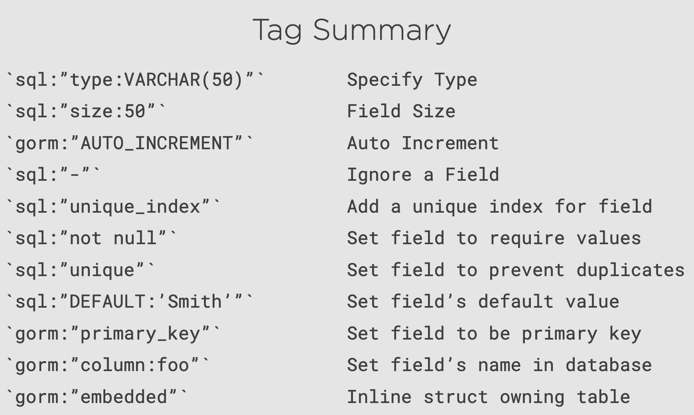

```go
package main

import (
	"fmt"

	"github.com/jinzhu/gorm"
	_ "github.com/lib/pq"
)

func main() {
	db, err := gorm.Open("postgres", "user=xuzheng password=gorm dbname=gorm sslmode=disable")
	if err != nil {
		panic(err.Error())
	}
	defer db.Close()

	dbase := db.DB()
	defer dbase.Close()

	// err = dbase.Ping()
	// if err != nil {
	// 	panic(err.Error())
	// }
	// println("Connection to database established")
	db.DropTable(&User{})
	db.CreateTable(&User{})

	for _, user := range users {
		db.Create(&user)
	}

	u := User{}
	db.Last(&u)

	fmt.Println(u)
}

// User .
type User struct {
	ID        uint
	Username  string
	FirstName string
	LastName  string
}

var users []User = []User{
	User{Username: "adent", FirstName: "Arthur", LastName: "Dent"},
	User{Username: "fprefect", FirstName: "Ford", LastName: "Prefect"},
	User{Username: "tmacmillan", FirstName: "Tricia", LastName: "MacMillan"},
	User{Username: "mrobot", FirstName: "Marvin", LastName: "Robot"},
}
```


使用单数table名字

db.SingularTable(true)


在Go里设置table name

```go
func (u User) TableName() string {
  return "stakeholders"
}
```

如果想要更改type

```go
// User .
type User struct {
	UserID    int    `gorm:"primary_key"`
	Username  string `sql:"type:VARCHAR(15);not null"`
	FirstName string `sql:"size:100; not null" gorm:"column:FirstName"`
	LastName  string `sql:"unique;unique_index;not null; DEFAULT:'Smith'" gorm:"column:LastName"`
	Count     int    `gorm:"AUTO_INCREMENT"`
	TempField bool   `sql:"-"`
}
```




