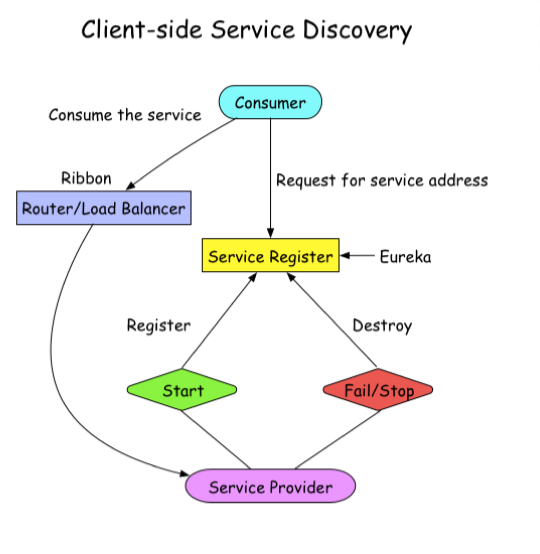

问题:

nginx成为中心热点.


网关一般对外提供的是RPC还是Http

平滑退出不能强杀 

kill pid

1. 收到一个kill信号
2. 向*服务发现*发送一个注销请求, 把自己注销
3. 把自己的HealthCheck标记为失败
4. gRPC的shutdown接口


BFF 书品组装


本地事物+消息队列


熟读官方文档.

### What is LVS

4层负载均衡, 前面提供一个虚拟IP, 后面其实有nginx提供的四个ip

### What is etcd?

**etcd** is an open source distributed key-value store used to hold and manage the critical information that distributed systems need to keep running. 

Most notably, it manages the configuration data, state data, and metadata for Kubernetes, the popular container orchestraition platform

## What is an RPC

* Remote procedure call
* In your **CLIENT** code, it looks like you're just calling a function directly on the **SERVER**
* At the core of gRPC, you need to define the messages and services using **Protocol Buffers**


## What are Protocol Buffers

Protocol buffers are Google's language-neutral, platform-neutral, extensible mechanism **for serializing structured data** – think XML, but smaller, faster, and simpler. You define how you want your data to be structured once, then you can use special generated source code to easily write and read your structured data to and from a variety of data streams and using a variety of languages.

* binary format

* Separate Context and Data

```java
message Person {
  string first_name = 1;
  string last_name = 2;
}
// 125Peter227Davison
```


1 - first_name

2 - length based

5 - length

Peter data


## 什么是服务发现(service discovery)

***Service Discovery*** is how applications and (micro)services ***locate*** each other on a network.

Service discovery implementations include both:

1. a central server (or servers) that maintain a global view of addresses and
2. clients that connect to the central server to update and retrieve addresses

[source](https://www.getambassador.io/resources/service-discovery-microservices/)

### 服务发现 - 客户端发现

一个服务实例被启动时, 它的网络地址会被写到注册表上;

当服务实例终止时, 再从注册表中删除;

这个服务实例的注册表通过心跳机制动态刷新;

客户端使用一个负载均衡算法, 去选择一个可用的服务实例

* 好处: 直连, 比服务端服务发现少一次网络跳转, Consumer需要内置特定的服务发现客户端和发现逻辑

  



### 服务发现 - 服务端发现(看上去美好, 其实不行)

客户端通过负载均衡器向一个服务器发送请求, 这个负载均衡器会查询服务注册表, 并将请求路由到可用的服务实例上. 

服务实例在服务注册表上被注册和注销 (Consul Template + Nginx, kubernetes + etcd)

### Service Mesh

个别大公司用Service Mesh

开销大, 

### 服务发现 (nqcos, eureka)

实际场景是海量服务发现和注册, 服务状态可以弱一致性, 需要的是AP系统 (不是cp就是ap)

AP: Always available even in a partition, but may be inconsistent.


长轮询: 请求, 没数据更新, 就先挂起. 30秒后再来一遍


## gRPC

### 什么是gRPC

> A high performance, open source universal RPC framework
>
> build on top of HTTP/2, low latency, supports streaming, language independent, and makes it super easy to plug in authentication, load balancing, logging and monitoring

* 轻量级, 高性能,: 序列化支持PB(Protocol Buffer) 和JSON, PB是一种语言无关的高性能序列化框架.
* 可插拔
* IDL: 基于文件定义服务, 通过proto3工具生成指定语言的数据结构、服务端接口以及客户端Stub
* 移动端: 基于标准的HTTP2设计, 支持双向流、消息头压缩、单TCP的多路复用、服务端推送等特性, 这些特性使得gRPC在移动端设备上更加省电和节省网络流量
* 服务而非对象, 消息而非引用: 促进微服务的系统间粗颗粒度的消息交互设计理念
* 负载无关: 不同的服务需要使用不同的消息类型的编码, 例如 pb, JSON, XML


#### Health check

主动健康检查,

​	

## 多集群

统一为一套逻辑集群(物理上多套资源池), 即gRPC客户端默认忽略服务发现中的Cluster信息, 按照全部节点, 全部连接.找到一种算法从全集群中选取一批节点(子集), 利用划分子集限制链接池大小.

否则:

* 长链接导致的内存和CPU开销, HealthCheck可以高达30%.
* 短链接极大的资源成本和延迟

合适的子集大小和选择算法

* 通常20-100个后端, 部分场景需要大子集, 比如大批量读写操作.
* 后端平均分给客户端
* 客户端重启, 保持重新均衡, 同时对后端重启保持透明, 同时连接的变动最小.


```python
def Subset(backends, client_id, subset_size):
  subset_count len(backends) / subset_size
  # Group clients into rounds; each round uses the same shuffled list:
  round = client_id / subset_count
  random.seed(round)
  random.shuffle(backends)
  random.shuffle(backends)
  
  # The subset id correspending to the current client:
  subset_id = client_id % subset_count
  
  start = subset_id *subset_size
  return backends[start: start+subset_size]
```


## 多租户

解决RPC路由

### 什么是多租户?

多租户(multi tenant) 是==**一种单个软件实例可以为多个不同用户提供服务**==的软件架构. SaaS(软件即服务)就是一种多租户架构. 

在云计算中, 也可以指共享主机, 其服务器资源在不同客户之间进行分配.


