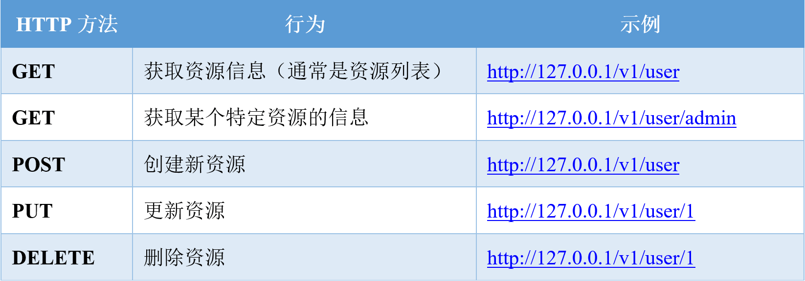

想用go开发微服务的话推荐框架：

* go-micro
* go-kit
* kite
* go-chassis

微服务间通信用`RPC` grpc+protobuf

REST适合对外开放的API

Go API 开发中常用的组合是

* gRPC + Protobuf
* REST + JSON

### REST 简介

`REST` 代表表现层状态转移（REpresentational State Transfer），

`REST `是一种架构风格，指的是一组架构约束条件和原则。

满足这些约束条件和原则的应用程序或设计就是RESTful

* REST规范把所有内容都视为资源.
* REST 架构对资源的操作包括获取、创建、修改和删除
* 资源的操作正好对应 HTTP 协议提供的 `GET`、`POST`、`PUT` 和 `DELETE` 方法

### RPC 简介

Remote Procedure Call (远程过程调用)，是一种进程间通信方式。它允许程序调用另一个地址空间（通常是共享网络的另一台机器上）的过程或函数，而不用程序员显式编码这个远程调用的细节。即程序员无论是调用本地的还是远程的，本质上编写的调用代码基本相同。

#### RPC结构：

1. User
2. User-stub
3. RPCRuntime
4. Server-stub
5. Server

 `User` 就是 `client` 端，当 `User` 想发起一个远程调用时，它实际是通过本地调用 `User-stub`。`User-stub` 负责将调用的**接口**、**方法**和**参数**通过约定的协议规范进行编码并通过本地的 `RPCRuntime` 实例传输到远端的实例。远端 RPCRuntime 实例收到请求后交给 Server-stub 进行解码后发起本地端调用，调用结果再返回给 User 端。

### REST vs RPC

RPC 相比REST的优点：

1. RPC+Protobuf采用的是TCP做传输协议，REST直接使用HTTP做应用层协议，这种区别导致REST在调用性能上会比RPC+Protobuf低
2. RPC 不像 REST 那样，每一个操作都要抽象成对资源的增删改查，在实际开发中，有很多操作很难抽象成资源，比如登录操作。所以在实际开发中并不能严格按照 REST 规范来写 API，RPC 就不存在这个问题
3. RPC 屏蔽网络细节、易用，和本地调用类似

> 这里的易用指的是调用方式上的易用性。在做 RPC 开发时，开发过程很烦琐，需要先写一个 DSL 描述文件，然后用代码生成器生成各种语言代码，当描述文件有更改时，必须重新定义和编译，维护性差。

REST相比RPC的优点：

1. 轻量级，简单易用，维护性和扩展性都比较好
2. REST 相对更规范，更标准，更通用，无论哪种语言都支持 HTTP 协议，可以对接外部很多系统，只要满足 HTTP 调用即可，更适合对外，RPC 会有语言限制，不同语言的 RPC 调用起来很麻烦
3. JSON 格式可读性更强，开发调试都很方便
4. 在开发过程中，如果严格按照 REST 规范来写 API，API 看起来更清晰，更容易被大家理解

内部系统之间

