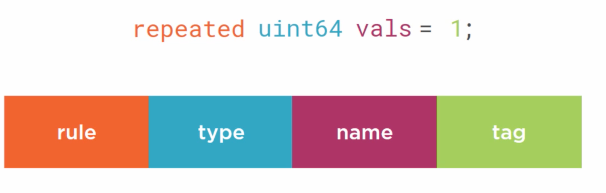

```
message Persone {
 string first_name = 1;
 string last_name = 2;
}

125Peter227Davison

{field_number} + {field_type} + {data}

1			first_name
2			length based
5			length
Peter	data


```


## 序列化

serialization，marshalling 的过程是指将数据结构或者对象的状态转换成可以存储（比如文件、内存）或者传输的格式（比如网络）。

反向操作就是反序列化过程（deserialization, unmarshalling）


## Defining Messages


Field Elements




repeated array

### Field Type

#### Scalar

1. string
2. bool
3. bytes
   1. image
4. float
5. double
6. int32 / int64
7. uint32/ uint64
8. sint32/sint64
9. fixed32/fixed64
10. sfixed32/sfixed64
11. 

#### Enumeration

```protobuf
message Customer {
	enum Type {
		REGULAR = 0;
		MEMBER = 1;
		SPONSOR = 2;
	}
	Type type = 1;
	string first_name = 1;
}
```


#### Message Type


### Field Name

lower case

user underscore (_) as separator

converted to correct style for each language

### Field Tag

* unique
* integer, [1, 2^29 - 1]
* reserved, [19000, 19999]
  * avoid these
* smaller values are more efficient

### Default values

proto3 Always the zero value


## Nested Message Types

```protobuf
message Cutomer {
	message Address {
	
	}
	// var address = new Customer.Address()
	repeated Address addresses = 1;
}
```


