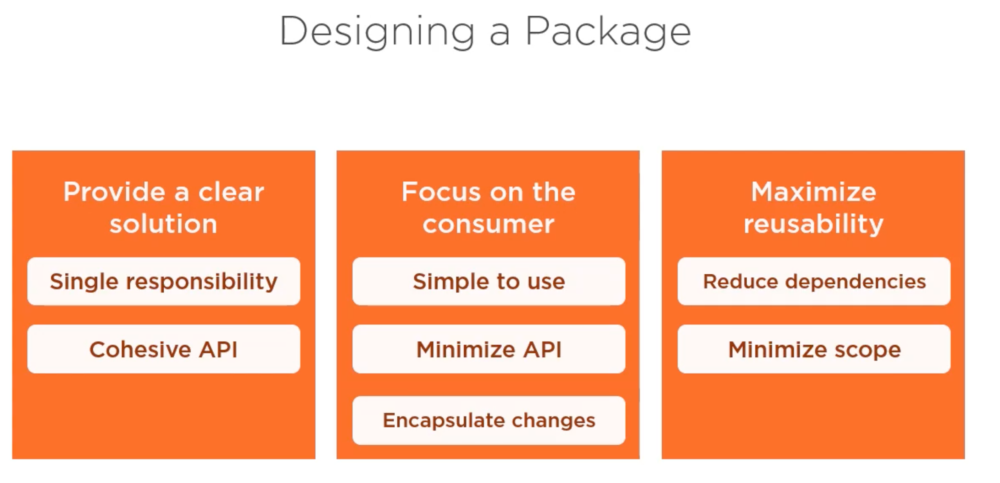
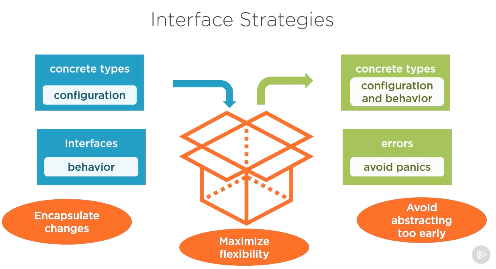

# Packages

## Overview

### Library Packages

* Consumed by another package
* Name must match directory name
* Should provide **a focused set** of related features
*  

### Main Packages

* App entry point
* Contains a main() function
* can be in any directory
* Focus on app setup and initialization

## Working with Package

### Naming Packages

* Short and clear
* Lowercase
* No underscores
* Prefer nouns subjects not actions
* Abbreviate judiciously

### LIfecycle of a Package

* Import required packages
* Set variables to initial values
* Call init() function

You are not allowed to call `init` function explicitly. It handled as the package is initialized. 

## Preparing a package to be Used

member visibility

documenting packages

designing a package

Interface strategies

How to return the result

### Member visibility 

#### Public Scope

​	Capitalize member

​	Available to all consumers

#### Package Scope

​	Lowercase member

​	only available within package

#### Internal Package

* Can use public and package level members
* Scoped to parent package and its descendants

# How to structure your Go app （DDD）

* Two top-level directories:
  * cmd (for your binaries) and pkg (for your packages)
* Group by context, not generic functionality
* Dependencies: own packages
* Mocks: shared subpackage
* All other project files (fixtures, resources, docks, Docker,...): root dir of your prj
* Main package initilaises and ties everything together
* Avoid global scope and init()

https://github.com/katzien/go-structure-examples

## Conclusion

* No single right answer
* "Be like water"
* "As simple as possible, but no simpler"

If you know you are writing a single app, don't bother looking into DDD.

If you're approaching a big problem then maybe be prepared to use a more complicated structure.

简单的问题不要复杂化， 复杂的问题去找更好的解决办法

* Maintain consisitency

* Expreiment

### credit

Peter Bourgon

https://peter.bourgon.org/blog/2017/06/09/theory-of-modern-go.html

Ben Johnson

https://medium.com/@benbjohnson/standard-package-layout-7cdbc8391fc1

Marcus Olsson

