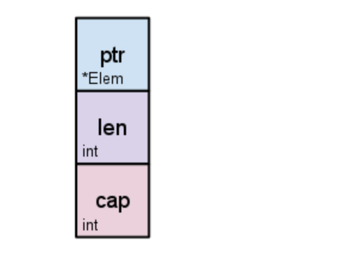
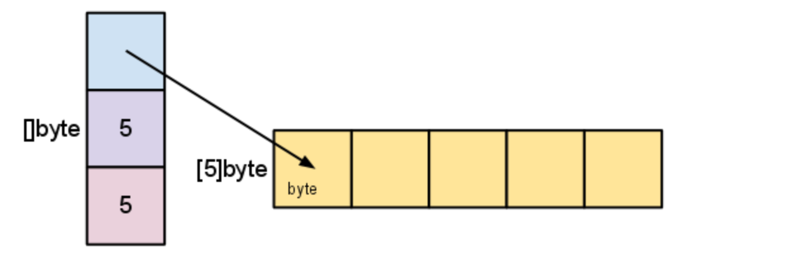
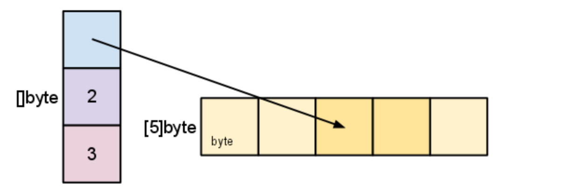
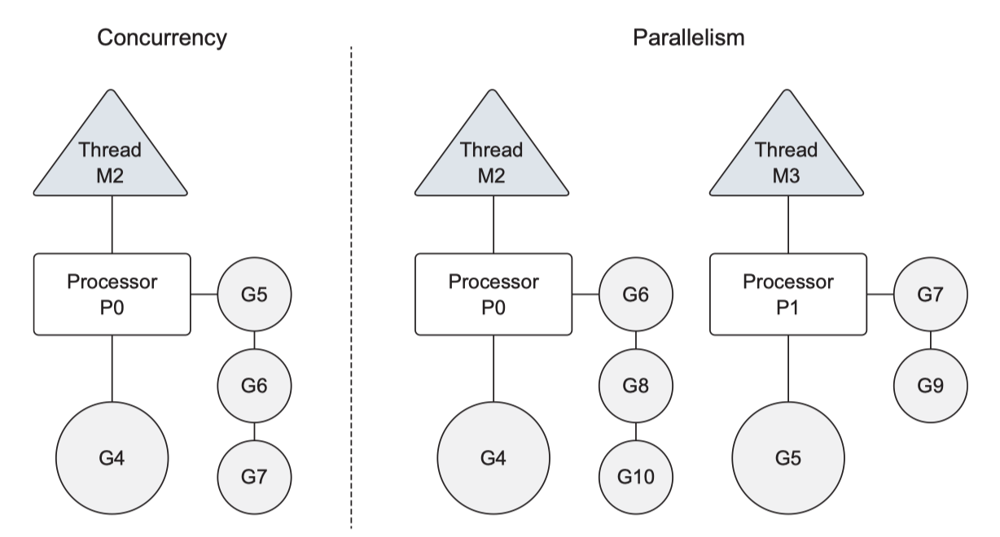

在内存中, 一个字符串存储为一个字节(byte)序列.

UTF-8 编码形式.


字符串和数字互转

```go
// int to string
i2s := strconv.Itoa(i)
s2i, err := strconv.Atoi(i2s)
fmt.Println(i2s, s2i, err)
```


## slice

```go
var slice = []string{"a", "b", "c", "d"}
// 追加一个元素
slice2:=append(slice, "e")
// 追加多个元素
slice2 := append(slice2, "f", "g")
// 追加一个切片
slice2 := append(slice2, slice)
```


## String and []byte


```go
s:="Hello飞雪无情"

bs:=[]byte(s)

fmt.Println(bs)

fmt.Println(s[0],s[1],s[15])
fmt.Println(len(s)) // 17
// 一个汉子对应三个字节

fmt.Println(utf8.RuneCountInString(s)) // 9
```


:taco:  type declaration copies the fields of an type over to a new type, whereas alias copies the fields and the method sets.


type declaration 更灵活， 适用场景更多， 但有时需要显示类型转换。


# Array & Slice

Go's arrays are values. An array variable denotes the entire array; 

Go的数组是值。数组变量表示的是整个数组


 it is not a pointer to the first array element (as would be the case in C).

数组变量并不是指向数组第一个元素的指针。

这表明当你赋值或传递数组时，你要复制它的内容。


To avoid the copy you could pass a *pointer* to the array, but then that's a pointer to an array, not an array.

为了避免这种复制，你可以传递一个数组的pointer， 但是这就是指向数组的指针了，而不是一个数组


```go
func make([]T, len, cap) []T
```

```go
var s []byte
s = make([]byte, 5, 5)
// s == []byte{0,0,0,0,0}
```

当省略capacity的参数时，它默认是length的值。

succinct 简明的

```go
s:= make([]byte, 5)
len(s) == 5
cap(s) == 5
```

The **zero value** of a slice is `nil`. The `len` and `cap` functions will both return 0 for a nil slice.

 ## Slice internals

切片是数组段的描述符。它由一个指向数组的指针，段的长度及其容量组成。



s := make([]byte, 5) 内部是这样




```go
s = s[2:4]
```



```go
s = s[:cap(s)]
```


```go
func copy(dst, src []T) int
```

```go
t:=make([]byte, len(s), (cap(s)+1)*2)
copy(t, s)
s = t
```


```go
func AppendByte(slice []byte, data ...byte) []byte {
    m := len(slice)
    n := m + len(data)
    if n > cap(slice) { // 如有必要，重新分配
        // 为未来增长分配两倍的需求
        newSlice := make([]byte, (n+1)*2)
        copy(newSlice, slice)
        slice = newSlice
    }
    slice = slice[0:n]
    copy(slice[m:n], data)
    return slice
}
```

但是大多数程序不需要去完整控制，所以 Go 提供了一个内置的 append 函数，它对大多数目的都很好用。它具有签名

```go
func append(s []T, x ...T) []T
```

append 函数将附加元素 x 到切片 s 的末尾，并在需要更大容量时增长切片。

```go
a := make([]int, 1)
// a == []int{0}
a = append(a, 1,2,3)
// a == []int{0,1,2,3}
```


要将一个切片附加到另一个上，可以使用 `...`将第二个参数拓展为参数列表

```go
a := []string{"John", "Paul"}
b := []string{"George", "Ringo", "Pete"}
a = append(a, b...) // 等同于 "append(a, b[0], b[1], b[2])"
// a == []string{"John", "Paul", "George", "Ringo", "Pete"}
```

因为零值切片（`nil`）就像零长度切片一样，所以可以声明一个切片变量，然后在循环中附加元素：

```go
// 过滤器返回一个新的切片，它只保留 s 中满足 fn() 的元素
func Filter(s []int, fn func(int) bool) []int {
    var p []int // == nil
    for _, v := range s {
        if fn(v) {
            p = append(p, v)
        }
    }
    return p
}
```

可能的 “陷阱”#
如前文所述，对切片进行再次切片不会复制底层数组。完整的数组将保留在内存中，直到它不再被引用。有时，这可能导致程序仅需要一小部分数据时，所有的数据都被保证在内存中。
例如 FindDigits 函数向内存加载了一个文件，并在文件中搜索第一组连续的数字，然后将它们作为新切片返回。

```go
var digitRegexp = regexp.MustCompile("[0-9]+")

func FindDigits(filename string) []byte {
    b, _ := ioutil.ReadFile(filename)
    return digitRegexp.Find(b)
}
```

 []byte 指向包含整个文件的数组。由于切片引用了原始数组，只要切片还在使用，该数组就无法释放；文件中几个有用的字节导致整个文件内容都保留在内存中。

要解决此问题，可以在返回之前将有用的数据复制到新的切片中：

```go
func CopyDigits(filename string) []byte {
    b, _ := ioutil.ReadFile(filename)
    b = digitRegexp.Find(b)
    c := make([]byte, len(b))
    copy(c, b)
    return c
}
```


```go

```


```go

```


```go

```


```go

```


```go

```


# Testing


Go has builtin testing coverage tool.

在 Go 中不能对切片使用等号运算符。你可以写一个函数迭代每个元素来检查它们的值。但是一种比较简单的办法是使用 [`reflect.DeepEqual`](https://github.com/studygolang/learn-go-with-tests/tree/4ed8beb2dfdac75cd1cc23ed6ee9f51c4869e9f6/zh-CN/deepEqual/README.md)，它在判断两个变量是否相等时十分有用。


# Concurrency

1）M：操作系统的主线程（物理线程）

2）P： 协程执行需要的上下文，逻辑处理器

3） G：协程 goroutine





Go的协程师轻量级的线程，是逻辑态的, Go可以容易的起上万个协程

其他程序c/java的多线程，往往是内核态的，比较重量级，几千个线程可能耗光cpu

