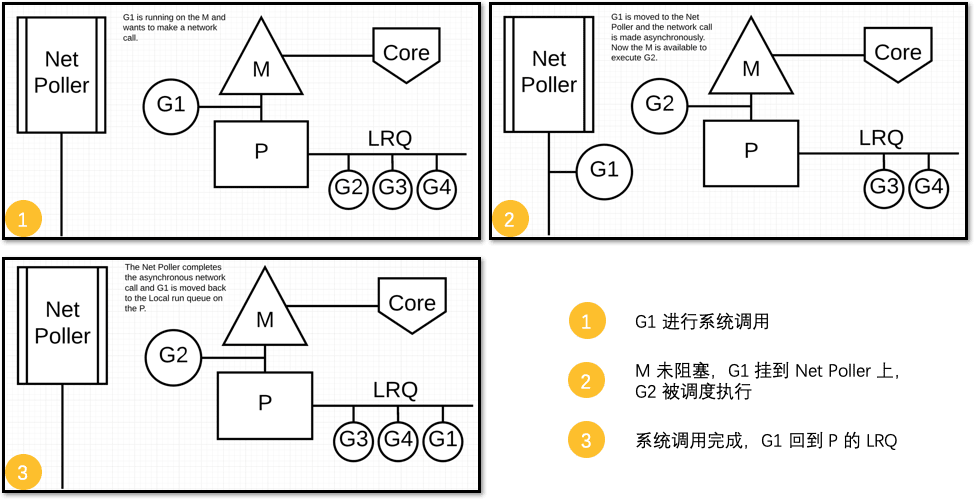

`M`: machine, a real life OS thread

`P`: logical processor

`C`: Core

`GRQ`: Global Run Queue

`LRQ`: Local Run Queue

What Go has done, what the brilliance is of this scheduler is Go has turned [[I/O boundwork]] into CPU bound work. When you have CPU bound work, more threads than cores can only add load because we don't need the extra context, which is those corse will never be idle to do other work because this thread has always got work to do.

当 G 需要进行系统调用时，根据调用的类型，它所依附的 M 有两种情况：`同步`和`异步`。

##### 同步

对于同步的情况，M 会被**阻塞**，进而从 P 上调度下来，P 可不养闲人，G 仍然依附于 M。之后，一个新的 M 会被调用到 P 上，接着执行 P 的 LRQ 里嗷嗷待哺的 G 们。一旦系统调用完成，G 还会加入到 P 的 LRQ 里，M 则会被“雪藏”，待到需要时再“放”出来。

##### 异步

对于**异步**的情况，**M 不会被阻塞**，G 的异步请求会被“代理人” `network poller` 接手，G 也会被绑定到 `network poller`，等到系统调用结束，G 才会重新回到 P 上。M 由于没被阻塞，它因此可以继续执行 LRQ 里的其他 G。

在异步情况下，通过调度 **Go scheduler** 成功地将I/O的任务转变成了CPU任务，或者说将内核级别的线程切换转变成了用户级别的goroutine切换，大大提高了效率

> The ability to turn IO/Blocking work into CPU-bound work at the OS level is where we get a big win in leveraging more CPU capacity over time.

