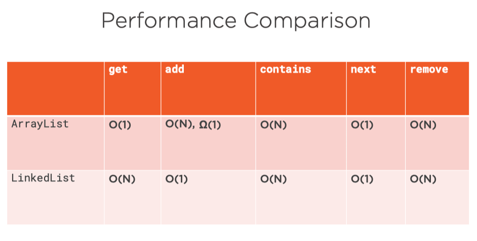

## List


```java
void add(int index, E e);
E get(int index);
E remove(int index);
E set(int index, E element);
boolean addAll(int index, Collection c);
```

Each element has an index.

An index is an int representing its position in the list.

We can modify Lists using indices.


Growing ArrayList


Double Strategy


ArrayList

* Good general purpose implementation
* use as default
* CPU cache sympathetic


LinkedList

* Worse performance in most cases
* Use when adding elements at start
* Or when adding / remove a lot


