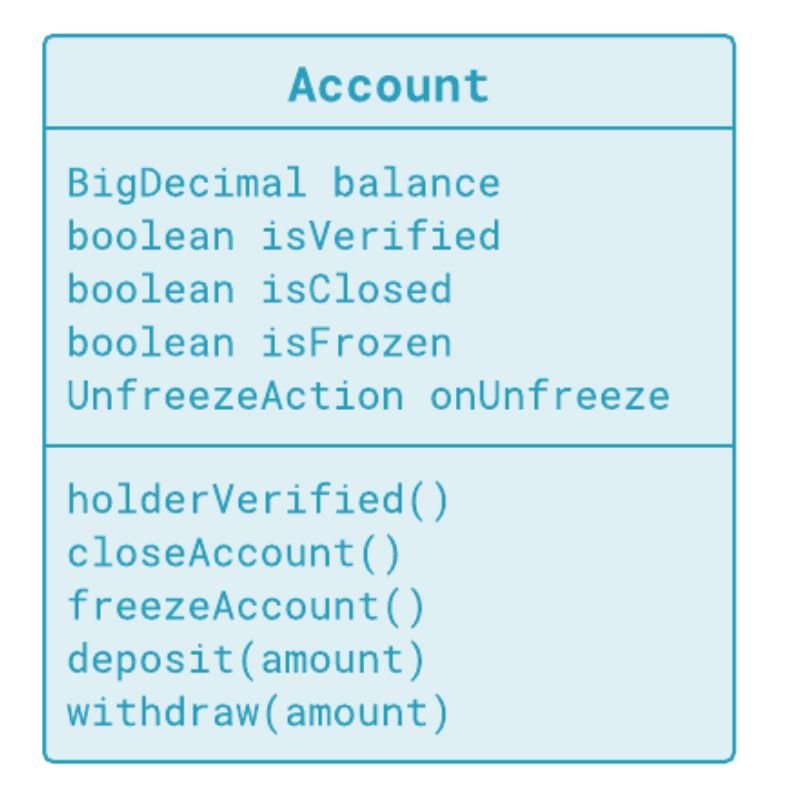

//20201126

## Roadmap

#### Introduction

* A collection is an object

* A missing object is also an object. 

#### Branching on Booleans

Replace branching with polymorphic calls

#### Immutable objects

How to avoid bugs due to mutability

#### Avoiding nulls

Null is not an object

#### Optional\<T> type

No more nulls in bussiness applications

----

```java
public class Main {
  public int sum(int[] values) {
    int sum = 0;
    for (int value: values) {
      sum += value;
    }
    return sum;
  }
  
  public static void main(String[] args) {
    
  }
}
```

What if we want sum even numbers or odd numbers?

```java
for (int value: values) {
  if (oddNumbersOnly || value % 2 != 0) {
    sum += value
  }
}
```

Hard-coded decisions impair maintenability

:warning: **Advice**:

Don't change code to modify behavior

Try to substitute an object with a different behavior


```java
public class Main {
  public int sum(int[] values, selector) {
    return values.sum(selector)
  }
}
// 
```

This class is the consumer. It needs a summation **service**

Consumers should not implement services themselves

 

:warning: Advice

Do not model a missing object with null; Use an object of a class to model the *missing* object


In this course, you will learn to:

- Detect where objects are missing
- Avoid branching around Booleans
- Remove null references
- Apply principles of object-oriented programming


---

## Rendering Branching over Boolean Flags Obsolete


* Apply the State pattern to control branching complexity

### :heart:Advice:

1. Either guard against a non-applicable case, or implement both the positive and negative branch
2. Try to branch by selecting an object, not a block of code, that will let you move code to other classes

创建一个AccountState Interface, 就是说创建一个状态机?

Old Design:



//20201127

Objects Design:


策略模式?


A poorly desgined class example

- It tries to do everything by itself
- Rellies on if-else instructions
- Behavior was factored out into other classes


**Applying the State Design Pattern**

- Hold a reference to the current state object
- Substitute the reference when state changes

**Benefits from turning state into an object**

- Class remains focused on primary role
- Other roles delegated to state objects
- Each state class also handles one role

---

## Chapter 2 Using Immutable Objects and Value objects


Value Objects are immutable

All their operations only return a new object

```java
    // Part of the Money.java
    @Override
    public boolean equals(Object other) {
        return other != null && other.getClass() == this.getClass() && this.equals((Money) other);
    }

    private boolean equals(Money other) {
        return this.amount.equals(other.amount) && this.currency.equals(other.currency);
    }

    @Override
    public int hashCode() {
        return this.amount.hashCode() * 17 + this.currency.hashCode();
    }

    @Override
    public int compareTo(Money other) {
        return this.compareAmountTo(this.currency.compareTo(other.currency), other);
    }

    private int compareAmountTo(int currencyCompare, Money other) {
        return currencyCompare == 0 ? this.amount.compareTo(other.amount)
                : currencyCompare;
    }

    @Override
    public String toString() {
        return this.amount + " " + this.currency;
    }
```

**Immutable objects and values**

- Immutability is simple to implement
- Saves us from bugs
- Rules out aliasing bugs

**Immutable objects can behave as values**

- Value objects behave as plain values
- No different than *int* or *string*

**Pitfalls of equivalence**

- equals implements equivalence relation
- Base and derived objects are not equivalent ==解决办法: getClass()==
- Otherwise, they would violate symmetry
- Objects of the same type are equal if their components are equal
- Value object only consists of values


### Other Resources


[Concurrency and Immutability](https://www.infoq.com/articles/dhanji-prasanna-concurrency/)

---

## Chapter 3 Leveraging Special Case Objects to remove null checks


### Summary

**Techniques to remove null references**

- Remove branching around null
- Null Object instances with empty implementation
- Speical case instances with trivial impl
- All together help eradicate nulls

**Object as a finite state machine (FSM)**

- Expose unconditional methods
- Encapsulated state drives behavior
- It requires no branching in the caller

**Relating FSM to the State pattern**

- Each concrete state is a separate class
- FSM manages state as a set of objects
- FSM looks polymorphic to the outside


## Chapter 4 Turning Optional Calls into calls on Optional Objects


### Summary

**Optional object defined**

- It is a proper object
- It may contain another object
- Or it may contain nothing
- Forces you to supply both positive and negative scenarios
- All references remain non-null

**Advanced topics on optional objects** 

- Optional looks like a stream
- Behaves the same as a stream with zero or one element
- Resulting design is resilient to bugs


