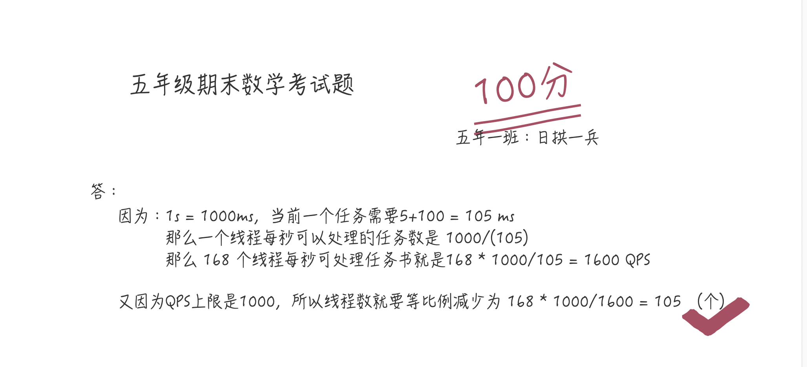
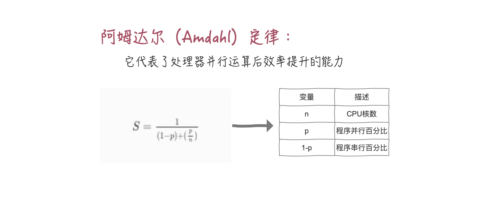

一个核心IO密集的最佳线程数 = (1/CPU利用率) = 1 + (I/O耗时/CPU耗时)

多个核心IO密集的最佳线程数 = CPU核心数 * (1/CPU利用率) = CPU核心数 * 1 + (I/O耗时/CPU耗时)

我怎么知道具体的 I/O耗时和CPU耗时呢？
怎么查看CPU利用率？

> SkyWalking
> CAT
> zipkin

> 计算操作需要5ms，DB操作需要 100ms，对于一台 8个CPU的服务器，怎么设置线程数呢?

线程数 = 8 * (1 + 100/5) = 168 (个)

> 假设要求一个系统的 TPS（Transaction Per Second 或者 Task Per Second）至少为20，然后假设每个Transaction由一个线程完成，继续假设平均每个线程处理一个Transaction的时间为4s

如何设计线程个数，使得可以在1s内处理完20个Transaction？

答: 一个线程1个transaction 为4s, 每秒一个线程只能处理:1/4 = 0.25 tps. 所以一秒要处理20个tps. 理论线程数 20/0.25 = 80

> 那如果DB的 QPS（Query Per Second）上限是1000，此时这个线程数又该设置为多大呢？

同样，这是没有考虑 CPU 数目，接下来就又是细节调优的阶段了

这个结论告诉我们，假如我们的串行率是 5%，那么我们无论采用什么技术，最高也就只能提高 20 倍的性能

**Tips:** 临界区都是串行的，非临界区都是并行的，用单线程执行临界区的时间/用单线程执行(临界区+非临界区)的时间就是串行百分比

