# Class Diagrams


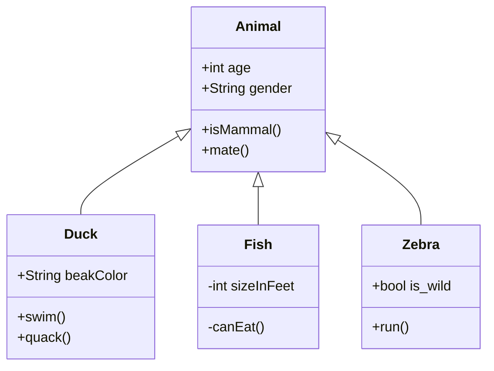

Visibility

- `+` Public
- `-` Private
- `#` Protected
- `~` Package/Internal

- `*` Abstract e.g.: `someAbstractMethod()*`
- `$` Static e.g.: `someStaticMethod()$`

| Type  | Description   |
| ----- | ------------- |
| <\|-- | Inheritance   |
| *--   | Composition   |
| o--   | Aggregation   |
| -->   | Association   |
| --    | Link (Solid)  |
| ..>   | Dependency    |
| ..\|> | Realization   |
| ..    | Link (Dashed) |


```
classDiagram
classA <|-- classB : Inheritance
classC *-- classD : Composition
classE o-- classF : Aggregation
classG <-- classH : Association
classI -- classJ : Link(Solid)
classK <.. classL : Dependency
classM <|.. classN : Realization
classO .. classP : Link(Dashed)
```

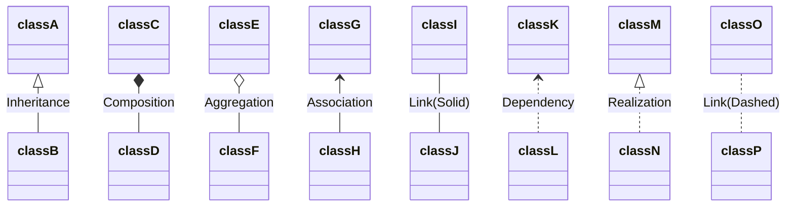

#### Cardinality/Multiplicity on relations

The different cardinality options are :

- `0..1` Zero or one
- `1` Only 1
- `0..1` Zero or One
- `1..*` One or more
- `*` Many
- `n` n {where n>1}
- `0..n` zero to n {where n>1}
- `1..n` one to n {where n>1}

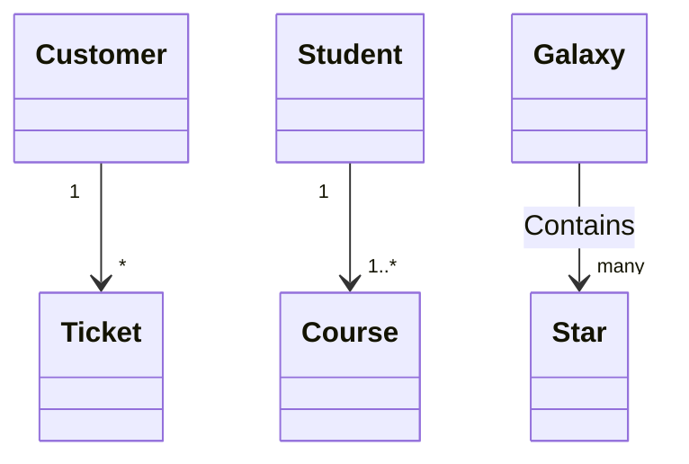

Annotations on Classes

- `<<Interface>>` To represent an Interface class
- `<<abstract>>` To represent an abstract class
- `<<Service>>` To represent a service class
- `<<enumeration>>` To represent an enum

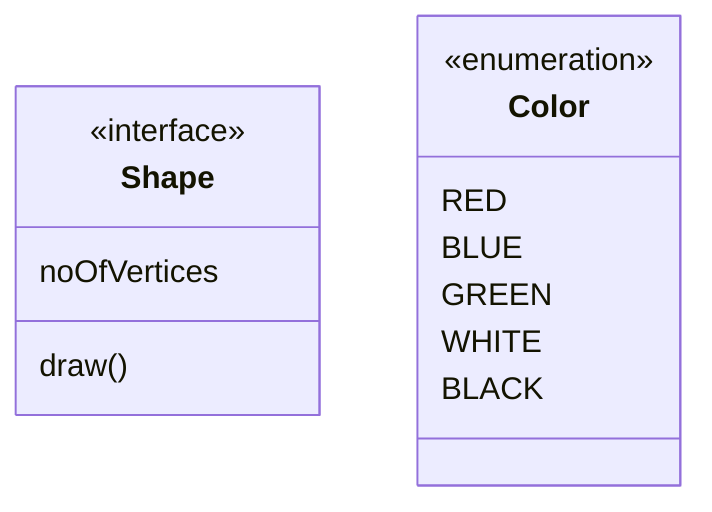

# State Diagrams


```
stateDiagram-v2
    [*] --> Still
    Still --> [*]

    Still --> Moving
    Moving --> Still
    Moving --> Crash
    Crash --> [*]
```


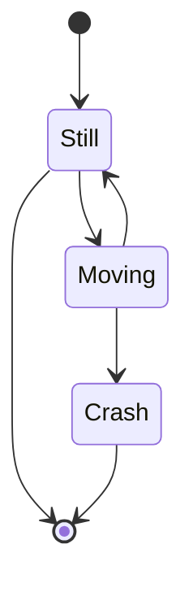

```
stateDiagram-v2
    s2 : This is a state description
```

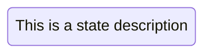

Transitions

```
stateDiagram-v2
	s1 --> s2
```

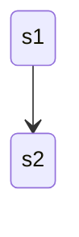

Start and End

```
stateDiagram-v2
    [*] --> s1
    s1 --> [*]
```

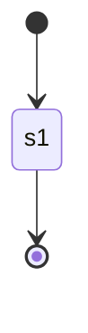

Fork

```
   stateDiagram-v2
    state fork_state <<fork>>
      [*] --> fork_state
      fork_state --> State2
      fork_state --> State3

      state join_state <<join>>
      State2 --> join_state
      State3 --> join_state
      join_state --> State4
      State4 --> [*]
```

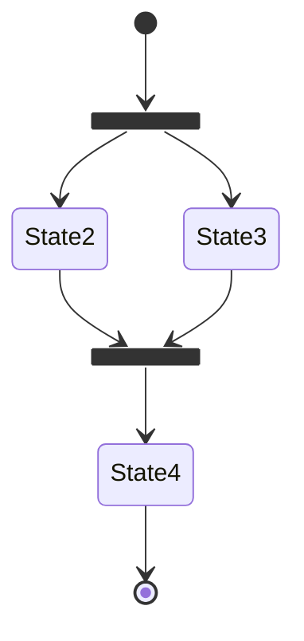

Notes

```
stateDiagram-v2
        State1: The state with a note
        note right of State1
            Important information! You can write
            notes.
        end note
        State1 --> State2
        note left of State2 : This is the note to the left.
```

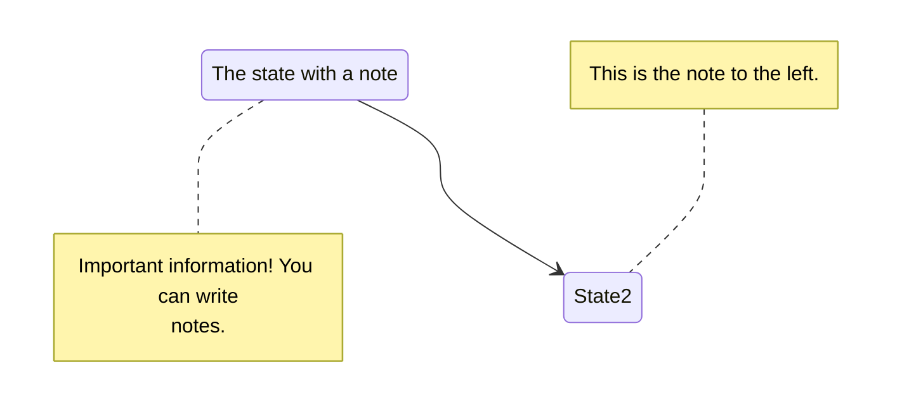

PieChartDiagram

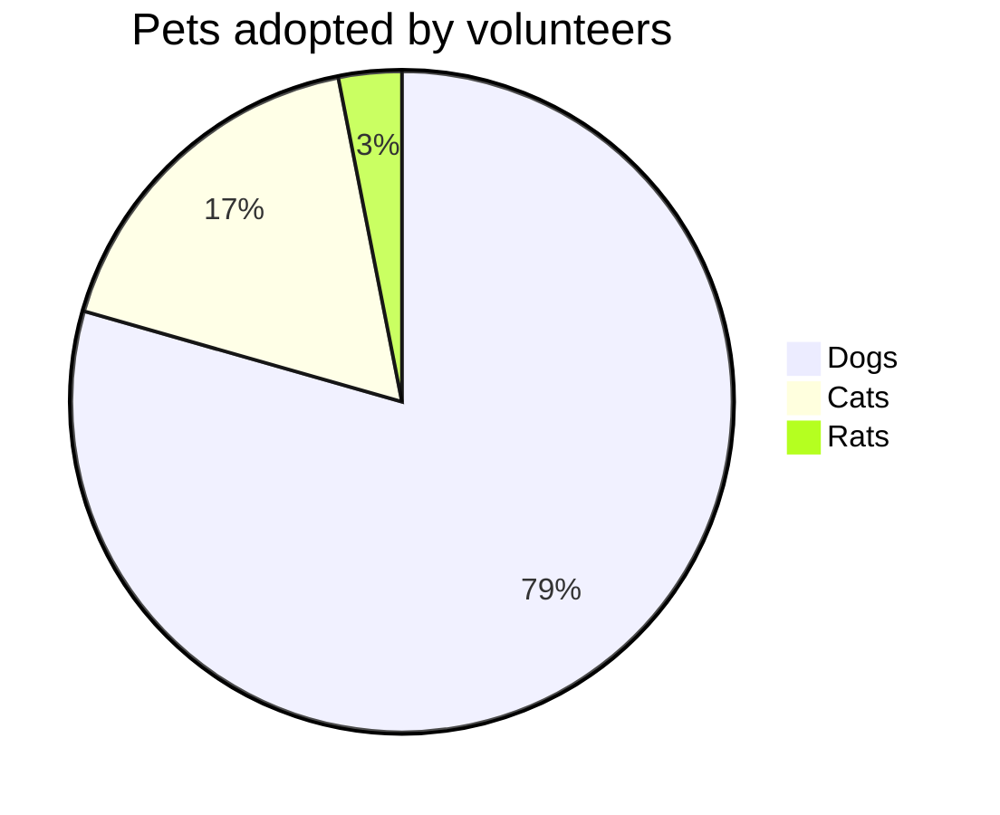

# Sequence Diagrams

```
sequenceDiagram
	Alice->>John: Hello John, How are you?
	John-->>Alice: Great!
```

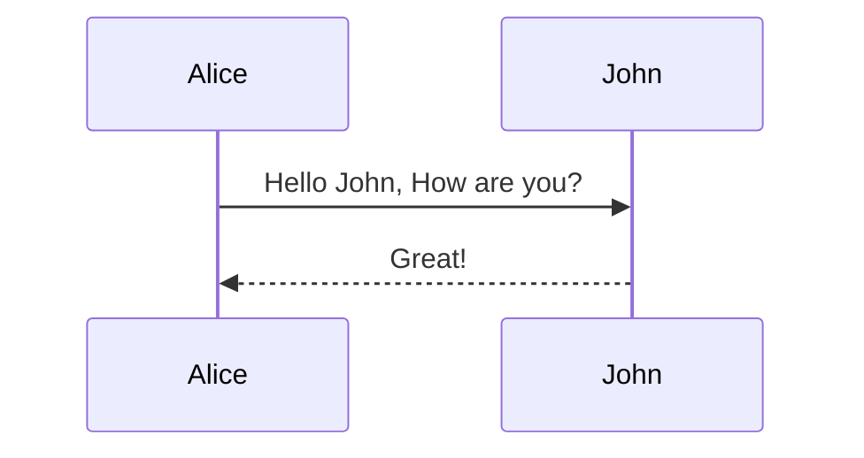

### Messages

| Type | Description                                 |
| ---- | ------------------------------------------- |
| ->   | Solid line without arrow                    |
| -->  | Dotted line without arrow                   |
| ->>  | Solid line with arrowhead                   |
| -->> | Dotted line with arrowhead                  |
| -x   | Solid line with a cross at the end (async)  |
| --x  | Dotted line with a cross at the end (async) |

```
sequenceDiagram
    Alice->>+John: Hello John, how are you?
    Alice->>+John: John, can you hear me?
    John-->>-Alice: Hi Alice, I can hear you!
    John-->>-Alice: I feel great!
```

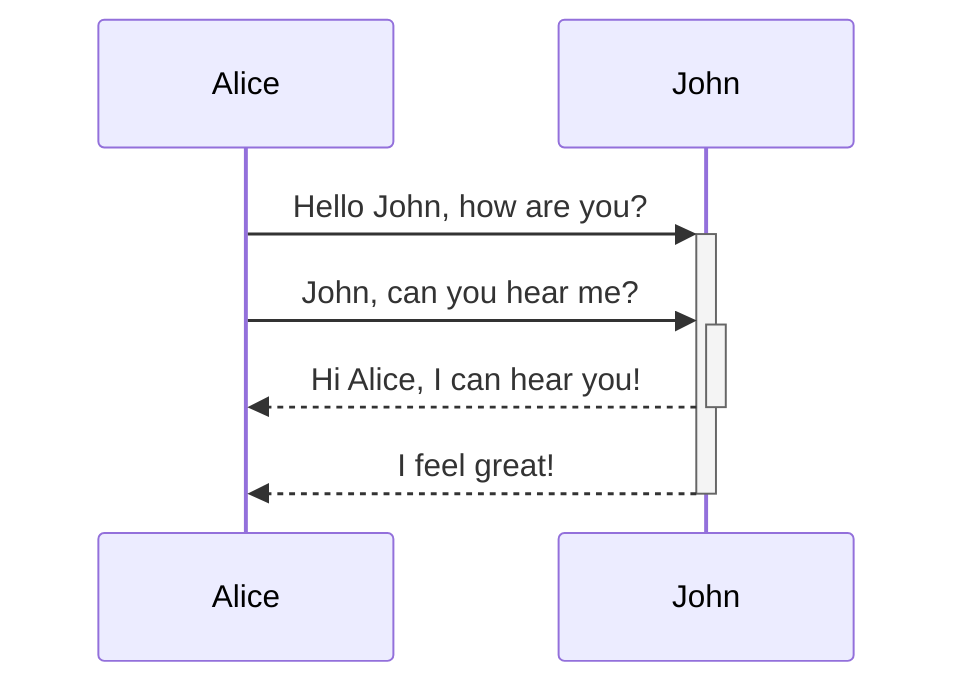


Loops

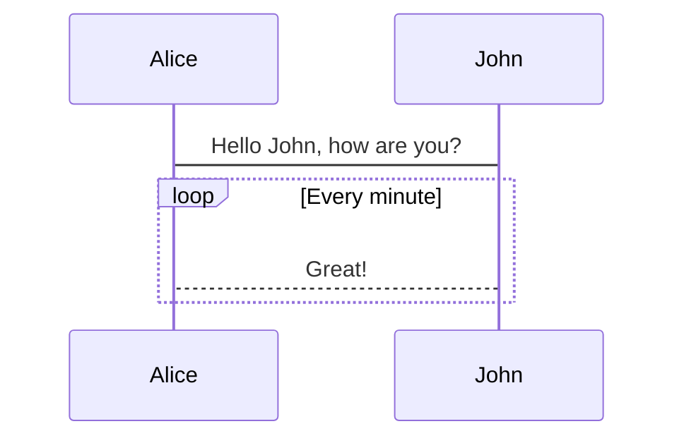

Alt

```
sequenceDiagram
    Alice->>Bob: Hello Bob, how are you?
    alt is sick
        Bob->>Alice: Not so good :(
    else is well
        Bob->>Alice: Feeling fresh like a daisy
    end
    opt Extra response
        Bob->>Alice: Thanks for asking
    end
```

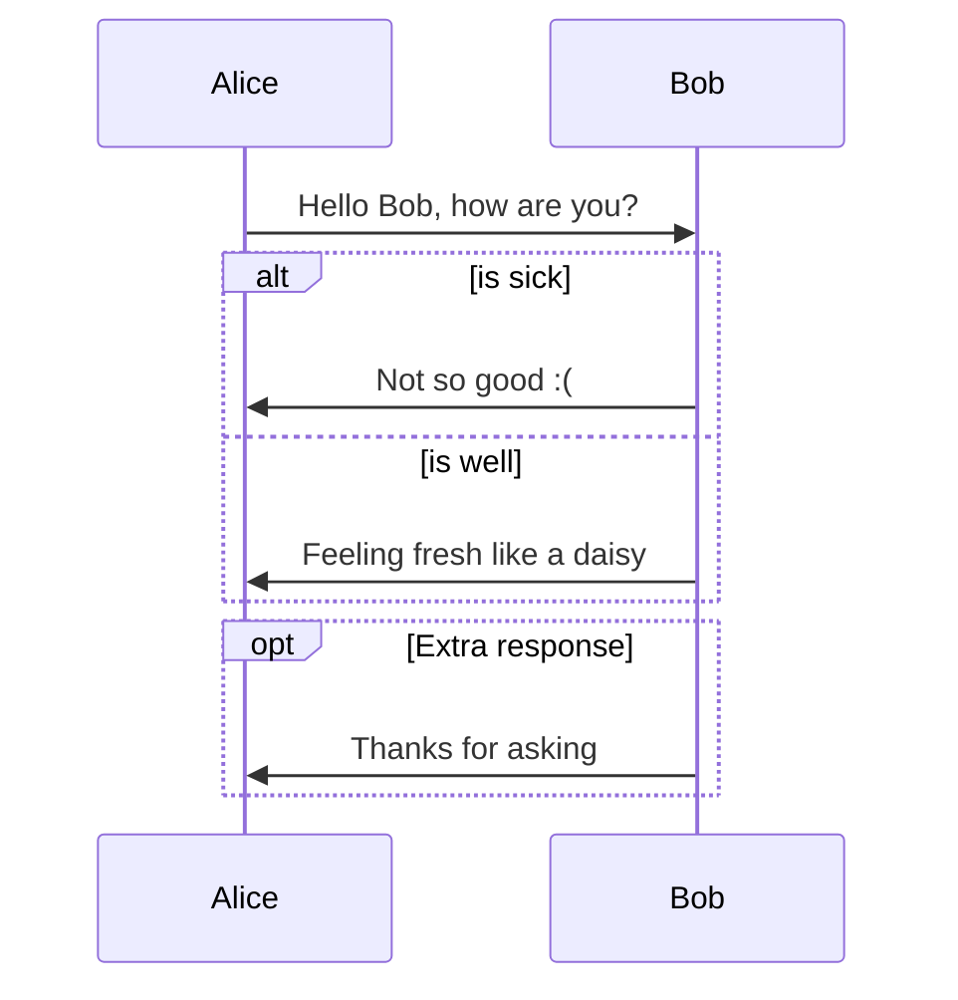


[flowchar](https://mermaid-js.github.io/mermaid/#/flowchart)

