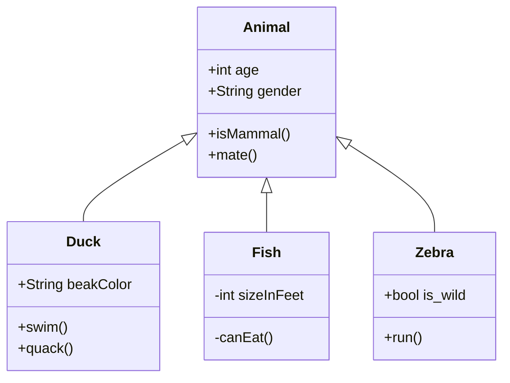
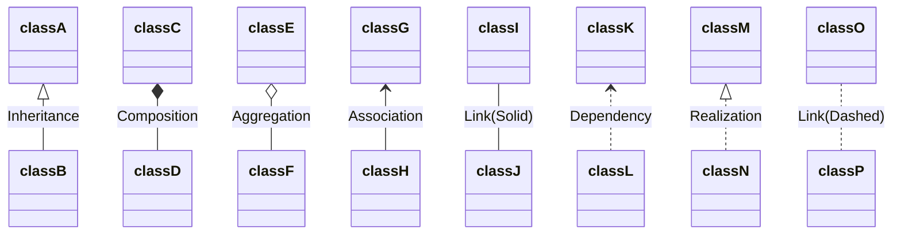

Visibility

- `+` Public
- `-` Private
- `#` Protected
- `~` Package/Internal

- `*` Abstract e.g.: `someAbstractMethod()*`
- `$` Static e.g.: `someStaticMethod()$`

| Type  | Description   |
| ----- | ------------- |
| <\|-- | Inheritance   |
| *--   | Composition   |
| o--   | Aggregation   |
| -->   | Association   |
| --    | Link (Solid)  |
| ..>   | Dependency    |
| ..\|> | Realization   |
| ..    | Link (Dashed) |


```
classDiagram
classA <|-- classB : Inheritance
classC *-- classD : Composition
classE o-- classF : Aggregation
classG <-- classH : Association
classI -- classJ : Link(Solid)
classK <.. classL : Dependency
classM <|.. classN : Realization
classO .. classP : Link(Dashed)
```



