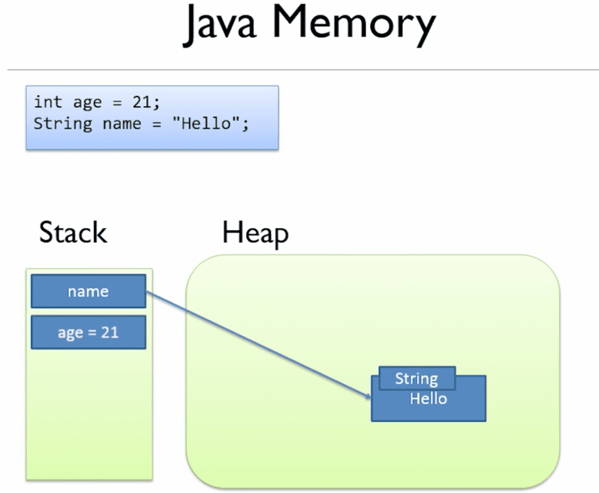

Local vars are stored in the stack.

All objects on the heap

Objs are stored on the heap

Vars are a ref to the obj

Local vars are stored on the stack

For objects passed into methods, the ==REFERENCE== to the object is passed ==BY VALUE==

