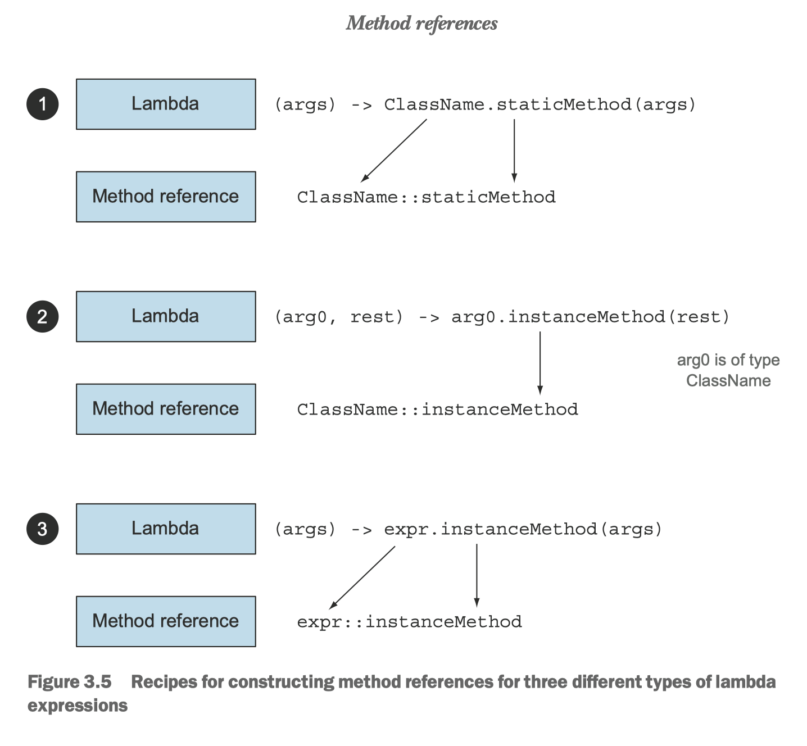

# Lambda


## 3.6 方法引用


方法引用让你可以重复使用现有的方法定义, 并像lambda一样传递他们。


| Lambda                                   | 等效的方法引用                    |
| ---------------------------------------- | --------------------------------- |
| (Apple apple) -> apple.getWeight()       | Apple::getWeight                  |
| () -> Thread.currentThread().dumpStack() | Thread.currentThread()::dumpStack |
| (str, i) -> str.substring(i)             | String::substring                 |
| (String s) -> System.out.println(s)      | System.out::println               |
| (String s) -> this.isValidName(s)        | this::isValidName                 |
|                                          |                                   |


  

你可以把方法引用看作针对仅仅涉及单一方法的 Lambda 的语法糖，因为你表达同样的事情 时要写的代码更少了。


方法引用主要有三类：

1. 指向静态方法的方法引用（例如Integer的parseInt方法，写作`Integer::parseInt`)
2. 指向任意类型实例方法的方法引用（例如String的length方法，写作`String::length`)
3. 指向现存对象或表达式实例方法的方法引用. 假如你有一个局部变量`expensiveTransaction` 保存了Transaction类型的对象，它提供了实例方法getValue， 那你就可以这么写`expensiveTransaction::getValue`)
   1. A method reference to an instance method of an existing object or expression


第三种方法引用在你需要传递一个私有辅助方法时特别有用。比如，你定义了一个辅助方法isValidName

```java
private boolean isValidName(String string) {
  return Character.isUppercase(string.charAt(0));
}
```

你可以借助方法引用，在`Predicate<String>`的上下文中传递该方法

```java
filter(words, this::isValidName)
```




Comparator 具有一个叫做comparing的静态辅助方法， 它可以接受一个Function来提取Comparable键值，并生成一个Comparator对象。


