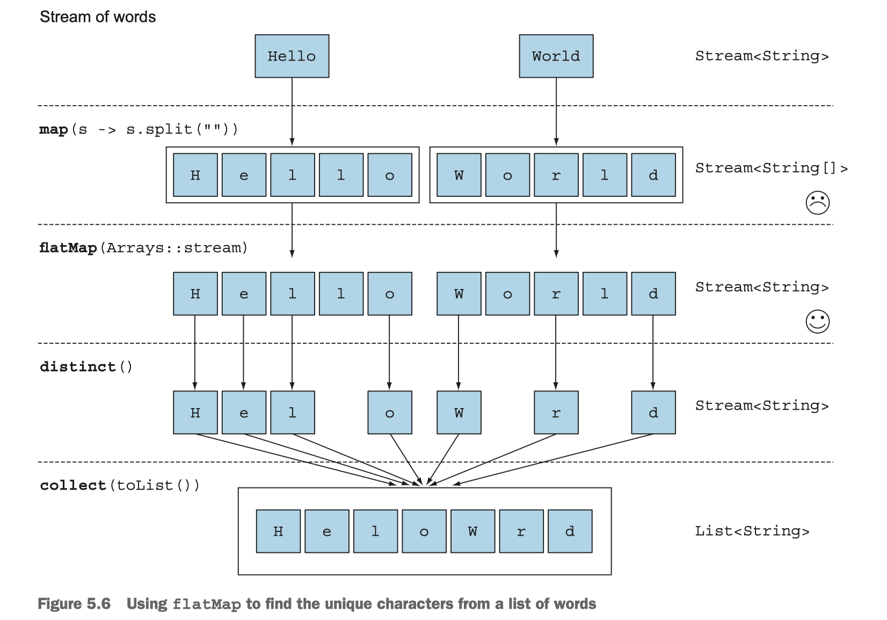

# 第5章 使用流


## 流的切片

### takeWhile

它会在遭遇第一个不符合要求的元素时停止处理。


### dropWhile

它会从头开始，丢弃所有谓词结果为false的元素。一旦遭遇谓词计算的结果为true，它就停止处理，并返回所有剩余的元素，即便要处理的对象是一个无限数量元素构成的流，它也能工作的很好。


### 截断 limit


### 跳过元素 skip(n)


## 映射

### map

接受一个函数作为参数。这个函数会被应用到每个元素上，并将其映射成一个新的元素

```java
List<String> dishNames = menu.stream()
  														.map(Dish::getName)
  														.collect(toList());
```

因为 getName 方法返回一个 String，

所以 map 方法输出的流的类型就是 `Stream<String>`。

```java
List<Integer> dishNameLengths = menu.stream()
                                    .map(Dish::getName)
                                    .map(String::length)
                                    .collect(toList());
```

### flatMap

```java
// Arrays.stream() 接受一个数组并产生一个流
String[] arrayOfWords = {"Goodbye", "World"};
Stream<String> streamOfwords = Arrays.stream(arrayOfWords);
streamOfwords.forEach(System.out::println);
// Goodbye
// World
```

每个数组并不是分别映射成一个流，而是映射成流的内容。所有使用`flatMap(Arrays::stream)` 时生成的单个流都被合并起来，即扁平化为一个流。



flatMap 方法让你把一个流中的每个值都换成另一个流，然后把所有的流都连接起来成为一个流。


给定两个数字列表，如何返回所有的数对呢？例如，给定列表[1, 2, 3]和列表[3, 4]，应该返回[(1, 3), (1, 4), (2, 3), (2, 4), (3, 3), (3, 4)]。为简单起见，你可以用有两个元素的数组来代表数对。

```java
List<Integer> numbers1 = Arrays.asList(1,2,3);
List<Integer> numbers2 = Arrays.asList(3,4);
List<int[]> pairs = 
  			numbers1.stream()
  							.flatMap(i -> numbers2.stream().map(j->new int[]{i, j}))
  							.collect(toList());
```

## 查找和匹配

**anyMatch**


流中是否有一个元素能匹配给定的谓词。

比如，你可以用来看看菜单里是否有素食可选择：

```java
if(menu.stream().anyMatch(Dish::isVegetarian)) {
  System.out.println("The menu is (somewhat) vegetarian friendly!!");
}
```

anyMatch return a boolean, 终端操作


**allMatch**


**noneMatch**


## 5.5 归约


## 5.7 数值流

### 特化

Stream API提供了原始类型流

Stream API also supplies primitive stream specializations:

* IntStream

* DoubleStream

* LongStream

which respectively specialize the elements of a stream to be int, long and double -- and thereby avoid hidden boxing costs.

1. 映射到数值流

IntStream 还支持 

* max， 
* min， 
* average

```java
int calories = menu.stream()
  									.mapToInt(Dish::getCalories)
  									.sum();
```

2. 转换回对象流

```java
IntStream intStream = menu.stream().mapToInt(Dish::getCalories);
Stream<Integer> stream = intStream.boxed();
```

3. 默认值OptionalInt

OptionalInt

OptionalDouble

OptionalLong

```java
OptionalInt maxCalories = menu.stream()
  														.mapToInt(Dish::getCalories)
  														.max();
```

如果咩有最大值的话，显式提供一个默认最大值

```java
int max = maxCalories.orElse(1);
```


### 数值范围


rangeClosed方法来生成1到100之间的所有数字。

mapToObj 返回一个对象值流。

```java
Stream<int[]> pythagoreanTriples =
  IntStream.rangeClosed(1,100).boxed()
  					.flatMap(a ->
                    IntStream.rangeClosed(a, 100)
                    					.filter(b->Math.sqrt(a*a + b*b) % 1== 0)
                    					.mapToObj(b->
                                       new int[] {a,b,(int)Math.sqrt(a*a+b*b)})
                    );
```


创建一个从1到100的数值范围来生成a的值。

对于每个给定的a值，创建一个三元数流。

要是把a的值映射到三元数流的话就会得到一个由流构成的流。

flatMap方法在做映射的同时，还会把所有生成的三元数流扁平化成一个流。

```java
Stream<double[]> pythagoreanTriples2 = 
  IntStream.rangeClosed(1,100).boxed()
  					.flatMap(a ->
                    IntStream.rangeClosed(a, 100)
                    					.mapToObj(
                              	b -> new double[]{a,b,Math.sqrt(a*a+b*b)})
                    					.filter(t->t[2]%1==0));
```


## 构建流


### 1. 由值创建流

```java
Stream<String> stream = Stream.of("Modern", "Java ", "In ", "Action");
Stream.map(String::toUpperCase).forEach(System.out::println);
```

Stream.of创建了一个字符串流，然后将字符串转换成大写，再一个个打印出来。


### 2. 由可空对象创建流

```java
Stream<String> homeValueStream
  	= Stream.ofNullable(System.getProperty("home"));
```

搭配flatMap


