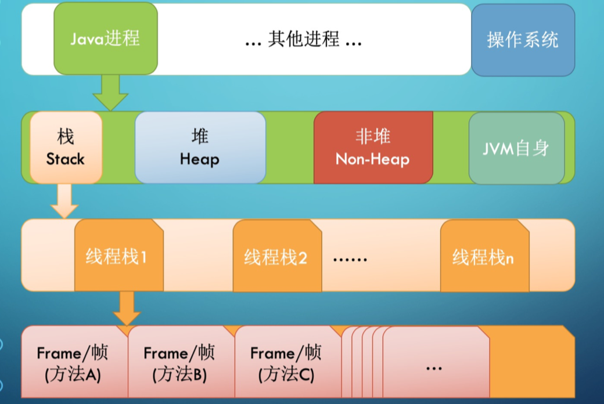
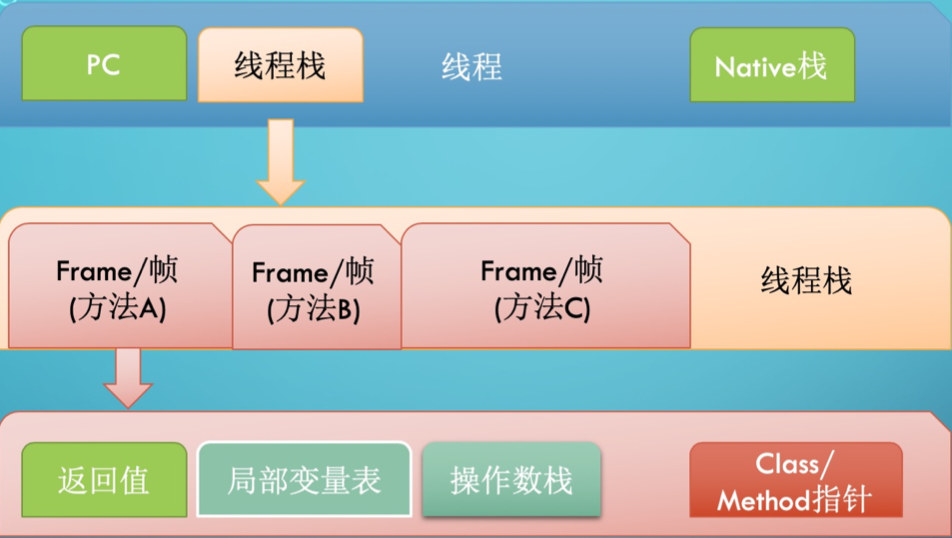
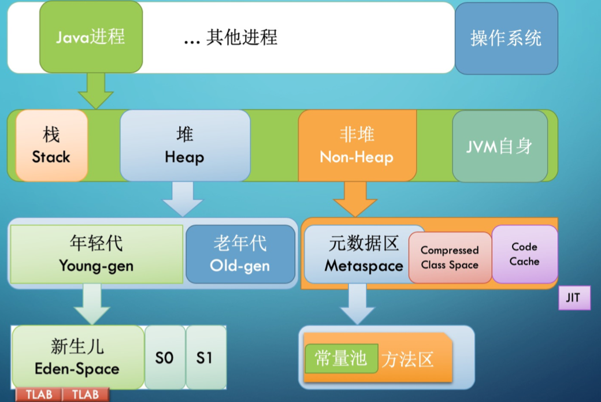

1. JVM基础知识：
2. width:700px;

源代码跨平台


二进制跨平台


Java, C++, RUst 的区别

C/C++ 容易内存泄漏，程序崩溃，安全问题

Java/Golang 内存生命周期都有JVM运行时统一管理。有内存问题是，用JVM来进行信息相关的分析诊断和调整。

Rust 写起来不友好，生产力低。


源代码编译成字节码文件，虚拟机类加载器使其变成类， 有类了就有对象，如何划分内存空间


local variable LOAD stack

stack STORE local varaible(本地变量表)


```
javap -c -verbose Hello.class

javap -c Hello.class
```

常量池

本地变量表

只需要操作对象指针，常量就可以，所有操作转换成数值操作。

看方法变量表

```bash
javac -g Hello.java
javap -c -verbose Hello.class
```


Start 变量在哪行起作用。

Length 范围 比如 9 可以是0-8 范围


字节码前面的数字是byte的位置


JVM操作栈，栈操作数据

| 助剂   | 二进制 |
| ------ | ------ |
| new    | bb     |
| dup    | 57     |
| invode |        |

dup:复制栈顶一个字长的数据，将复制后的数据压栈

a开头 引用类型 对象

i开头 int


#### QA

字节码需要掌握到什么程度，？

字节码不是给人看的，是让JVM（计算机）无脑的去执行。


2. ## Java字节码技术

[字节码对照表](https://blog.csdn.net/u013294097/article/details/103747429)


3. ## JVM类加载器

三类加载器：

1. 启动类加载器 （BootstrapClassLoader）
2. 扩展类加载器（ExtClassLoader）
3. 应用类加载器（AppClassLoader）


加载器特点：

1. parent委托
2. 负责依赖
3. 缓存加载


jdk 9


```java
// JDK 9
Class.forName("xxx", new URLClassLoader("Path"));
```


## 4. JVM内存结构

内存屏障 保证每个cpu


* 每个线程都只能访问自己的线程栈

* 每个线程都不能访问（看不见）其他线程的局部变量。

* 所有原生类型的局部变量都存储在线程栈中，因此对其他线程是不可见的

* 线程可以将一个原生变量的副本传给另一个线程，但不能共享原生局部变量本身

* 堆内存中包含了Java代码中创建的所有对象，不管是哪个线程创建的。其中也涵盖了包装类型（如Byte，Integer，Long等）

* 不管是创建一个对象并将其赋值给局部变量，还是赋值给另一个对象的成员变量，创建的对象都会被保存到堆内存中。

  

* 如果是原生数据类型的局部变量，，那么它的内容就全部保留在线程上。

* 如果是对象引用，则栈中的局部变量槽位中保存着对象的引用地址，而实际的对象内存保存在堆中

* 对象的成员变量与对象本身一起存储在堆上，不管成员变量的类型是原生数值，还是对象引用

* 类的静态变量则和类定义一样都保存在**堆**中

* jdk8 后，字符串常量池在堆中


summary:

* ==方法中使用的**原生数据类型**和**对象引用**地址在栈上存储。==

* 对象、对象成员与类定义、静态变量在堆上。

* 堆内存又称为 “共享堆”， 堆中的所有对象，都可以被所有线程访问，只要他们能拿到对象的引用地址
* 如果一个线程可以访问某个对象时，就可以访问该对象的成员变量。
* 如果两个线程同时调用某个对象的同一个方法，则它们都可以访问到这个对象的成员变量，但每个线程的局部变量副本是独立的。





* 每启动一个线程，JVM就会在栈空间栈分配对应的线程栈，比如1MB的空间（`Xss1m`)
* 线程栈也叫做Java方法栈。如果使用了JNI方法，则会分配一个单独的本地方法栈（Native Stack）
* 线程执行过程中，一般会有多个方法组成调用栈（Stack Trace），比如A调用B，B调用C。。。每执行到一个方法，就会创建对应的栈帧（Frame）




* 栈帧是一个逻辑上的概念，具体的大小在一个方法编写完成后基本上就能确定

* 比如返回值 需要一个空间存放，每个局部变量都需要对应的地址空间，此外还有给指令使用的操作数栈，以及class指针

  ### JVM堆内存结构



* 堆内存是所有线程共用的内存空间，
* JVM将Heap内存分为年轻代（Young Generation) 和 老年代（Old Generation）两部分
* 年轻代还划分为内存池（Eden space） 和存活区（survivor space）
  * Eden
  * S0
  * S1
* 在大部分GC算法中有两个存活区（S0，S1），在我们可以观察到的任何时刻，S0和S1总有一个是空的，但一般较小，也不浪费多少空间
* Non-Heap本质上还是一个==Heap==， 只是一般不归GC管理，里面划分为三个内存池
  * Metaspace，以前叫持久代（永久代，permanent generation），Java 8换了个名字叫metaspace
  * CCS，Compressed Class Space， 存放class信息的，和metaspace有交叉
  * Code Cache， 存放JIT编译器编译后的本地机器代码

### CPU与内存行为

CPU乱序执行

volatile关键字

原子性操作

内存屏障

JMM规范明确定义了不同的线程之间，通过哪些方式，在什么时候可以看见其他线程保存到共享变量中的值，以及在必要时，如何堆共享变量的访问进行同步。这样的好处是屏蔽各种硬件平台和操作系统之间的内存访问差异。

所有的对象（包括内部的实例成员变量），static变量，以及数组，都必须存放到堆内存中。

局部变量，方法的形参/入参，异常处理语句的入参不允许在线程之间共享，所以不受内存模型的影响。

多个线程同时对一个变量访问时，读取/写入，这时候只要有某个线程执行的是写操作，那么这种现象就称之为“**冲突**”

可以被其他线程影响或感知的操作，称为线程间的交互行为，可分为：读取、写入、同步操作、外部操作等等。其中同步操作包括：

* 对volatile变量的读写，
* 对管程（monitor）的锁定与解锁，
* 线程的起始操作与结尾操作，
* 线程启动和结束等等。

外部操作则是指线程执行环境之外的操作，比如停止其他线程等等

JMM规范的是线程间的交互操作，而不管线程内部对局部变量进行的操作。


## 5. JVM启动参数

系统属性参数

运行模式参数

堆内存设置参数

GC设置参数

分析诊断参数

JavaAgent参数


`-D` 设置系统属性

`-X` 开头为非标准参数，基本都是传给JVM的，默认JVM实现这些参数的功能。

`-XX` 开头为非稳定参数，专门用于控制JVM的行为，跟具体的JVM实现有关，随时可能会在下个版本取消。

`-XX`： +-Flags形式，+- 是对布尔值进行开关

`-XX`: key=value 形式，指定某个选项的值


#### JVM启动参数--运行模式

`-Xint` 在**解释模式（interpreted mode）**下运行，`-Xint` 标记会强制JVM解释执行所有的字节码，这当然会降低运行速度，通常低10倍或更多。

`-Xcomp`: -Xcomp 参数与-Xint相反，JVM在第一次使用时会把所有的字节码编译成本地代码，从而带来最大程度的优化。【注意预热】

`-Xmixed` 混合模式，将解释模式和编译模式进行混合使用，有JVM自己决定，这时JVM的默认模式，也是推荐模式。使用java -verison可以看到mixed mode等信息

#### JVM启动参数--堆内存

堆内（Xms-Xmx）

非堆+堆外

`-Xmx` 指定**最大堆内存**，如`-Xmx4g` 这只是限制了Heap部分的最大值为4g。***这个内存不包括栈内存，也不包括对外使用的内存***

`-Xms` 指定**堆内存空间的初始大小**，如 `-Xms4g` 。而且指定的内存大小，并不是操作系统实际分配的初始值，而是GC先规划好，用到才分配。专用服务器上需要保持 `-Xms` `-Xmx`一致，否则应用刚启动可能就有好几个FullGC。当两者匹配不一致时，堆内存扩容可能导致性能抖动。

`-Xmn` 等价于 `-XX:NewSize` 使用G1垃圾收集器 不应该 设置该选项，在其他的某些业务场景下可以设置。官方建议设置为`-Xmx` 的1/2 ～ 1/4

`-XX:MaxPermSize=size` JDK1.7 之前使用的。Java8默认允许的meta空间无限大，此参数无效

`-XX:MaxMetaspace=size` 

`-XX:MaxDirectMemorySize=size`

`-Xss`: 设置每个线程栈的字节数，影响栈的深度。例如`-Xss1m` 指定线程栈为1MB，

与 `-XX:ThreadStackSize=1m` 等价

`-XX`

#### JVM启动参数-GC相关

-XX:+UseG1GC：使用 G1 垃圾回收器

-XX:+UseConcMarkSweepGC：使用 CMS 垃圾回收器

-XX:+UseSerialGC：使用串行垃圾回收器

-XX:+UseParallelGC：使用并行垃圾回收器 

// Java 11+

-XX:+UnlockExperimentalVMOptions -XX:+UseZGC

// Java 12+

-XX:+UnlockExperimentalVMOptions -XX:+UseShenandoahGC


