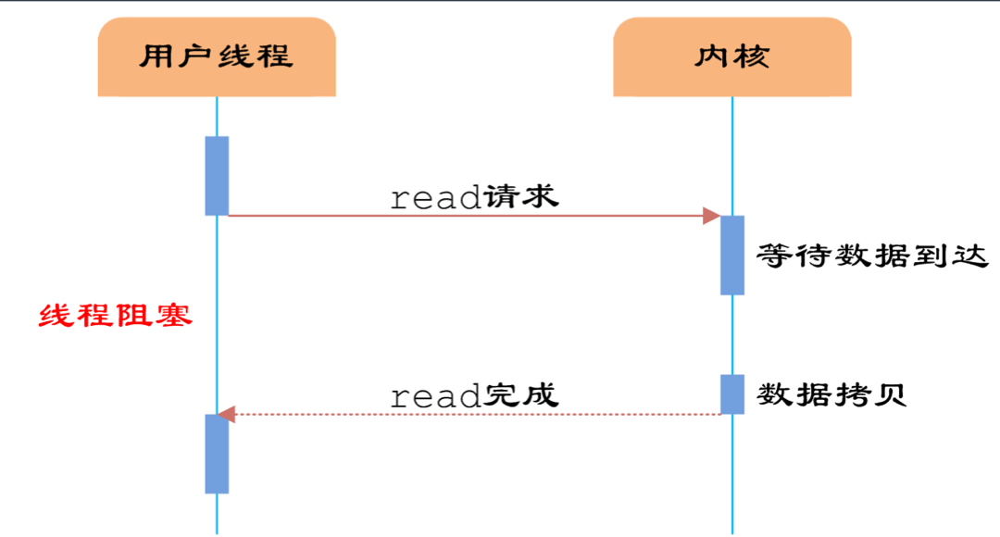
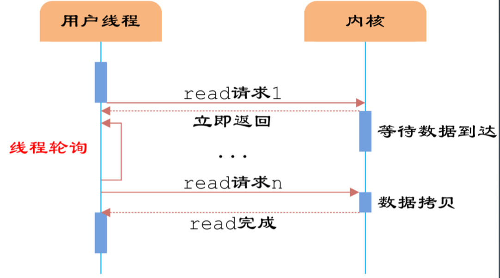

## Java Socket编程


Server

建立服务端倾听socket

等待并接收连接请求

接收请求后创建连接socket

InputStream

OutputStream

关闭socket及相关资源


Client

创建连接socket想服务端发送请求

OutputStream

InputStream

关闭socket及相关资源


0-1024 基础设施


1. 创建一个ServerSocket
2. 绑定8801端口
3. 当有客户端请求时通过accept方法拿到Socket，进而可以进行处理
4. Sleep 20ms，模拟业务操作（IO）
5. 模拟输出HTTP报文头和hello
6. 关闭socket


```bash
wrk http://localhost:8801
```

```bash
wrk -c 10 -t 10 -d 60s http://localhost:8801
```

10并发10线程60s


### 服务器通信过程分析

存在两种类型操作：

- CPU计算/业务处理
- IO操作与等待/网络、磁盘、数据库


## 深入讨论IO：Server处理时到底发生了什么


## IO模型与相关概念：怎么理解IO

### 通信模型

同步异步 时通信模式


阻塞、非阻塞是线程处理模式


| blocking    | Non-Blocking     |
| ----------- | ---------------- |
| 阻塞I/O模型 | 非阻塞IO模型     |
| IO复用模型  | 信号驱动的IO模型 |


异步IO模型


### 阻塞式IO、BIO




### 非阻塞式IO

和bio相比，内核立即返回，返回后获得足够的CPU事件继续做其他的事情




IO 多路复用 （IO multiplexing），也称为事件驱动IO（event-driven IO）

* 单个线程里同时监控多个套接字
* 通过select或poll轮询所负责的所有socket，当某个socket有数据到达了，就通知用户进程
* IO复用 同 **非阻塞IO** 本质一样， 不过利于用了新的select系统调用
* 看似比非阻塞IO还多了一个系统调用开销，不过因为可以支持多路IO，才算提高了效率。
* 进程先是阻塞在select/poll 上，再是阻塞在读操作的第二个阶段
* 


## Netty

#### Channel

通道，Java NIO的基础概念，代表一个打开的连接，可执行读取/写入IO操作

Netty对Channel的所有IO操作都是非阻塞的

#### ChannelFuture

Java的`Future`接口，只能查询操作的完成情况，或者阻塞当前线程等待操作完成。Netty封装一个`ChannelFuture`接口

#### Event and Handler


#### Encoder & Decoder

处理网络IO时，需要进行序列话和反序列化，转换Java对象与字节流。对入站数据进行解码，基类时`ByteToMessageDecoder`。

对出站数据进行编码，基类时`MessageToByteEncoder`


#### ChannelPipeline 

数据处理通道就是事件处理器链。有顺序，同一Channel的出站处理器和入站处理器在同一个列表中


## 答疑


这些网络模型适用的场景是？

有网络请求的时候，这些模式是不断发展到更高级的

