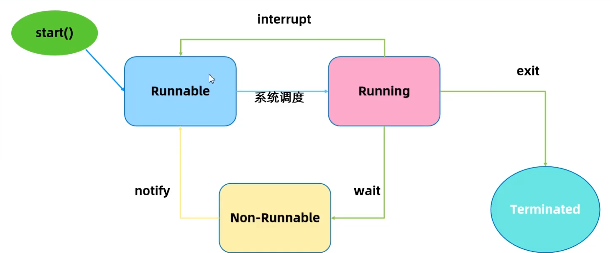
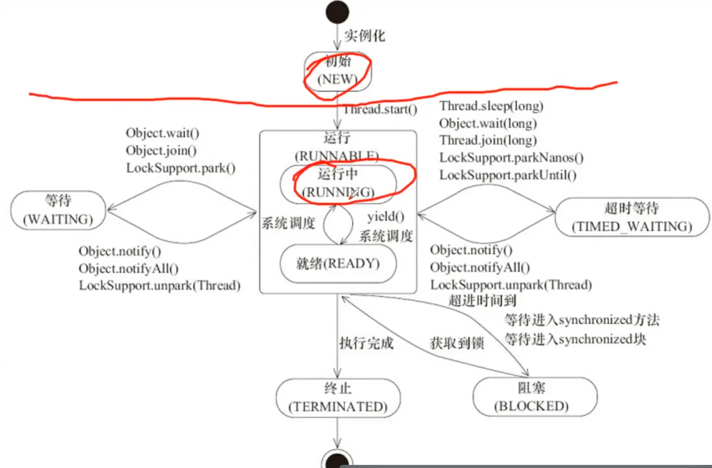
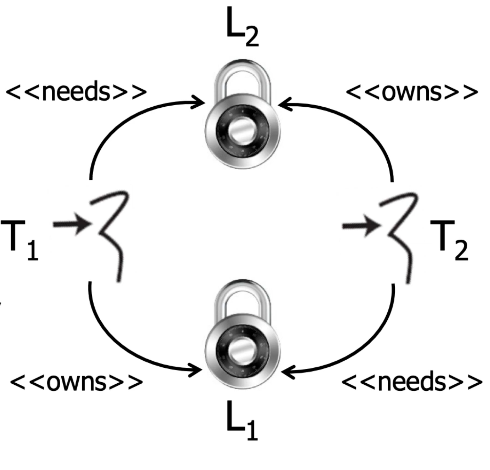
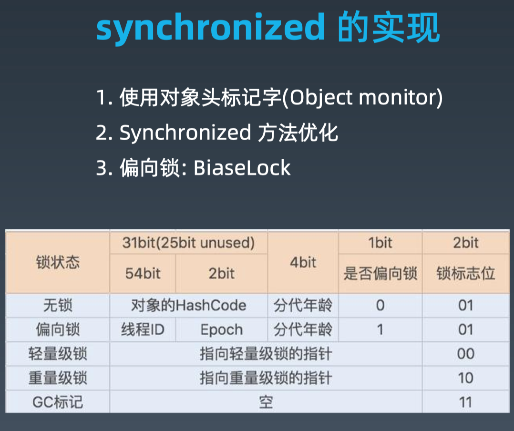
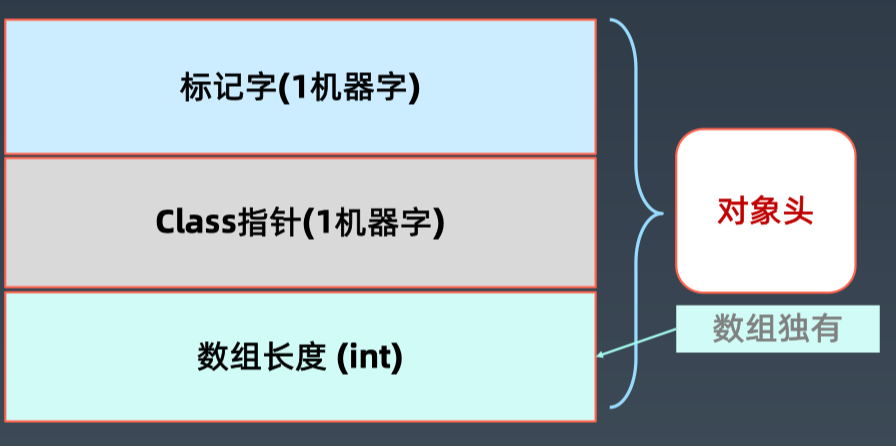
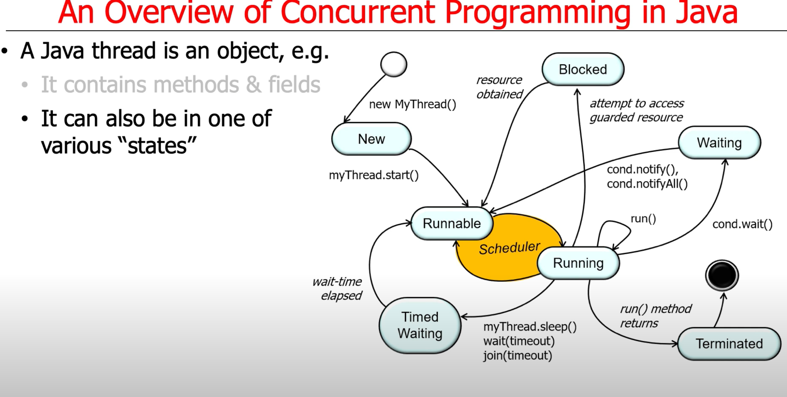

并发


一个端口是否可以被进程复用?

答: 可, 只要是一个父进程和几个子进程


#### 创建线程

```java
public static void main(String[] args) {
  Runnable task = new Runnable() {
    @Override
    public void run() {
      try {
        Thread.Sleep(5000);
      } catch (InterruptedException e) {
        e.printStrackTrace();
      }
      Thread t = Thread.currentThread();
      System.out.println("当前线程: " + t.getName());
    }
  };
  Thread thread = new Thread(task);
  thread.setName("test-thread-1");
  thread.setDaemon(true);
  // 为true时,很可能根本不执行 什么都不输出.
  thread.start();
}
```

什么是守护线程?

前端线程: 做业务的线程

默默做任务的是守护线程, 刷缓存. 当剩下线程都是守护线程时, 把JVM关掉


Thread#start(): 创建新线程

Thread#run(): 本线程调用


线程状态



Runnable: 可运行状态. CPU 从很多Runnable的线程里挑选一个.

线程内部有计数器

时间戳: 前后比较. 

| 重要属性/方法                              | 说明                                |
| ------------------------------------------ | ----------------------------------- |
| volatile String name;                      | 线程名称 - 诊断分析使用             |
| boolean daemon = false;                    | 后台守护线程标志 - 决定JVM优雅关闭  |
| Runnable target; 也就是task                | 任务(只能通过构造函数传入)          |
| synchronized void **start**()              | [协作] 启动新线程并自动执行         |
| void **join**()                            | [协作] 等待某个线程执行完毕(来汇合) |
| static native Thread **currentThread**();  | 静态方法获取当前线程信息            |
| static native void **sleep**(long millis); | 静态方法: 线程睡眠并让出CPU时间片   |


| Object#方法                        | 说明                                                         |
| ---------------------------------- | ------------------------------------------------------------ |
| void wait( )                       | 放弃锁+等待0ms+尝试获取锁;                                   |
| void wait(long timeout, int nanos) | 放弃锁+wait+到时间自动唤醒/中途换行(精度: nanos>0 则timeout++) |
| native void wait(long timeout);    | 放弃锁+wait+到时间自动唤醒/中途被唤醒(唤醒后自动获取锁)      |
| native void notify();              | 发送信号通知1个等待线程                                      |
| native void notifyAll();           | 发送信号通知所有等待线程.                                    |

:warning: **辨析**

* Thread.sleep: 释放CPU
* Object#wait: 释放CPU + 释放锁, wait可通过notify方法唤醒


### :heavy_exclamation_mark:Thread的状态改变操作

1. **Thread.sleep(long millis)**, 一定是当前线程调用此方法, 当前线程进入TIMED_WAITING状态, 但==不释放对象锁==, millis后线程自动苏醒进入就绪状态. ***作用***: <u>给其他线程执行机会的最佳方式</u>.
2. **<u>Thread.yield()</u>**,  ❌ 没什么应用场景, 奇葩
   * 一定是当前线程调用此方法, 
   * 当前线程放弃获取的CPU时间片, 但不释放锁资源, 由运行状态变为就绪状态, 让给你OS再次选择线程. 
   * 作用: 
     * 让相同优先级的线程轮流执行, 但并不保证一定会轮流执行. 
     * 实际中无法保证yield()达到让步的目的, 因为让步的线程还有可能被线程调度程序再次选中. Thread.yield() 不会导致阻塞. 
   * 该方法与sleep()类似, 只是不能由用户指定暂停多长时间.
3. **t.join()/t.join(long millis)**, `当前线程`里调用`其他线程t`的join方法, 当前线程进入WAITING/TIMED_WAITING状态, **当前线程不会释放已经持有的对象锁**. 
   * 线程t执行完毕或者millis时间到, 当前线程进入就绪状态.
4. obj.wait(), 当前线程调用对象的wait()方法, 当前线程**释放对象锁**, 进入等待队列. 依靠notify()/notifyAll() 唤醒或者 wait(long timeout) timeout 时间到自动唤醒
5. obj.notify() 唤醒再次对象监视器上等待的单个线程, 选择是任意性的. 
6. notifyAll() 唤醒在此对象监视器上等待的所有线程.

### :heavy_exclamation_mark:Thread的中断与异常处理. 

1. 线程内部自己处理异常, 不溢出到外层.
2. 


Callable 能返回一个T类型的值

```java
System.out.println(Thread.activeCount());
Thread.currentThread().getThreadGroup().list();
```

java.lang.ThreadGroup[name=main,maxpri=10]
    Thread[main,5,main]
    Thread[Monitor Ctrl-Break,5,main]




## 线程安全

多个线程竞争同一资源时, 如果对资源的访问顺序敏感, 就称为**竞态条件**.

Race conditions occur when a program depends upon the sequence or timing of threads for it to operate properly.


导致竞态条件发生的代码区称为**临界区**.


Memory inconsistencies

* These errors occur when diff threads have inconsistent views of what should be the same data.

Deadlocks

* Occur when 2+ competing threads are waiting for the other to finish, & thus none ever do
* 

### 原子性

原子性: 原子操作

对基本数据类型的变量的读取和复制操作是原子性操作, 即这些操作是不可被中断的, 要么执行, 要么不执行.

```java
x = 10; // 1
y = x ; // 2
x++;		// 3
x = x + 1; // 4
```

只有 `1`是原子操作.


### 可见性

可见性: 对于可见性, Java提供了**volatile**关键字来保证**可见性**.

当一个共享变量被volatile修饰时, 它会保证修改的值会立即被更新主存. 

volatile不能保证原子性. 

### 有序性

happens-before 原则 (先行发生原则):

1. 程序次序规则: 一个县城内, 按照代码先后顺序;
2. 锁定规则: 一个unlock操作先行发生于后面对同一个锁的lock操作.
3. Volatile变量规则: 对一个变量的写操作先行发生于后面对这个变量的读操作.
4. 传递规则: 如果操作A先行发生于操作B, 而操作B又先行发生于操作C, 则可以得出A先于C
5. 线程启动规则: Thread对象的start()方法先行发生于此线程的每一个动作.
6. 线程中断规则: 对线程interrupt()方法的调用先行发生于被中断线程的代码检测到中断事件的发生.
7. 线程终结规则: 线程中所有的操作都先行发生于线程的终止检测, 我们可以通过Thread.join() 方法结束、Thread.isAlive()的返回值手段检测到线程已经终止执行.
8. 对象终结规则: 一个对象的初始化完成先行发生于他的finalize()方法的开始.





### volatile

1. 每次读取都强制从主内存刷数据
2. 适用场景: 单个线程写, 多个线程读
3. 原则: 能不用就不用, 不确定的时候也不用
4. 替代方案: Atomic 原子操作类

### final

| final定义类型     | 说明                                                         |
| ----------------- | ------------------------------------------------------------ |
| final class XXX   | 不允许继承                                                   |
| final方法         | 不允许Override                                               |
| final局部变量     | 不允许修改                                                   |
| final实例属性     | 1. 构造函数/初始化/《init》之后不允许变更;<br />2. 只能赋值一次; <br />3. **安全发布**: 构造函数结束返回时, final域最新的值被保证对其他线程可见 |
| final static 属性 | \<clinit>静态块执行后不允许变更; 只能赋值一次                |
|                   |                                                              |

:question:思考:final声明的引用类型和原生类型在处理时有什么区别?

Java里的常量替换. 写代码最大化用final是个好习惯.

