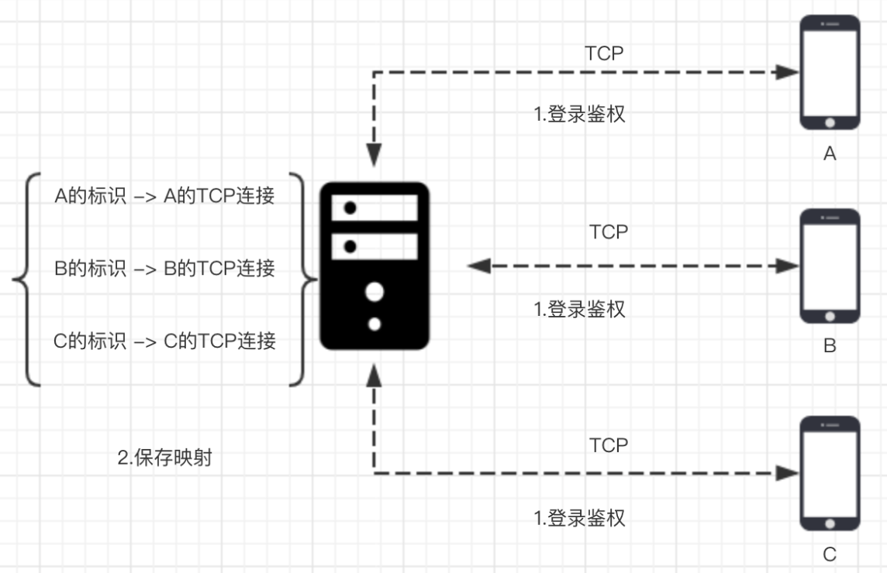
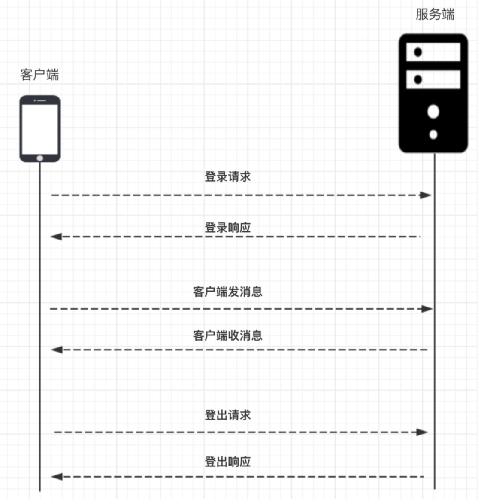
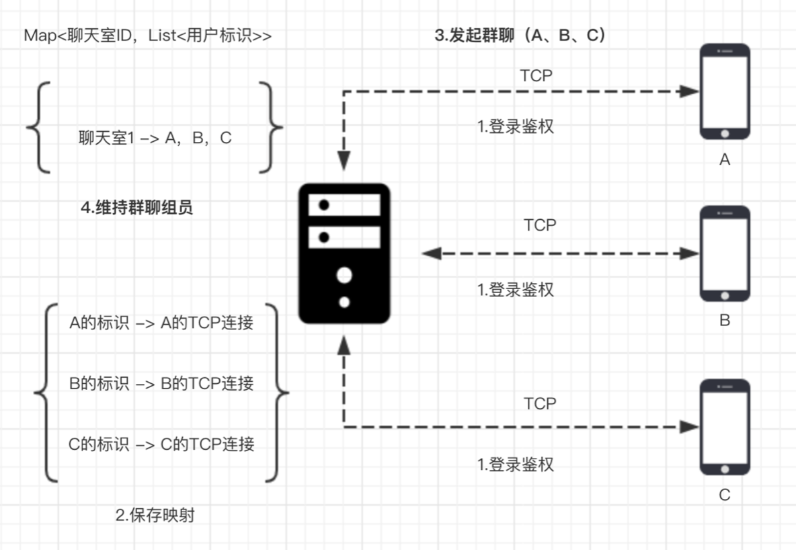
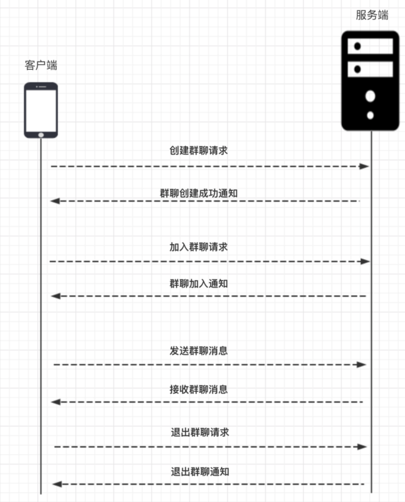
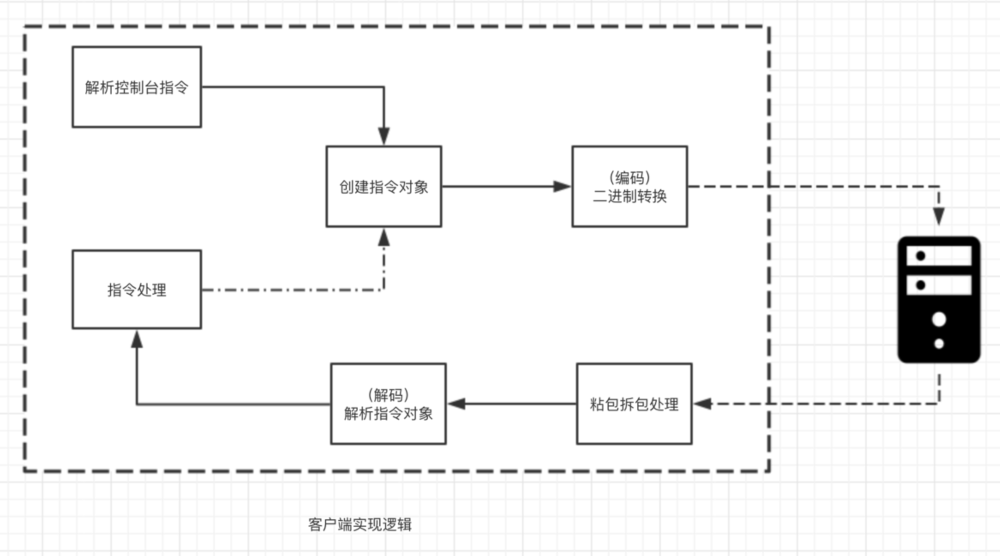
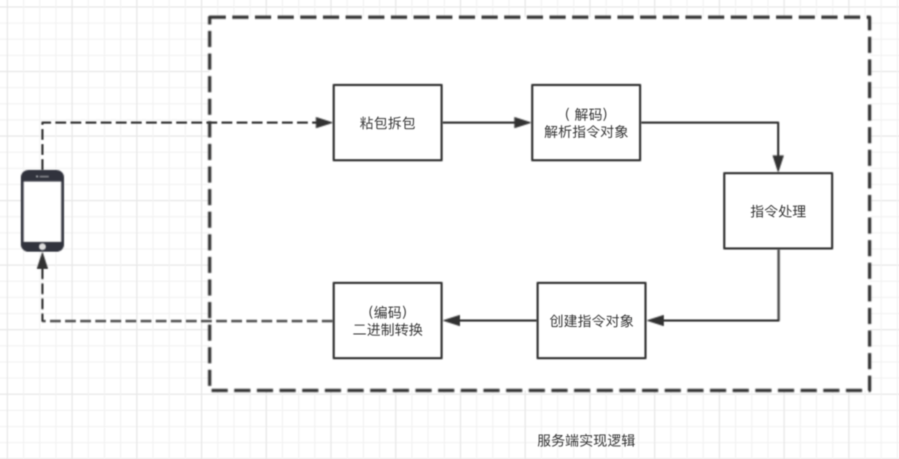

# 仿微信IM系统简介

## 单聊流程

1. A要和B聊天，首先A和B需要与服务器建立连接，然后进行一次登录流程，服务端保存用户标识和TCP连接的映射关系。
2. A发消息给B，
   * 首先需要将带有B标识的消息数据包发送到服务器，然后服务器从消息数据包拿到B的标识，找到对应B的链接，将消息发送给B
3. 任意一方发消息给对方，如果对方不在线，需要将消息缓存，对方上线后再发送。

我们把客户端与服务端之间相互通信的数据包称为指令数据包，指令数据包分为 **指令** 和 **数据**，每一种指令对应客户端或服务端的一种操作，数据部分对应的是指令处理需要的数据。

## 单聊的指令

### 指令图示

## 群聊流程

群聊指的是一个组内多个用户之间的聊天，一个用户发到群组的消息会被组内任何一个成员接收, 下面我们来看一下群聊的基本流程

要实现群聊，其实和单聊类似

1. A，B，C依然会经历登录流程，服务端保存用户标识对应的TCP连接
2. A发起群聊的时候，将A，B，C的标识发送到服务端，服务端拿到之后建立一个群聊ID，然后把这个ID与A，B，C的标识绑定。
3. 群聊里面任意一方在群里聊天的时候，将群聊ID发送至服务端，服务端拿到群聊ID之后，取出相应的用户标识，遍历用户标识对应的TCP连接，就可以将消息发送至每一个群聊成员

## 群聊要实现的指令集

| Instruction      | Client | Server |
| ---------------- | ------ | ------ |
| 创建群聊请求     | 发送   | 接收   |
| 群聊创建成功通知 | 接收   | 发送   |
| 加入群聊请求     | 发送   | 接收   |
| 群聊加入通知     | 接收   | 发送   |
| 发送群聊消息     | 发送   | 接收   |
| 接收群聊消息     | 接收   | 发送   |
| 退出群聊请求     | 发送   | 接收   |
| 退出群聊通知     | 接收   | 发送   |

## Netty

我们使用Netty统一的IO读写API以及强大的pipeline来编写业务处理逻辑，在后续的章节中，我会通过IM这个例子，带你逐步了解Netty的一下核心知识点

* Server 如何启动
* Client 如何启动
* 数据载体 ByteBuf
* 长连自定义协议如何设计
* 粘包拆包原理与实践
* 如何实现自定义编解码
* pipeline与channelHandler
* 定时发心跳怎么做
* 如何进行连接空闲检测

1. 首先，客户端会解析控制台指令，比如发送消息或建立群聊等指令
2. 然后，客户端会基于控制台的输入创建一个指令对象，用户告诉服务端具体要干什么事情
3. TCP通信需要的数据格式为二进制，因此，接下来通过自定义二进制协议将指令对象封装成二进制，这一步成为协议的编码。
4. 对于收到服务端的数据，首先需要截取出一段完整的二进制数据包（**拆包粘包**）
5. 将此二进制数据包解析成指令对象，比如收到消息
6. 将指令对象送到相应的逻辑处理器来处理

服务端使用Netty的程序逻辑结构

