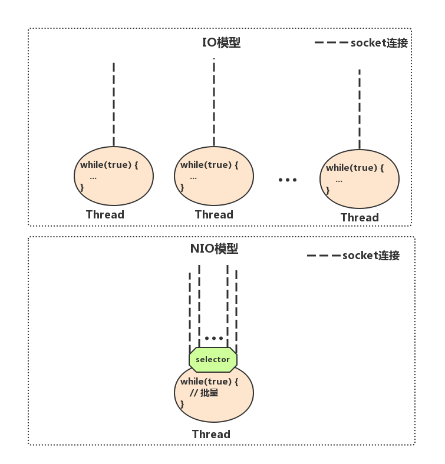

# Netty是什么？

在开始了解Netty是什么之前，我们先来回顾一下，如果我们需要实现一个客户端与服务端通信的程序，使用传统的IO编程，应该如何实现？


## IO 编程

简化下场景：客户端每隔两秒就发送一个带有时间戳的“hello world”给服务端，服务端收到之后打印。

为了方便演示，下面例子中，服务端和客户端各一个类，把这两个类拷贝到你的IDE中，先后运行`IOServer.java`和`IOClient.java` 可看到结果


下面是传统的IO编程中服务端实现：

> IOServer.java


```java
public class IOServer {
  public static void main(String[] args) throws Exception {
    ServerSocket serverSocket = new ServerSocket(8000);
    
    new Thread(() -> {
      while (true) {
        try {
          // (1) 阻塞方法获取新的连接
          Socket socket = serverSocket.accept();
          
          // （2） 每一个新的连接创建一个线程，负责读取数据
          new Thread(() -> {
            try {
              int len;
              byte[] data = new byte[1024];
              InputStream inputStream = socket.getInputStream();
              
              // (3) 按字节流方式读取数据
							while ((len = inputStream.read(data)) != -1) {
                System.out.println(new String(data, 0, len));
              }
            } catch (IOException e) {
            }
          }).start();
          
        } catch (IOException e) {
          
        }
      }
    }).start();
  }
}
```


* Server 端首先创建了一个`serverSocket` 来监听8000端口，然后创建一个线程，线程里面不断调用阻塞方法 `serversocket.accept();` 获取新的连接，见（1）
* 当获取到新的连接之后，给每条连接创建一个新的线程，这个线程负责从该连接中读取数据，（2）
* 然后读取是以字节流的方式，见（3）


下面是传统的IO编程中客户端实现

> IOClient.java

```java
public class IOClient {
  public static void main(String[] args) {
    new Thread( ()-> {
      try {
        Socket socket = new Socket("127.0.0.1", 8000);
        while (true) {
          try {
            socket.getOutputStream().write((new Date() + ": hello world").getBytes());
            Thread.sleep(2000);
          } catch (Exception e) {
            
          }
        }
      } catch (IOException e) {
        
      }
    } ).start();
  }
}
```

客户端的代码相对简单，连接上服务端8000端口后，每隔2秒，我们向服务端写一个带有时间戳的“hello world”

IO编程模型在客户端较少的情况下运行良好，但是对于客户端较多的业务来说，单机服务端可能需要支撑成千上万的连接，IO模型可能就不太合适了，我们来分析一下原因。


上面的demo，从服务端的代码中我们可以看到，在传统的IO模型中，每个连接创建成功之后都需要一个线程来维护，每个线程包含一个while循环，那么1w 个连接对应1w 个线程，继而1w个while死循环，这就带来如下几个问题：

1. 线程资源受限：线程是操作系统中非常宝贵的资源，同一时刻有大量的线程处于阻塞状态是非常严重的资源浪费，操作系统耗不起
2. 线程切换效率低下：单机CPU核数固定，线程爆炸之后操作系统频繁进行线程切换，应用性能急剧下降。
3. 除了以上2个问题，IO编程中，我们看到数据读写是以字节流为单位。
4. 


## NIO


### 线程资源受限

NIO编程模型中，新来一个连接不再创建一个新的线程，而是可以把这条连接直接绑定到讴歌固定的线程，然后这条连接所有的读写都由这个线程来负责




IO模型中，一个连接来了，会创建一个线程，对应一个while死循环，死循环的目的就是不断监测这条连接上是否有数据可以读。

大多数情况下，1w个连接里面同一时刻只有少量的连接有数据可读，因此许多个while死循环都白白浪费掉了，因为读不出啥数据。


在NIO模型中，许多while循环变成一个死循环，这个死循环由一个线程控制，那么他又是如何做到一个线程，一个while死循环就能监测1w个连接是否有数据可读呢？

NIO中的selector，一条连接来了之后，现在不创建一个while死循环去监听是否有数据可读了，而是直接把这条连接注册到selector上，然后，通过检查这个selector，就可以批量监测出有数据可读的连接，进而读取数据。

实际开发过程中，我们会开多个线程，每个线程都管理者一批连接，相对于IO模型中一个线程管理一条连接，消耗的线程资源大幅减少


### IO读写面向流

IO读写是面向流的，一次性只能从流中读取一个或多个字节，并且读完之后流无法再读取，你需要自己缓存数据。

而NIO的读写是面向Buffer的，你可以随意读取里面任何一个字节数据，不需要你自己缓存数据，这一切只需要**移动读写指针**即可。

```java
package nettyIM;

import java.io.IOException;
import java.net.InetSocketAddress;
import java.nio.ByteBuffer;
import java.nio.channels.SelectionKey;
import java.nio.channels.Selector;
import java.nio.channels.ServerSocketChannel;
import java.nio.channels.SocketChannel;
import java.nio.charset.Charset;
import java.util.Iterator;
import java.util.Set;

public class NIOServer {
    public static void main(String[] args) throws IOException {
        Selector serverSelector = Selector.open();
        Selector clientSelector = Selector.open();

        new Thread( () -> {
            try {
                // 对应IO编程中服务端启动
                ServerSocketChannel listenerChannel = ServerSocketChannel.open();
                listenerChannel.socket().bind(new InetSocketAddress(8000));
                listenerChannel.configureBlocking(false);
                listenerChannel.register(serverSelector, SelectionKey.OP_ACCEPT);

                while (true) {
                    // 监测是否有新的连接， 这里的1 指阻塞时间为1ms
                    if (serverSelector.select(1) > 0) {
                        Set<SelectionKey> set = serverSelector.selectedKeys();
                        Iterator<SelectionKey> keyIterator = set.iterator();
                        while (keyIterator.hasNext()) {
                            SelectionKey key = keyIterator.next();
                            if (key.isAcceptable()) {
                                try {
                                    // 每来一个新连接，不需要创建一个线程，而是直接注册到clientSelector
                                    SocketChannel clientChannel = ((ServerSocketChannel) key.channel()).accept();
                                    clientChannel.configureBlocking(false);
                                    clientChannel.register(clientSelector, SelectionKey.OP_READ);
                                } finally {
                                    keyIterator.remove();
                                }
                            }
                        }
                    }
                }

            } catch (IOException ex) {
                ex.printStackTrace();
            }
        } ).start();

        new Thread( () -> {
            try {
                while (true) {
                    // 2. 批量轮询是否有哪些连接有数据可读，这里的1指的是阻塞时间为1ms
                    if (clientSelector.select(1) > 0) {
                        Set<SelectionKey> set = clientSelector.selectedKeys();
                        Iterator<SelectionKey> keyIterator = set.iterator();

                        while (keyIterator.hasNext()) {
                            SelectionKey key =  keyIterator.next();
                            if (key.isReadable()) {
                                try {
                                    SocketChannel clientChannel = (SocketChannel) key.channel();
                                    ByteBuffer byteBuffer = ByteBuffer.allocate(1024);
                                    // 3. 面向Buffer
                                    clientChannel.read(byteBuffer);
                                    byteBuffer.flip();
                                    System.out.println(Charset.defaultCharset().newDecoder().decode(byteBuffer).toString());
                                } finally {
                                    keyIterator.remove();
                                    key.interestOps(SelectionKey.OP_READ);
                                }
                            }
                        }
                    }
                }
            } catch (IOException ex) {
                ex.printStackTrace();
            }
        } ).start();
    }
}

```


NIO的核心思路：

1. NIO模型中通常会有两个线程，每个线程绑定一个轮询器selector，在这个例子中`serverSelector`负责轮询是否有新的连接，`clientSelector`负责轮询连接是否有数据可读
2. 服务端监测到新的连接之后，不再创建新的线程，而是直接将新连接绑定到`clientSelector` 上，这样就不用IO模型中1w个while循环在死等。参见（1）
3. `clientSelector` 被一个while死循环包裹着，如果在某一刻有多条连接有数据可读，那么通过`clientSelector.select(1)`方法轮询出来，进而批量处理，参见（2）
4. 数据的读写面向Buffer

**不建议直接基于JDK原生NIO来进行网络开发，原因如下**：

1. 编程模型不友好，ByteBuffer的API反人类
2. 对NIO编程来说，一个比较合适的线程模型能充分发挥它的优势，而JDK没有给你实现，你需要自己实现，就连简单的自定义协议拆包都要自己实现
3. JDK的NIO底层由epoll实现，该实现饱受诟病的空轮询bug会导致cpu飙升100%。
4. 项目庞大后，自行实现NIO很容易出现各类Bug，维护成本较高


## Netty编程

Netty封装了JDK 的NIO，让你用的更爽。

Netty是一个异步事件驱动的网络应用框架，用于快速开发可维护的高性能服务器和客户端。

==使用Netty不使用JDK原生NIO的原因==：

1. Netty底层IO模型随意切换，微小的改动，改改参数，Netty直接从NIO模型变为IO模型
2. Netty自带的拆包解包，异常检测等机制让你从NIO的繁重细节中脱离出来，让你只需关心业务逻辑
3. Netty解决了JDK的很多包括轮询在内的Bug
4. Netty底层对线程，selector做了很多细小的优化，精心设计的reactor线程模型做到非常高效的并发处理
5. 自带各种协议栈让你处理任何一种通用协议都几乎不用亲自动手
6. Netty社区活跃，遇到问题随时邮件列表或者issue
7. Netty已经历各大RPC框架，消息中间件，分布式通信中间件线上的广泛验证，健壮性无比强大


引入Maven依赖，

```java
    <dependency>
        <groupId>io.netty</groupId>
        <artifactId>netty-all</artifactId>
        <version>4.1.6.Final</version>
    </dependency>
```

```java
package nettyIM;

import io.netty.bootstrap.ServerBootstrap;
import io.netty.channel.ChannelHandlerContext;
import io.netty.channel.ChannelInitializer;
import io.netty.channel.SimpleChannelInboundHandler;
import io.netty.channel.nio.NioEventLoopGroup;
import io.netty.channel.socket.nio.NioServerSocketChannel;
import io.netty.channel.socket.nio.NioSocketChannel;
import io.netty.handler.codec.string.StringDecoder;

public class NettyServer {
    public static void main(String[] args) {
        ServerBootstrap serverBootstrap = new ServerBootstrap();
        NioEventLoopGroup boss = new NioEventLoopGroup();
        NioEventLoopGroup worker = new NioEventLoopGroup();

        serverBootstrap
                .group(boss, worker)
                .channel(NioServerSocketChannel.class)
                .childHandler(new ChannelInitializer<NioSocketChannel>() {
                    protected void initChannel(NioSocketChannel ch) {
                        ch.pipeline().addLast(new StringDecoder());
                        ch.pipeline().addLast(new SimpleChannelInboundHandler<String>() {
                            @Override
                            protected void channelRead0(ChannelHandlerContext ctx, String msg) throws Exception {
                                System.out.println(msg);
                            }
                        });
                    }
                })
                .bind(8000);
    }
}

```


由于大部分人对NIO编程缺乏经验，因此，将Netty里面的概念与IO模型结合起来可能更好理解

1. boss 对应IOServer.java中的接收新连接线程，主要负责创建新连接
2. `worker`对应`IOServer.java` 中的负责读取数据的线程，主要用于读取数据以及业务逻辑处理

```java
public class NettyClient {
    public static void main(String[] args) throws InterruptedException {
        Bootstrap bootstrap = new Bootstrap();
        NioEventLoopGroup group = new NioEventLoopGroup();

        bootstrap.group(group)
                .channel(NioSocketChannel.class)
                .handler(new ChannelInitializer<Channel>() {
                    @Override
                    protected void initChannel(Channel ch) throws Exception {
                        ch.pipeline().addLast(new StringEncoder());
                    }
                });
        Channel channel = bootstrap.connect("127.0.0.1", 8000).channel();
        while (true) {
            channel.writeAndFlush(new Date() + ": hello world!");
        }
    }
}

```

在客户端程序中，`group` 对应了我们IOClient.java中main函数起的线程

