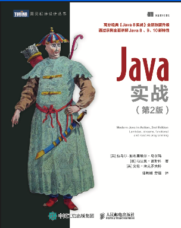
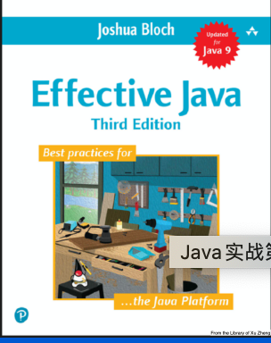

# Book

## Language

1. - [ ] Modern Java In Action / Java实战 第2版

     

   - [ ] Effective Java

     

   - [ ] Java in a Nutshell

   - [ ] Java Cookbook

   - [ ] Modern Java Recipes

2. Spring In Action 和 Spring Boot in Action

3. 

## Object Oriented Design

1. - [ ] Head First Design Pattern
   - [ ] Design Patterns
   - [ ] The Object-Oriented Thought Process
   - [ ] Object Design Style Guide
   - [ ] 

- [ ] [Making Your Java Code More Object-oriented](https://app.pluralsight.com/library/courses/object-oriented-java-code)
- [ ] [Mastering Object-oriented Programming in Java](https://app.pluralsight.com/library/courses/object-oriented-programming-java/table-of-contents)
- [ ] 
- [ ] 

Java 8

- [ ] [What's New in Java 8](https://app.pluralsight.com/library/courses/java-8-whats-new)
- [ ] [From Collections to Streams in Java 8 Using Lambda Expressions](https://app.pluralsight.com/library/courses/java-8-lambda-expressions-collections-streams)
- [ ] [Streams, Collectors, and Optionals for Data Processing in Java 8](https://app.pluralsight.com/library/courses/java-8-data-processing-streams-collectors-optionals)
- [ ] [Applying Concurrency and Multi-threading to Common Java Patterns](https://app.pluralsight.com/library/courses/java-patterns-concurrency-multi-threading)
- [ ] [Advanced Java Concurrent Patterns](https://app.pluralsight.com/library/courses/java-concurrent-patterns-advanced)
- [ ] [Implementing Design Patterns Using Java 8 Lambda](https://app.pluralsight.com/library/courses/implementing-design-patterns-java-8-lambda-expression)
- [ ] [Using Java Streams to Process and Analyze Data in Memory](https://app.pluralsight.com/library/courses/java-streams-process-analyze-data-memory)
- [ ] [Using Lambda Expressions in Java Code](https://app.pluralsight.com/library/courses/lambda-expressions-java-code)
- [ ] 

I/O

- [ ] [Java Fundamentals: Input/Output](https://app.pluralsight.com/library/courses/java-fundamentals-input-output)
- [ ] [NIO and NIO2](https://app.pluralsight.com/library/courses/java-fundamentals-nio-nio2)

- [ ] [Working with files in Java Using the Java NIO API](https://app.pluralsight.com/library/courses/files-java-nio-api/table-of-contents)
- [ ] 

Concurrency

- [ ] [Analyzing Java Thread DumpsWWAnalyzing Java Thread Dumps](https://app.pluralsight.com/library/courses/analyzing-java-thread-dumps)
- [ ] 

Reflection

- [ ] [Java Fundamentals: The Java Reflection API Method Handles](https://app.pluralsight.com/library/courses/java-fundamentals-reflection-api-method-handles)
- [ ] 

- [ ] [Java Fundamentals: Asynchronous Programming Using CompletionStage](https://app.pluralsight.com/library/courses/java-fundamentals-asynchronous-programming-completionstage)

Refactoring

- [ ] [Java Refactoring: Best Practices](https://app.pluralsight.com/library/courses/java-refactoring-best-practices)
- [ ] [Java: Refactoring to Design Patterns](https://app.pluralsight.com/library/courses/java-refactoring-design-patterns)
- [ ] [Java: Writing Readable and Maintainable CodeWWJava: Writing Readable and Maintainable Code](https://app.pluralsight.com/library/courses/java-writing-readable-maintainable-code)

Testing

- [ ] [Getting Started with Web API Test Automation in Java](https://app.pluralsight.com/library/courses/java-web-api-test-automation-getting-started)
- [ ] [Fundamentals of Test Automation in JavaWWFundamentals of Test Automation in Java](https://app.pluralsight.com/library/courses/test-automation-java-fundamentals)
- [ ] [Implementing a Test Pyramid Strategy in Java](https://app.pluralsight.com/library/courses/implementing-test-pyramid-strategy-java/table-of-contents)

JVM

- [ ] [Understanding the Java Virtual Machine: Memory Management](https://app.pluralsight.com/library/courses/understanding-java-vm-memory-management)
- [ ] [Understanding the Java Virtual Machine: Class Loading and Reflection](https://app.pluralsight.com/library/courses/understanding-java-vm-class-loading-reflection)
- [ ] [Understanding the Java Virtual Machine: Security](https://app.pluralsight.com/library/courses/understanding-java-vm-security)
- [ ] [Understanding and Solving Java Memory ProblemsWWUnderstanding and Solving Java Memory Problems](https://app.pluralsight.com/library/courses/java-understanding-solving-memory-problems)

Kotlin

- [ ] [Kotlin Fundamentals](https://app.pluralsight.com/library/courses/kotlin-fundamentals)
- [ ] [Kotlin: Using Coroutines](https://app.pluralsight.com/library/courses/kotlin-using-coroutines)
- [ ] [Getting Started with Kotlin](https://app.pluralsight.com/library/courses/kotlin-getting-started)
- [ ] 

TODO of TODO

Great course

CS891

https://www.coursera.org/specializations/secure-coding-practices

https://www.coursera.org/specializations/cs-fundamentals

https://www.coursera.org/learn/computational-thinking-problem-solving

