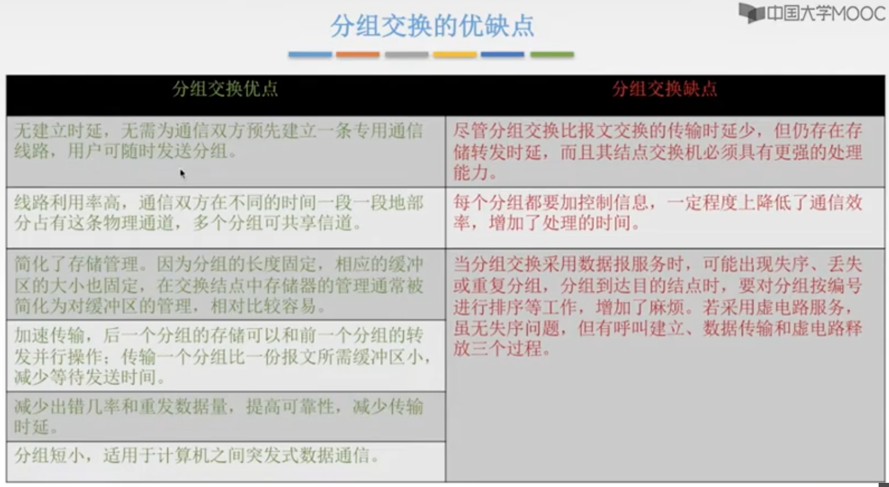
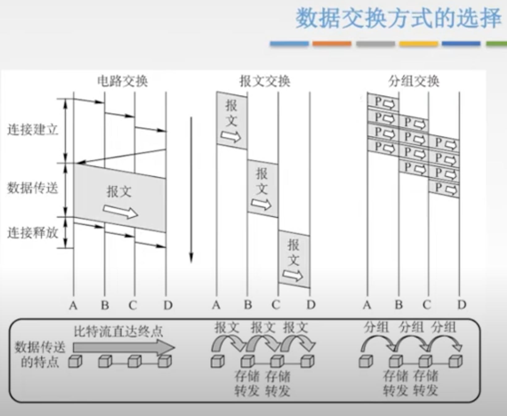

三种通信方式

1. 单工通信

只有一个方向的通信而没有反方向的交互，仅需要一条信道

类比：主播

2. 半双工通信/双向交替通信

   通信的双方都可以发送或接收信息，但任何一方都不能同时发送和接收，需要两条信道

类比：对讲机

3. 全双工通信/双向同时通信

通信双方可以同时发送和接收信息，也需要两条信道

#### 串行传输

逐个将8位二进制数按由低到高位的顺序依次发送

慢，费用低，适合远距离

#### 并行传输

将表示一个字符的8位二进制数同时通过8条信道发送。

快，贵，适合近距离

#### 码元

码元是指用一个**固定时长的信号波形（数字脉冲）**，代表不同离散数值的基本波形，是数字通信中数字信号的计量单位，这个时长内的信号称为k进制码元，该时长称为==码元宽度==。

当码元的离散状态有M个时（M大于2），此时码元为M进制码元。

K进制码元

4进制码元--》码元的离散状态有四个--〉4种高低不同的信号波形 00，01，10，11

2 bit 信息量

16进制码元

4bit 信息量

#### 码元传输速率

单位时间内数字通信系统锁传输的码元个数

#### 信息传输速率

单位时间内数字通信系统传输的二进制码元个数 （即比特数）

#### 失真

1. 码元传输速率
2. 信号传输距离
3. 噪声干扰
4. 传输媒体质量

#### 信号带宽

信道带宽是信道能通过的最高频率和最低频率之差。

码间串扰：接收端收到的信号波形失去了码元之间清晰界限的现象

#### 分组交换

小数据块+控制信息（源和目的地址、编号） = 分组 （packet）

##### 分组交换的优缺点

##### 数据交换方式的选择

1. 传送数据量大，且传送时间远大于呼叫时间，选择电路交换。电路交换传输时延最小
2. 当端到端的通路有很多段的链路组成时，采用**分组交换**传送数据较为合适
3. 从信道利用率上看，报文交换和分组交换优于电路交换
   1. 其中==分组交换==比报文交换的时延小，尤其适合计算机之间的突发式的数据通信

#### 数据报方式的特点

1. **数据报**方式为网络层提供==无连接服务==。发送方可随时发送分组，网络中的节点可随时接收分组

> 无连接服务：不事先为分组的传输确定传输路径，每个分组独立确定传输路径，不同分组传输路径可能不同

2. 同一报文的不同分组达到目的结点时可能发生乱序、重复与丢失
3. 每个分组在传输过程中必须携带原地址与目的地址，分组号
4. 分组在交换节点存储转发时，需要排队等候处理，这会带来一定的时延，当通过交换节点的通信量较大或网络发生拥塞时，这种试验大大增加，减缓节点还可根据情况丢弃部分分组。
5. 网络具有冗余路径，当某一交换节点或一段链路出现故障时，可相应地更新转发表，寻找另一条路径转发分组，对故障的适应能力强，适用于突发性通信，