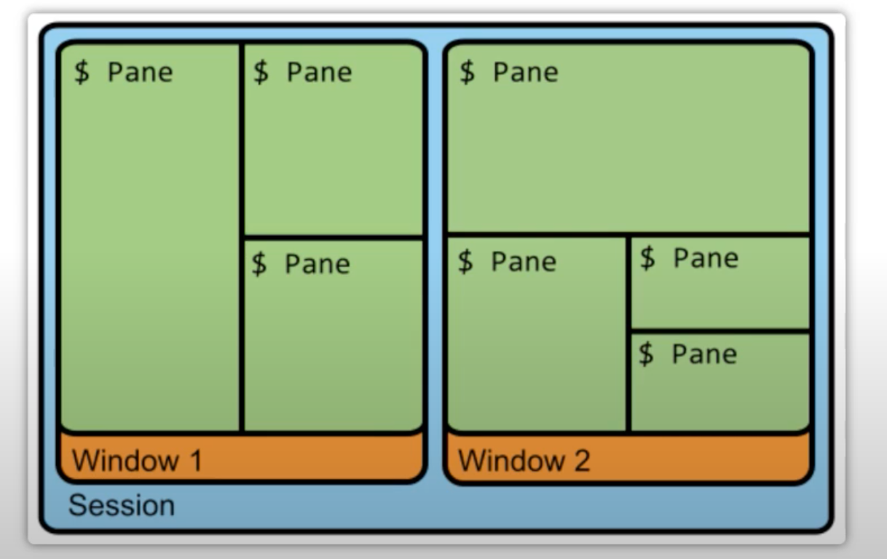

安装tmux

```bash
brew install tmux
```





tmux 默认的快捷键前缀是ctrl + b

some import concepts in tmux:

1. 会话 (session), 建立一个tmux工作区会话
2. 窗口(window): 容纳多个窗格
3. 窗格(pane): 可以在窗口中分成多个窗格(pane)

## Session


创建新session with the name mysession

```bash
tmux new -s mysession
```

* Kill / delete session *mysession*

```bash
tmux kill-ses -t mysession
```

* kill/delete all sessions but the current

```bach
tmux kill-ses -a
```

* kill/delete all session but *mysession*

```bash
tmux kill-session -a -t mysession
```

* Rename session

```bash
ctrl + b + $
```


## Windows

* Create window

```bash
ctrl + b c
```

* rename current window

```bash
ctrl + b ,
```

* Close current window

```bash
ctrl + b &
```

* Previous/Next window

```
ctrl + b p/n
```


## Pane

竖分屏

```
ctrl b + %
```

横分屏

``` 
ctrl + b  "
```

* Toggle last active pane

```
ctrl + b ;
```

* Move the current pane left

```
ctrl + b {
```


可以在一个window进行代码编辑, 在另一个窗口进行提交

ctrl + b + `:`

```
:resize-pane -D (Resizes the current pane down)
:resize-pane -U (Resizes the current pane upward)
:resize-pane -L (Resizes the current pane left)
:resize-pane -R (Resizes the current pane right)
:resize-pane -D 10 (Resizes the current pane down by 10 cells)
:resize-pane -U 10 (Resizes the current pane upward by 10 cells)
:resize-pane -L 10 (Resizes the current pane left by 10 cells)
:resize-pane -R 10 (Resizes the current pane right by 10 cells)
```

```
# vim-like pane resizing  
bind -r C-k resize-pane -U
bind -r C-j resize-pane -D
bind -r C-h resize-pane -L
bind -r C-l resize-pane -R

# vim-like pane switching
bind -r k select-pane -U 
bind -r j select-pane -D 
bind -r h select-pane -L 
bind -r l select-pane -R 
```


