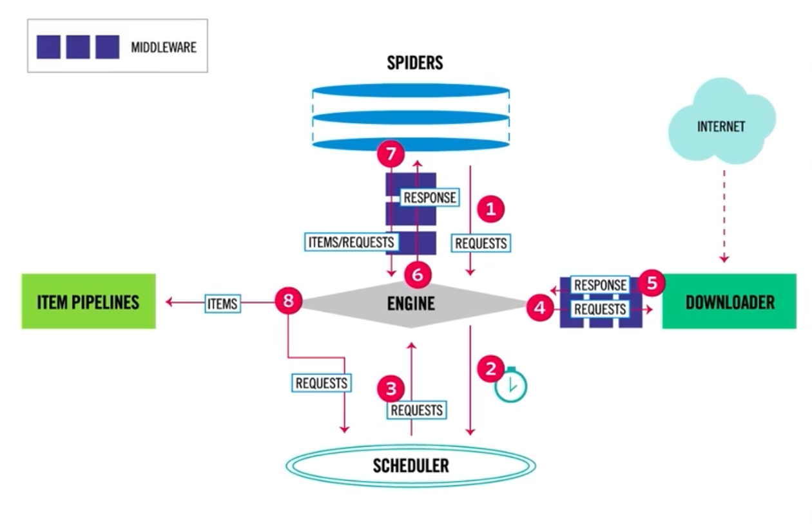

json

image

video

## 策略
广度优先
深度优先
聚焦

### 广度优先

1. 获取一个页面的所有  URL
2. 将URL按顺序存入列表
3. 整个页面URL爬取完毕, 从列表中按顺序去出URL, 再次重复第一步.
4. 直到列表为空.

### 深度优先

# Scrapy

## 爬取流程

针对每个URL,
Scheduler -> Downloader -> Spider ->

1. 如果返回的是新的URL, 就会返回Scheduler
2. 如果是需要保存的数据, 则会被放倒item pipline里面

改两个东西, spider, pipline, 其他一般不用改

创建scrapy项目

scrapy startproject project name

创建scrapy蜘蛛

scrapy genspider example example.com

爬取 without log

scrapy crawl example --nolog

