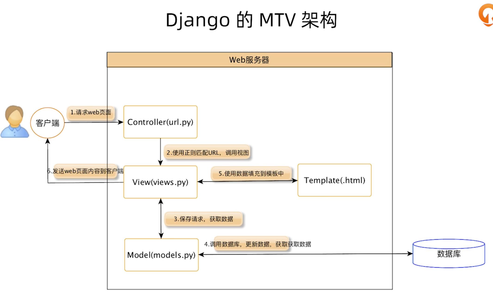

## Django适用场景

* 内容管理系统
  * 博客
  * CMS
  * Wiki
* 企业内部系统
  * 会议室预定
  * 招聘管理
  * ERP & CRM
    * **ERP** stands for **Enterprise Resource Planning** and refers to software and systems used to plan and manage all the core supply chain, manufacturing, services, financial and other processes of an organization.
    * A CRM tool lets you store customer and prospect contact information, identify sales opportunities, record service issues, and manage **marketing** campaigns, all in one central location — and make information about every customer interaction available to anyone at your company who might need it.
  * 报表系统
* 运维管理系统
  * CMDB
  * 发布管理
  * 作业管理
  * 脚本管理
  * 变更管理
  * 故障管理

## Pros and Cons

### 优点:

1. python实现, 代码干净整洁
2. 提供后台管理, 快速开发
3. 复用度高, 
4. 易于拓展复用的中间件
5. 内置的安全框架
6. 丰富的第三方类库

### 缺点:

1. 单体应用: 不易于并行开发, 单点拓展
2. 不适合高并发的to C的互联网项目.

## 著名产品

Youtube

Instgram

Dropbox

Spotify

Disqus

## Django MTV 架构

