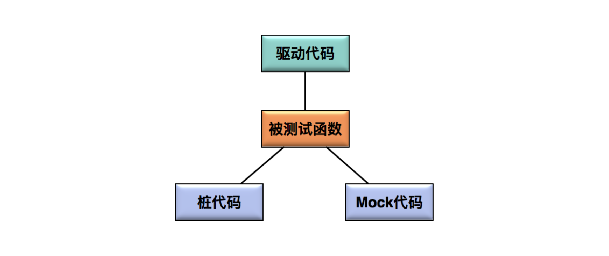

开发工程师为了设计并实现逻辑功能正确的代码，通常会有如下的考虑过程：

1. 如果要实现正确的功能逻辑，会有哪几种正常的输入；
2. 是否有需要特殊处理的多种边界输入；
3. 各种潜在非法输入的可能性以及如何处理。

单元测试的用例是一个“输入数据”和“预计输出”的集合.

* 需要针对确定的输入, 根据逻辑功能推算出预期正确的输出, 并且以执行被测试代码的方式进行验证.
  * 在明确了代码需要实现的逻辑功能的基础上, 什么输入, 应该产生什么输出.

如果某些等价类或者边界值, 开发工程师在开发的时候没有考虑到, 测试的时候就更不会去设计对应的测试用例了. 造成测试盲区

### 驱动代码, 桩代码和Mock代码

#### 驱动代码 Diver

* 指调用被测函数的代码
  * 调用被测函数前的数据准备
  * 调用被测函数
  * 验证相关结果

#### 桩代码 Stub

* 代替真实代码的临时代码
  * 比如, 某个函数A的内部实现中调用了一个尚未实现的额函数B, 为了对函数A的逻辑进行测试, 那么就需要模拟一个函数B, 这个模拟的函数B的实现就是桩代码.
  * 隔离和补齐的作用, 使被测代码能够独立编译, 链接, 并独立运行. 
  * 控制被测函数执行路径的作用
* 编写桩代码的三个原则:
  * Signature相同, 内部实现不同
  * 用于实现隔离和补齐的桩函数比较简单，只需保持原函数的声明，加一个空的实现，目的是通过编译链接；
  * 实现控制功能的桩函数是应用最广泛的，要根据测试用例的需要，输出合适的数据作为被测函数的内部输入。

#### Mock代码

* 和桩代码类似
* 本质**区别**: 测试期待结果的验证 (Assert and Expectation)
  * 对于 Mock 代码来说，我们的关注点是 Mock 方法==有没有被调用==，以什么样的参数被调用，被调用的==次数==，以及多个 Mock 函数的先后==调用顺序==。
    * 在使用Mock代码的测试中, 对于结果的验证(assert), 通常出现在Mock函数中.
  * 对于桩代码来说, 我们的关注点是利用Stub来控制被测函数的==执行路径==. 

Martin Fowler [《Mock代码不是桩代码》(Mocks aren't Stubs)](https://martinfowler.com/articles/mocksArentStubs.html)

### 实际项目

1. 底层模块或核心模块的测试才会采用Unit Test
2. 单元测试框架选型 Java-Junit, C/C++ = CppTest和Parasoft C/C++ test
3. 代码覆盖率, JaCoCo (Java)
4. 把单元测试执行、代码覆盖率统计和持续集成流水线做集成, 以确保每次代码递交,都会自动触发单元测试, 并统计代码覆盖率. 最后以==单元测试通过率==和==代码覆盖率==为标准来决定本次代码递交能否被接受

