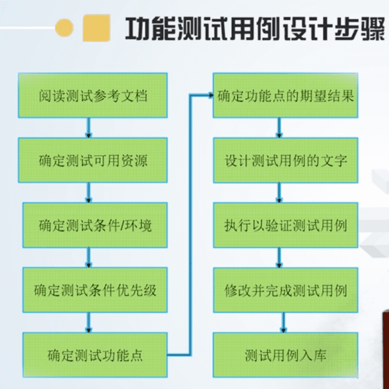
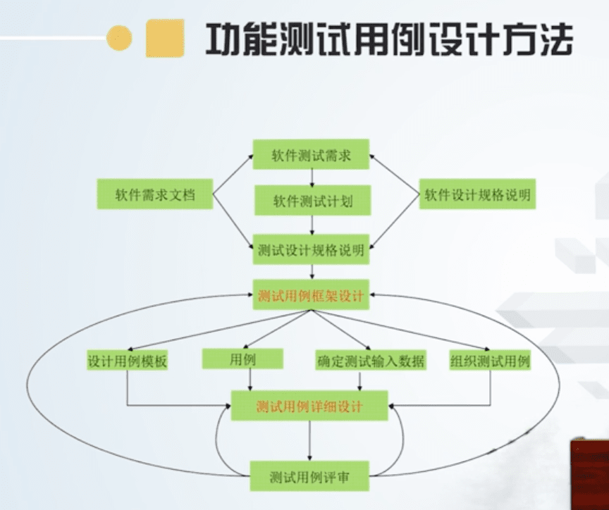
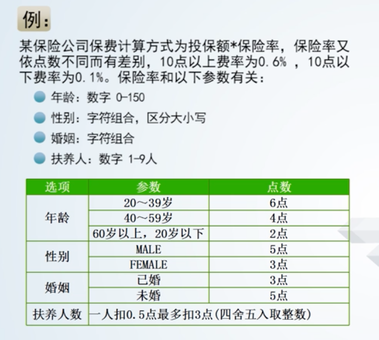
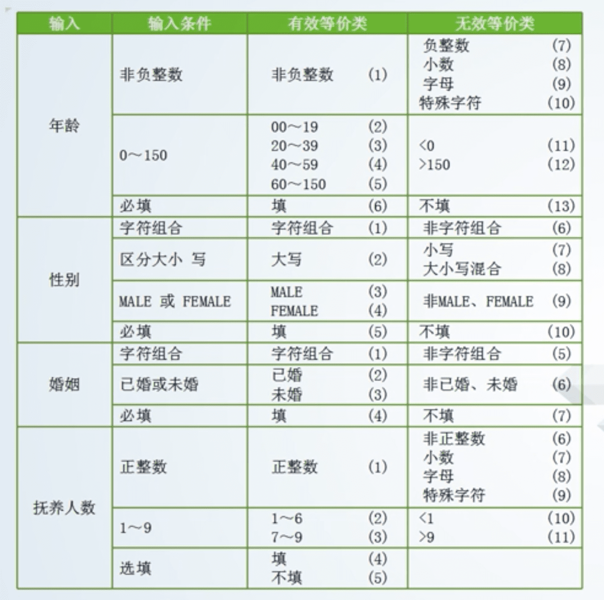
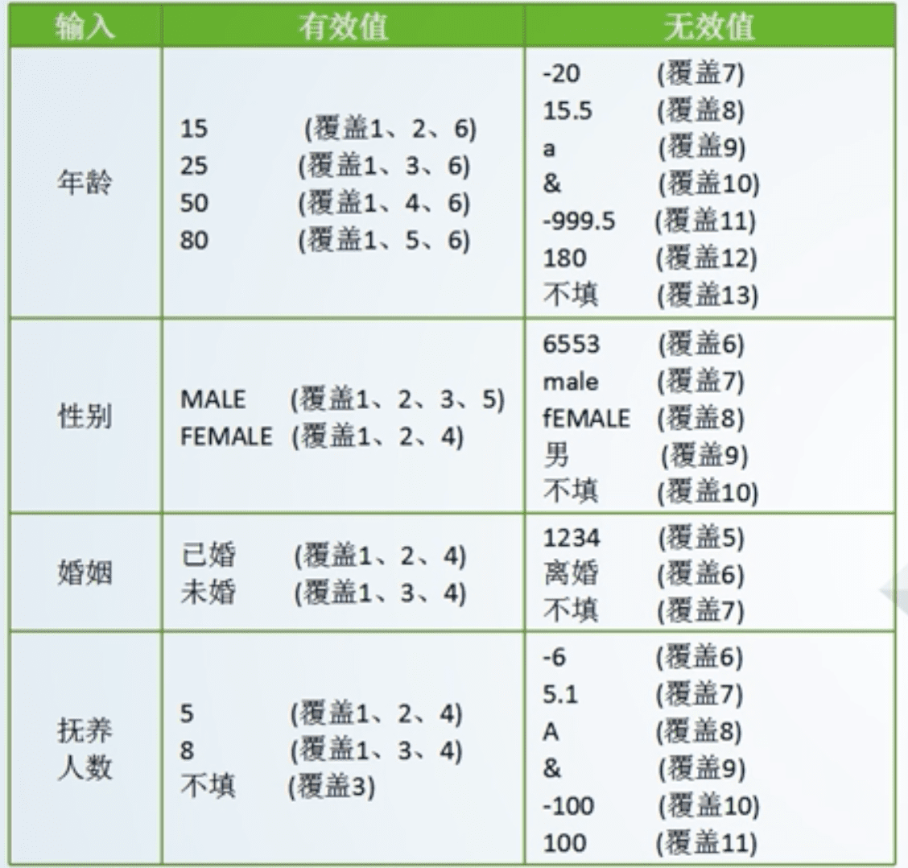
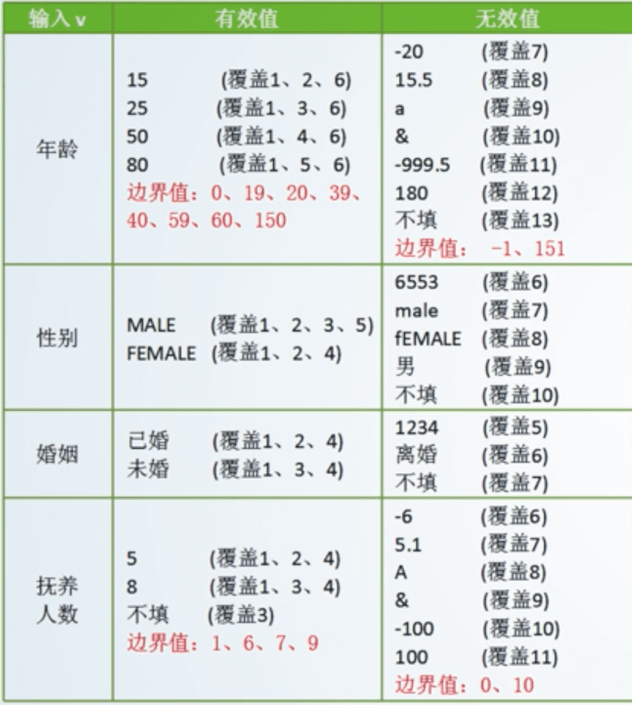

# 黑盒测试与测试用例设计

## 3.1 测试用例综述

### 

### 什么是测试用例

### 根据什么编写测试用例

* 唯一标准用户需求
* 参考资料：《需求规格说明书》

### 为什么需要测试用例

软件测试是有组织性、步骤行和计划性的为了能将软件测试的行为转换为可管理的、具体量化的模式，需要创建和维护测试用例

### 好的测试用例的特征

### 测试用例的影响因素

需求目标

用户实际使用场景，从用户角度来模拟程序的输入

软件功能需求规格说明书、产品设计文档。

测试方法对测试用例的设计影响非常大

测试对象。客户端软件和服务器端系统，分布式系统和集中式系统

软件所采用的技术

测试用例的四大特性

* 代表性
  * 异常性的测试比正常性的测试还要多
  * 能够代表并覆盖各种合理的和不合理，合法的和不合法的，边界的和越界的以及极限的输入数据、操作等。
* 针对性：对程序中的可能存在的错误有针对性的测试
* 可判定性：测试执行结果的正确性是可判定的，每一个测试用例都应有相应的期望结果。
* 可重现性：对同样的测试用例，系统的执行结果应当是相同的。

### 测试用例设计的基本思想

### 测试用例的元素

测试用例是对测试场景和操作的描述，所以必须给出测试目标、测试对象、测试环境要求、软件数据和操作步骤，预期结果，概括为5W1H1E

* 测试目标：Why 为什么而测？功能，性能，易用性，可靠性，兼容性，安全性
* 测试对象：What 测什么？被测试的项目、如对象、菜单、按钮等
* 测试环境：Where 在那里册 测试用例运行时环境，包括系统配置和设定等要求，也包括操作系统、浏览器、网络环境等。
* 测试前提： When- 什么时候开始测？测试用例的运行的前提或条件限制
* 输入数据： Which 哪些数据？在操作时系统所接受的数据
* 操作步骤： How 如何测？执行软件的先后次序步骤
* 预期结果： 判定依据？执行用例后的判定依据

### 测试用例的范例

### 测试用例的分类

* 接口测试用例
* 路径测试用例
* 功能测试用例
* 容错能力测试用例
  * 小错误不会崩溃
* 性能测试用例
* 界面测试用例
* 安全性测试用例
  * 明文
  * sql注入
* 压力测试用例
* 可靠性测试用例
* 安装/反安装测试用例

### 功能测试用例设计步骤

## 3.2 等价类设计方法

黑盒测试：

数据驱动测试，完全不考虑程序内部结构和内部特性，注重于测试软件的功能需求。

确认测试、系统测试、验收测试都采用这种不需要了解内部结构的测试方法。

能发现的错误：

1. 功能不对或功能遗漏，
2. 界面错误
3. 数据结构或数据库访问错误
4. 性能问题
5. 初始化和终止错误

针对性找问题，定位问题更准确

黑盒测试可以证明产品是否达到用户要求的功能，能否符合用户的工作要求

能重复执行相同的操作，测试中最枯燥的部分可由自动化完成。

黑盒缺点

* 充分了解产品用到的技术，测试人员需要具有较多的经验
* 在测试过程中多是手工操作
* 测试人员需要负责大量的文档

有针对的点，代表性。

**等价类划分方法**，是将所有可能的输入数据划分成若干个**子集**，在每个子集中，如果**任意**一个输入数据对于揭露程序中潜在错误都具有**同等效果**，那么这样的子集就构成了一个**等价类**。后续只要从每个等价类中任意选取一个值进行测试，就可以用少量具有代表性的测试输入取得较好的测试覆盖结果。

**边界值分析方法**，就是选取输入、输出的**边界值**进行测试。通常大量的软件错误是发生在输入或输出范围的边界上，所以需要对边界值进行重点测试，通常选取正好等于、刚刚大于或刚刚小于边界的值作为测试数据。

### 等价类：

某个输入类数据的子集

### 等价类划分：

有效等价类： 指符合《需求规格说明书》，输入合理的数据集合

无效等价类：指不符合《需求规格说明书》，输入不合理的数据集合

### 等价类划分的步骤

1. 先考输入数据的数据类型（合法和非法的）
2. 再考虑数据范围（合法类型中的合法区间和非法区间）
3. 画出示意图，区分等价类
4. 为每一个等价类编号
5. 从一个等价类中选择一个测试数据结构测试用例

### 例1

## 3.3 边界值设计方法

程序的很多错误发生在输入或输入范围的边界上，因此针对各种边界情况设置测试用例，可以发现不少程序缺陷。

### 设计方法：

* 确定边界情况 （输入或输出等价类的边界）

* 选取正好等于、刚刚大于或刚刚小于边界值作为测试数据

### 边界值与等价划分的区别

* 边界值分析不是从某等价类中随便挑一个作为代表，而是这个等价类的每个边界都作为测试条件
* 边界值分析不仅考虑输入条件，还要考虑输出空间的测试情况

### 常见的边界值

* 文本框接受自负个数
* 报表的第一行和最后一行
* 数组元素的第一个和最后一个
* 循环的第一次、第二次和倒数第二次，最后一次

例子：

错误推测法。经验

## 3.4 因果图设计方法

因果法

**适用条件**：输入条件比较多

**原因**就是**输入**

**结果**就是**输出**

### 导出步骤：

* 分析程度规格说明的描述中，哪些是原因，哪些是结果。
  * 原因：输入条件 或输入条件等价类
  * 结果：输出
* 分析程度规格说明的描述中语义内容，并将其表示成连接各个原因与各个结果的“因果图”
* 标明约束条件
* 把因果图转换成判定表
* 为判定表中的每一列表示的情况设计测试用例

#### 因果图优缺点：

* 优点： 逻辑清晰
* 缺点：测试用例数量庞大

#### 因果图的问题：

* 有些因果关系不明确
* 规模庞大，代价庞大

## 3.5 正交试验设计方法

正交试验设计法，是一种成对测试交互的系统的统计方法。

它提供了一种能对所有变量对的组合进行**典型覆盖（均匀分布）**的方法。

可以从大量的试验点中挑出适量的，有代表性的点，利用“正交表”，合理的安排实验的一种科学的试验设计方法。

### 正交表的构成

* **行数**：
  * 正交表中的行的个数，即**试验的次数**，
  * 也是我们通过正交实验法设计的**测试用例的个数**
* **因素数**：
  * 正交表中列的个数，即要测试的**功能点**。
* **水平数**：
  * 任何单个因素能够取得的值的最大个数，
  * 即要测试功能点的取值个数
* 正交表的形式
  * L行数（水平数因素） 如：L8（27）

### 设计步骤：

* 有哪些因素（功能点）
* 每个因素有哪几个水平（功能点的取值）
* 选择一个合适的正交表
* 把变量的值映射到表中
* 把每一行的各个因素水平的组合做成一个测试用例
* 加上你认为可以且没有在表中出现的组合

### 如何选择正交表：

* 考虑因素（功能点）的个数
* 考虑因素水平（功能点的取值）的个数
* 考虑正交表的行数
* 取行数最少的一个

### 设计测试用例的三种情况：

* 因素数（变量），水平数（变量值）相符
* 因素数不相同
* 水平数不相同

### 例子

## 场景图设计法

